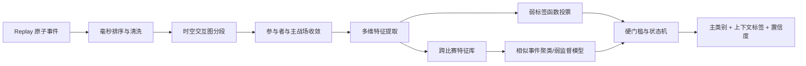

# Dota Lens 自动战斗事件识别方案

> 文档状态：实施中 Draft 1.0  
> 更新时间：2026-07-19  
> 适用范围：团战、线上消耗、线上换血、抓单、小规模冲突、TP 支援及其上下文识别  
> 当前约束：产品不提供人工标注、仲裁、黄金样本接口或标签学习

## 1. 结论

可以使用机器学习，但当前不应直接训练一个端到端“团战分类神经网络”。原因是：

1. 无监督学习只能把相似事件聚在一起，不能自动知道某一簇应该叫“团战”还是“线上换血”。
2. 现有三场真实比赛约有 310 个战斗候选，数据量适合验证特征与聚类，不足以训练稳定的高容量模型。
3. 没有独立外部真值时，无法诚实计算语义分类的精确率和召回率；模型置信度只能称为“规则/模型置信度”，不能冒充已校准概率。
4. Dota 规则中“TP 支援”“越塔”“肉山争夺”并不是与团战互斥的类别，而是可以叠加在战斗上的上下文标签。

推荐采用三层混合架构：

- **事实层**：只从 Replay 提取伤害、控制、治疗、死亡、施法、位置、TP、视野和目标事件。
- **自动判定层**：时空聚类、状态机、弱标签函数和硬门槛，输出可解释结果并允许放弃判断。
- **学习层**：积累跨比赛特征后，用弱监督概率标签训练轻量模型；无监督表征只用于相似事件检索和异常发现。

第一版先上线自动判定层，同时持续生成训练特征，不依赖人工标注即可改善产品。

## 2. 当前数据审计

当前本地三场真实分析包的自动候选统计：

| 指标 | 结果 |
| --- | ---: |
| 战斗候选 | 310 |
| 无死亡候选 | 157（50.6%） |
| 当前标为团战 | 61（19.7%） |
| TP/飞鞋使用事件 | 265 |

已确认的主要误差来源：

- 固定 6 秒间隔和固定空间半径会把一场持续追击拆成两段，也可能被连续 DoT 拖长。
- 只要无死亡且双方都造成伤害，非线上区域也可能被叫作“线上换血”。
- 抓单只看参与人数和死亡，没有检查目标集中度、受害者是否孤立、攻击方是否形成人数差。
- TP 物品使用已经存在，但没有与位置跃迁、落点和首次战斗行为组成支援链。
- 当前只输出最终类别和少量理由，没有候选类别分数、特征覆盖和放弃判断条件。

## 3. 事件语义模型

### 3.1 主类别

主类别保持单选：

| 类别 | 自动判定语义 |
| --- | --- |
| `harass` | 低承诺、低强度或明显单向的英雄消耗 |
| `lane_trade` | 兵线区域内、双方有实质回击、无明确击杀结果的换血 |
| `pickoff` | 单杀或多人集中击杀少数孤立目标 |
| `skirmish` | 未达到团战门槛的小规模高承诺冲突，2v2 永久属于此类 |
| `teamfight` | 双方多人有效参与且伤害、控制、技能或减员达到高强度门槛 |

### 3.2 正交标签

以下标签可以与任意主类别叠加：

- `gank`：多人对孤立目标形成局部人数差。
- `solo_kill`：1v1 产生击杀。
- `tp_support`：TP 完成后在战场附近产生有效战斗行为。
- `tp_arrival`：TP 到达战场附近，但尚无有效战斗行为。
- `chase`：长持续时间、中心移动或事件散布较大。
- `lane_context`、`roshan_context`、`base_context`：地点上下文。
- 后续增加 `tower_dive`、`counter_gank`、`smoke_gank`、`buyback_response`。

### 3.3 重要性

`importance` 与主类别分离。一次 2v2 越塔反打仍是 `skirmish`，但可以是高重要性事件；一次无结果的 5v5 拉扯即使通过团战门槛，也未必是最高优先级复盘。

## 4. 自动识别流水线



候选分段采用时空图而不是单纯死亡窗口：

1. 伤害、控制、死亡为强节点；有效治疗、主动技能和物品为附着节点。
2. 时间接近、空间接近、共享参与者或存在攻击链时连接节点。
3. 连续 5 秒没有有效行为视为脱战。
4. 两段短时间相邻、共享多个参与者且中心距离合理时合并为一场追击。
5. 同时发生但主战场距离很远的冲突保持分离，即使日志错误地共享了一个参与者。

## 5. 特征设计

### 5.1 时序特征

- 正式接触时长、峰值窗口、峰值前后强度比。
- 每秒伤害、技能、控制、治疗和死亡密度。
- 最长空档、爆发占比、DoT 占比、追击持续时间。
- 双方首次行动、增援到达和首次减员的相对时间。

### 5.2 参与者交互图

- 双方有效参与人数和人数平衡度。
- 攻击边数量、图密度、连通分量和互相伤害比例。
- 伤害目标集中度，用于区分抓单与多人混战。
- 每名英雄首次/最后有效动作、活跃秒数、附近但未行动状态。

### 5.3 伤害与承诺度

- 总伤害及相对双方英雄最大生命值的伤害当量。
- 双方伤害比、最高目标伤害占比、控制秒数、技能和物品次数。
- 死亡、买活、关键大招、BKB 等高价值资源投入。

### 5.4 空间与上下文

- 主战场中心、散布半径、中心移动距离和区域置信度。
- 兵线、塔下、基地、野区、河道、肉山坑及关键目标上下文。
- 接触前 10 秒的队伍收敛、孤立目标和局部人数变化。

### 5.5 TP 支援链

每次 TP 建立以下证据：

1. `cast_start`：TP/飞鞋使用事件。
2. `origin`：施法前最近的有效英雄位置。
3. `landing`：2 至 8 秒内第一次显著位置跃迁。
4. `completed`：存在足够位移且落点有效；否则标为中断或证据不足。
5. `near_battle`：落点位于主战场合理半径内。
6. `first_action`：到达后第一次伤害、控制、治疗或有效施法。
7. `local_numbers_before/after`：TP 前后局部队友人数变化。

只有“完成 + 落点接近 + 及时产生有效动作”才标记 `tp_support`。仅落地不参战标记 `tp_arrival`，没有位置跃迁不得写成 TP 完成。

## 6. 无人工标注的机器学习路线

### 阶段 A：可解释自动模型（当前实施）

- 输出统一特征向量、五类候选分数、硬门槛、理由和上下文标签。
- 使用规则弱标签函数，冲突时降低置信度或放弃判断。
- 对战斗片段做追击合并和 TP 支援链识别。
- 不读取人工标签作为默认分类依据。

### 阶段 B：弱监督模型

当积累至少 100 场、约 5,000 个候选后：

1. 为不同证据编写互相独立且可放弃投票的标签函数。
2. 学习标签函数的可靠性和相关性，生成概率弱标签。
3. 使用跨比赛切分训练轻量 GBDT 或多项逻辑回归。
4. 模型只在高置信区覆盖规则结果，团队人数、2v2 和数据完整性仍为硬门槛。
5. 模型文件版本化，解析器只负责纯 Java 推理，桌面端不附带 Python 运行时。

### 阶段 C：自监督表征与相似事件

当积累至少 500 场后，可对每秒特征序列训练 TS2Vec 一类的自监督表示：

- 用于“寻找与这次团战最相似的历史事件”。
- 使用 HDBSCAN/ST-DBSCAN 发现新型事件和异常片段。
- 聚类结果不能直接作为中文语义标签，只能作为弱标签函数或检索特征。

## 7. 输出协议

```json
{
  "kind": "pickoff",
  "classification": {
    "model": "combat-automatic-hybrid-v4",
    "confidence": 86,
    "calibration": "uncalibrated",
    "scores": {
      "harass": 8,
      "lane_trade": 2,
      "pickoff": 86,
      "skirmish": 43,
      "teamfight": 11
    },
    "context_tags": ["gank", "tp_support"],
    "reasons": ["isolated_target", "local_numbers_advantage"],
    "features": {
      "active_players": 4,
      "damage_reciprocity": 0.31,
      "target_concentration": 0.78,
      "interaction_graph_density": 0.42
    }
  },
  "support_events": []
}
```

页面必须同时显示分类名称、置信度、关键标签和主要理由。低置信度时显示“战斗片段，类型不确定”，不能强制给出确定结论。

## 8. 无标注阶段的验收方法

没有人工真值时，不宣称精确率或召回率，只执行以下自动验收：

- 2v2 升级为团战必须为 0。
- 非兵线区域不能标记为 `lane_trade`。
- TP 未检测到位置跃迁时不能标记 `tp_support`。
- 同地点、短空档、强参与者重叠的追击不得重复生成两场。
- 同时发生且距离很远的冲突必须分离。
- 同一 Replay 重跑结果完全一致。
- 阈值上下浮动 5% 时，高置信事件标签稳定率不低于 95%。
- 所有结果保留特征、门槛和理由，可从页面追溯到原始事件。

语义准确率仍需要独立外部复核真值才能最终确认，这是无法通过无监督学习绕开的边界。

## 9. 与全模块路线图的衔接

当前执行顺序调整为：

1. `DATA-01` 毫秒统一时间和 `DATA-03` 地图区域事实继续作为基础项。
2. `COMBAT-02/04/11/12` 先落地自动事件识别、上下文标签和 TP 链。
3. `COMBAT-07/08` 复用自动片段补齐阶段与视野准备。
4. `COMBAT-09` 职责评价必须等待事件类型、参与者和技能可用性事实稳定。
5. 人工标注与标签学习已从产品移除；自动功能只依赖 Replay 事实、程序不变量和固定回放回归集。

## 10. 技术依据

- OpenDota 的解析链路本身也是使用 Clarity 将 Replay 转成自动化事件数据，而不是依赖人工录入：[OpenDota Parser](https://github.com/odota/parser)、[Clarity](https://github.com/skadistats/clarity)。
- ST-DBSCAN 说明空间、时间和非空间属性可以共同用于密度聚类：[ST-DBSCAN 论文](https://doi.org/10.1016/j.datak.2006.01.013)。
- Snorkel 给出了不逐条人工标注、通过多组弱标签函数生成概率训练标签的可行路径：[Snorkel VLDB 论文](https://www.vldb.org/pvldb/vol11/p269-ratner.pdf)。
- TS2Vec 可在无标签条件下学习时间片段表示，适合后续相似战斗检索，而不是直接命名语义类别：[TS2Vec AAAI 论文](https://ojs.aaai.org/index.php/AAAI/article/view/20881)。
- 变化点检测可用于识别战斗强度从准备、接触到脱战的边界：[Bayesian Online Changepoint Detection](https://arxiv.org/abs/0710.3742)。
