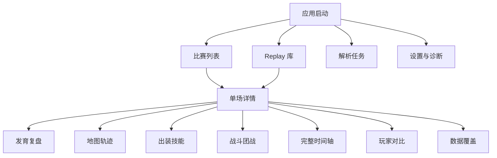

# Dota Lens Windows 桌面端前端页面 PRD

| 项目 | 内容 |
| --- | --- |
| 文档版本 | v0.2 |
| 日期 | 2026-07-16 |
| 文档状态 | Windows 客户端实施中 |
| 产品形态 | Windows x64 桌面应用（便携 EXE） |
| 目标阶段 | Electron 客户端 + 内置 Java Replay parser |
| 关联文档 | `PRD.md`、`POC-REPLAY-PARSER.md` |

## 1. 文档目的

本文定义 Dota Lens 桌面端第一版前端的信息架构、页面布局、交互规则、视觉语言、
数据状态和验收标准。评审通过后，再按本文搭建可运行的桌面端前端页面。

本轮评审重点：

1. 页面层级是否符合桌面端使用习惯。
2. 比赛列表与单场详情是否真正分离。
3. 单场复盘能否在一屏内完成地图、曲线、事件和结论联动。
4. 是否足够聚焦本人英雄的秒级发育分析。
5. 视觉密度、颜色、字号和组件风格是否适合长期反复使用。

## 2. 产品定位

### 2.1 一句话定位

面向 Dota 2 个人玩家的本地单场 replay 复盘工作台，用逐秒位置和逐事件数据解释
“这一分钟在哪里、做了什么、获得了什么、错过了什么”。

### 2.2 核心用户

- 主要用户：绑定 Steam 数字 ID、复盘自己比赛的 Dota 2 玩家。
- 使用设备：Windows 10/11 台式机或笔记本。
- 典型分辨率：1920x1080、2560x1440；最低支持 1024x720。
- 典型输入：鼠标、键盘、滚轮；不以触屏和移动端为首要目标。

### 2.3 核心任务

1. 查询账号最近比赛并快速找到可复盘场次。
2. 导入本地 replay，查看解析进度和失败原因。
3. 选择本人英雄，拖动时间轴查看任意秒的状态和位置。
4. 查看每段刷野的营地、单位、收益、耗时和同期兵线机会。
5. 查看出装、技能、战斗、眼位和完整事件证据。

## 3. 设计原则

1. **桌面工具优先**：第一屏就是可操作工作台，不制作营销首页或大幅 Hero 区。
2. **一屏完成复盘**：详情页不依赖长页面滚动；地图、片段和曲线使用固定工作区。
3. **个人英雄优先**：默认选中账号本人，不用十人总览淹没主要分析。
4. **统一时间优先**：全页面只有一个 `current_time`，地图、曲线和事件同步响应。
5. **事实与推导分离**：事实、聚合、估算使用固定标签和颜色，不混写为确定结论。
6. **中文优先**：英雄、装备、技能、单位、地图区域和事件均显示中文名称。
7. **数据密度优先**：少用装饰性卡片和大标题，强调比较、扫描和连续操作。
8. **状态透明**：未解析、部分数据、解析失败和字段缺失都有明确入口和下一步操作。

## 4. 第一版前端范围

第一版以可双击运行的 Windows `.exe` 交付。Electron 负责桌面窗口和资源加载，应用
内置裁剪后的 Java 21 运行时与 replay parser；前端通过仅监听本机的 API 读取 OpenDota
比赛索引、启动解析任务并加载本地分析包。浏览器开发地址只用于研发调试，不作为产品交付物。

### 4.1 P0 页面

| 页面 | 第一版前端要求 |
| --- | --- |
| 比赛列表 | 完整页面、筛选、固定高度比赛行、解析状态、进入详情。 |
| 单场发育复盘 | 完整核心工作区、真实地图底图、互动时间轴、刷野片段、曲线。 |
| 地图轨迹 | 完整地图图层、玩家轨迹、营地、眼位和事件检查器。 |
| 出装技能 | 装备图标、购买与库存轨道、技能升级与使用时间线。 |
| 战斗团战 | 战斗列表、伤害拆解、事件证据。 |
| 完整时间轴 | 虚拟化密集事件表、筛选、搜索、时间跳转。 |
| 玩家对比 | 双方十人数据表和英雄切换。 |
| 数据覆盖 | 字段、来源、精度和缺失状态。 |
| Replay 库 | 导入入口、文件列表、解析状态。 |
| 解析任务 | 当前任务、队列、失败和日志入口。 |
| 设置与诊断 | 账号、Dota 路径、资源限制、语言和诊断。 |

### 4.2 本轮不做

- Steam 登录、支付、社区、好友和战队功能。
- 云同步、多人账号协作和跨设备同步。
- AI 自由聊天入口。
- Steam 客户端自动发现和 replay 文件目录监控。
- 移动端、小程序和触屏布局。

## 5. 信息架构



### 5.1 一级导航

左侧常驻导航只保留四项：

1. 比赛
2. Replay
3. 任务
4. 设置

单场详情不是左侧一级菜单项，只能从比赛或 Replay 进入。返回时恢复原列表的筛选、
滚动位置和选中项。

### 5.2 页面路由建议

| 路由 | 页面 |
| --- | --- |
| `/matches` | 比赛列表 |
| `/matches/:matchId/development` | 发育复盘 |
| `/matches/:matchId/farm` | 打钱分析 |
| `/matches/:matchId/map` | 地图轨迹 |
| `/matches/:matchId/vision` | 视野分析 |
| `/matches/:matchId/build` | 出装技能 |
| `/matches/:matchId/combat` | 战斗团战 |
| `/matches/:matchId/timeline` | 完整时间轴 |
| `/matches/:matchId/players` | 玩家对比 |
| `/matches/:matchId/coverage` | 数据覆盖 |
| `/replays` | Replay 库 |
| `/tasks` | 解析任务 |
| `/settings` | 设置与诊断 |

## 6. 全局应用框架

### 6.1 窗口结构

```text
┌──────────┬───────────────────────────────────────────────────────┐
│          │ 顶部标题栏 / 页面操作                                │
│ 左侧导航 ├───────────────────────────────────────────────────────┤
│          │                                                       │
│          │                 当前页面工作区                        │
│          │                                                       │
│          ├───────────────────────────────────────────────────────┤
│          │ 全局状态栏；详情页替换为统一播放控制器                │
└──────────┴───────────────────────────────────────────────────────┘
```

### 6.2 固定尺寸

| 区域 | 默认尺寸 | 规则 |
| --- | ---: | --- |
| 展开左侧导航 | 216px | 低于 1280px 自动收为 64px 图标栏。 |
| 顶部标题栏 | 52px | 不随页面滚动。 |
| 详情二级导航 | 44px | 单场详情常驻。 |
| 底部播放控制器 | 76px | 只在单场详情显示。 |
| 全局状态栏 | 28px | 列表、Replay、任务和设置页面显示。 |
| 最小窗口 | 1024x720 | 小于该尺寸阻止继续缩小。 |

### 6.3 左侧导航

- 顶部显示 Dota Lens 标志和当前版本，不显示宣传文案。
- 使用 Lucide 图标加文字：比赛、Replay、任务、设置。
- 任务存在时，任务图标显示数量角标和环形进度。
- 底部显示本地解析器状态：可用、未安装、忙碌、异常。
- 折叠状态只显示图标，悬停显示工具提示。

### 6.4 顶部标题栏

- 左侧显示当前页面标题和必要的返回按钮。
- 中间不放大面积搜索框，搜索只在有需要的页面出现。
- 右侧放页面级操作，例如刷新、导入、开始解析和更多菜单。
- 所有图标按钮使用熟悉图标并提供工具提示。

### 6.5 全局状态栏

- 左侧：数据连接状态和最后同步时间。
- 中间：当前后台任务的简短状态。
- 右侧：本地 parser 版本、Dota patch、内存占用入口。
- 不展示教学说明和快捷键提示。

## 7. 页面详细需求

### 7.1 首次运行设置

首次运行使用三步模态流程，不制作独立欢迎首页。

#### 步骤一：绑定账号

- 输入 SteamID64 或 32 位 `account_id`。
- 自动换算并显示最终账号 ID。
- 展示头像和昵称仅作为校验，不要求 Steam 登录。

#### 步骤二：定位 Dota

- 自动检测 Steam 与 Dota 安装目录。
- 显示 replay 默认目录。
- 支持文件夹选择器手动修改。

#### 步骤三：环境检测

- 检查 parser、Java runtime、目录读写和本地端口。
- 每项显示通过、警告或失败。
- 失败项允许稍后处理，但必须说明哪些功能暂不可用。

#### 验收

- 完成后直接进入比赛列表。
- 再次启动不重复出现。
- 设置页面可以重新打开并修改全部项目。

### 7.2 比赛列表

#### 页面目标

快速浏览最近比赛、识别数据状态，并进入独立单场详情。

#### 页面布局

```text
┌ 账号选择 ─ 最近比赛 ─ 搜索 ─ 刷新 ─ 导入 Replay ┐
├ 状态分段控件：全部 / 本地完整 / 可解析 / 需请求 / 解析中 / 失败 ┤
├ 日期与模式筛选 ────────────────────────────────────┤
│ 固定高度比赛行                                      │
│ 固定高度比赛行                                      │
│ 固定高度比赛行                                      │
│ ...虚拟滚动                                         │
└ 分页或继续加载 ─────────────────────────────────────┘
```

#### 比赛行

每行高度固定为 76px，整行可点击，包含：

- 48x48 英雄头像、中文英雄名和位置标签。
- 胜利或失败，使用文字和颜色双重表达。
- K/D/A、补刀、GPM、XPM、时长和开赛时间。
- 比赛 ID 与模式。
- 数据状态：本地完整、Replay 可自动解析、需要请求 Replay、解析中、失败。
- 最右侧使用箭头图标进入详情，不使用大号文字按钮。

#### 交互

- 点击本地完整比赛后路由跳转到详情，不在列表底部展开。
- 点击其它比赛立即创建本地自动解析任务，不再要求用户手动下载或选择 Replay 文件。
- 返回列表时保持筛选、滚动位置和焦点。
- 解析中行显示稳定宽度进度槽，不改变行高。
- 任务完成后自动打开真实玩家表和数据覆盖页；失败行点击后直接重试并保留错误码。
- MVP 读取 OpenDota 最近 20 场；接入分页接口后再扩展历史列表和虚拟滚动。

#### 真实数据流程

1. 用户输入 32 位 Steam `account_id`，前端校验 `1-4294967295` 并保存为本地默认账号。
2. 本地服务代理 OpenDota `recentMatches`，避免浏览器直接承担密钥、限流和跨域逻辑。
3. 列表把 OpenDota 解析状态与本地分析缓存合并为六种稳定状态。
4. 用户选择比赛后，前端 `POST /api/matches/{match_id}/parse`，随后轮询本地任务。
5. 服务端解析 Replay 地址；缺失时提交 OpenDota 公开解析请求并轮询，不要求 Steam 登录。
6. 服务端流式下载 `.dem.bz2`、解压为可复用 `.dem`、生成 raw JSONL 和 `summary.json`。
7. 前端只读取轻量摘要；原始 200 MB 级 JSONL 不进入浏览器内存。
8. 已接入真实 schema 的模块开放；未接入的深度模块禁用并标记，不显示原型假数据。

#### 空状态

- 未绑定账号：显示紧凑账号绑定表单。
- 无比赛：显示日期范围和隐私设置检查入口。
- 离线：保留本地缓存比赛并明确标注离线。

### 7.3 单场详情公共框架

#### 固定顶部信息

第一行包含：

- 返回比赛列表。
- 胜负、比赛 ID、时长、模式、开赛时间和 patch。
- 数据来源与覆盖状态入口。
- 刷新、重新解析和更多菜单。

第二行使用固定宽度英雄带展示双方十名英雄：

- 头像固定 36x36，不允许因名字或状态改变尺寸。
- 天辉和夜魇各五名，中间使用比分分隔。
- 本人英雄有清晰选中描边。
- 点击头像切换当前分析英雄，所有页面保持该选择。
- 英雄中文名放在工具提示或选择器中，不挤压头像带。

#### 二级导航

顺序固定为：

1. 发育复盘
2. 地图轨迹
3. 出装技能
4. 战斗团战
5. 完整时间轴
6. 玩家对比
7. 数据覆盖

二级导航不横向溢出。宽度不足时，将后三项放入“更多”菜单。

#### 页面滚动

- 单场详情公共框架本身不产生长页面滚动。
- 地图、片段列表、事件表等区域各自滚动。
- 底部统一播放控制器始终可见。

### 7.4 发育复盘

#### 页面目标

回答本人英雄在每个时间段的路线、资源收益和机会损失，是单场详情默认页。

#### 默认布局

```text
┌───────────────────────────────┬─────────────────────────┐
│                               │ 发育片段列表            │
│ 真实 Dota 地图                │ 刷野 / 兵线 / 回城      │
│ 路线、营地、当前位置          │ 死亡 / 团战 / 空窗       │
│                               │                         │
├───────────────────────────────┴─────────────────────────┤
│ 经济 / 经验 / 补刀 / 净值曲线与当前秒读数              │
└─────────────────────────────────────────────────────────┘
```

在 1440x900 可用区域中：

- 地图和片段区域约占垂直空间 68%。
- 曲线固定约 190px 高，不因图例或头像改变高度。
- 地图区域最小宽度 520px，始终保持 1:1 比例。
- 右侧片段栏最小宽度 360px。

#### 地图内容

- 使用当前 patch 对应的真实 Dota minimap 位图。
- 当前英雄位置使用英雄头像标记，不使用普通圆点。
- 显示已走轨迹、后续淡化轨迹、野区营地和当前片段范围。
- 可切换兵线路径、野区营地、眼位和死亡事件图层。
- 地图悬停显示时间、坐标、区域和最近事件。

#### 发育片段列表

每条片段固定包含：

- 起止时间和持续秒数。
- 类型：刷野、兵线、转线、回城、死亡、团战、空窗。
- 区域或营地中文名。
- 获得：金钱、经验、补刀和击杀单位。
- 错过：同期兵线机会和估算价值。
- 事实或推导标签，以及推导置信度。

点击片段后：

1. 时间游标跳到片段开始。
2. 地图缩放到相关区域。
3. 曲线高亮片段范围。
4. 右侧打开片段检查器，显示逐事件证据。

#### 曲线

- 支持净值、总金钱、经验、补刀四种指标。
- 使用分段控件切换主指标，辅助指标可叠加一条。
- 鼠标移动、点击和底部时间轴均可控制同一游标。
- 图上显示当前英雄曲线；对位英雄为低对比度参考线。
- 关键事件使用小图标标记，不显示拥挤的永久文字标签。
- 支持滚轮横向缩放和拖动平移，提供一键恢复全场。

### 7.4.1 打钱分析

#### 页面目标

在 OpenDota“击杀单位”分类统计基础上增加空间和决策解释：玩家的钱从哪些单位、哪些区域和哪些时间段获得；实际路线与当时可执行的更高收益路线相比损失了多少，以及模型为什么认为替代路线可行。

#### 页面结构

1. 顶部：总资源收入、兵线、野区、战斗、无收益空窗和可挽回收益。
2. 中部左侧：真实 Dota 地图上的金钱热力图，可按 0-10、10-20、20-30、30 分钟后和收入来源筛选。
3. 中部右侧：路线诊断列表与单次反事实详情，展示实际行为、建议行为、收益差、移动时间、风险和置信度。
4. 底部：按胜者、败者或全场筛选的击杀单位表，包含英雄、小兵、中立生物、远古、防御塔、信使、肉山、假眼、死灵书和其它单位。

#### 路线诊断模型

模型以固定时间步生成可执行候选动作：继续当前路线、收取各路兵线、清理可用野怪、参与附近战斗、回城补给或处理目标物。每个候选动作计算：

```text
期望价值 = 可获得金钱 + 经验折算 + 战略价值
         - 移动与等待成本 - 死亡风险期望损失 - 放弃其它资源的机会成本
```

核心特征：

- 兵线当前位置、剩余单位、塔下消耗速度和预计消失时间。
- 野怪营地存活、远古类型、刷新窗口和英雄清野效率。
- 当前英雄位置、移动速度、传送状态、技能冷却、生命和魔法。
- 己方眼位存活范围、当前可见敌方英雄、最后出现位置和时间。
- 未出现敌人的最大可达区域、传送可能性与高威胁英雄先手距离。
- 附近队友、建筑保护、己方控制区域和正在发生的目标物事件。

安全不是二元值。模型必须对失踪敌人的可达区域做概率估计，并输出风险分数与置信度。只有替代路线在收益显著更高、风险处于可接受范围且证据完整时，才标记为“建议换线”；信息不足时显示“谨慎观察”，正确放弃危险兵线则标记为“正确决策”。

#### 补充指标

- 每分钟空间收入重心和路线移动距离。
- 线上资源与野区资源占比，以及远古利用率。
- 无收益空窗、重复走路和营地刷新前等待时间。
- 安全兵线错过价值、危险兵线规避价值与传送机会成本。
- 眼位覆盖下的资源收益、无视野区域收益和被抓损失。
- 建议路线执行后的预计净值差与实际结果回测。

### 7.5 地图轨迹

#### 布局

- 左侧为尽可能大的正方形真实地图，占可用宽度约 70%。
- 右侧为图层控制、当前秒状态和事件检查器。
- 地图不放进装饰性卡片，直接作为主工作区。

#### 图层

| 图层 | 表现 |
| --- | --- |
| 英雄轨迹 | 按时间渐变透明度的路径，当前位置为英雄头像。 |
| 位置热力 | 可选时间范围内的密度热力，不覆盖地图关键道路。 |
| 野区营地 | 营地图标、边界、刷新和清理状态。 |
| 眼位 | 假眼、真眼、放置者、持续时间和视野范围。 |
| 战斗 | 击杀、死亡、伤害爆发和团战范围。 |
| 目标物 | 防御塔、兵营、肉山、盾和莲花等事件。 |

#### 地图交互

- 滚轮缩放，鼠标拖动平移，双击事件复位并定位。
- 点击图标后打开右侧检查器，不弹出遮挡地图的大型浮层。
- 时间播放时地图保持稳定，不自动改变缩放级别。
- 图层开关使用图标加复选框，状态持久化到当前用户。

### 7.5.1 视野分析

#### 页面目标

将眼位从“放置次数”升级为可解释的视野决策：谁在什么时间、什么位置放置了哪种眼，存活期间看到了什么，以及这些信息是否转化为反眼、目标控制或战斗收益。

#### 页面结构

1. 顶部总览：眼位数、平均存活、敌方发现次数、有效反眼、战斗转化和平均评分。
2. 中部左侧：真实 Dota 地图，显示当前时刻存活眼位、放置者、地形修正视野范围和发现事件。
3. 中部右侧：按玩家、阵营、真假眼、进攻/防守分类筛选的眼位清单，以及单眼详情检查器。
4. 底部：每个眼位从放置到消失的存活轨道；轨道内标记发现敌方单位、反眼和关键战斗事件，并与全局时间游标同步。

#### 单眼字段

| 维度 | 说明 |
| --- | --- |
| 放置者 | 英雄、玩家、阵营与玩家槽位。 |
| 眼型 | 侦查守卫（假眼）或岗哨守卫（真眼）。 |
| 用途 | 进攻眼或防守眼，并标记关联目标，如肉山、推进、野区入侵。 |
| 生命周期 | 放置、消失、存活时长与失效原因，包括自然消失和被反眼。 |
| 视野范围 | 按版本半径并结合高低坡、树木和阻挡做地图近似。 |
| 情报收益 | 发现次数、独立敌方英雄数、首次发现延迟和重复进入。 |
| 行动转化 | 发现后一定窗口内发生的击杀、团战、撤退、反眼或目标控制。 |
| 覆盖效率 | 与己方其他眼位的重叠比例、无效空窗和关键入口覆盖。 |
| 眼位评分 | 由情报、时机、存活、覆盖效率、目标价值和行动转化共同组成，并展示分项。 |

#### 补充分析

- 关键目标覆盖：肉山刷新、推进高地和符点窗口是否提前布置视野。
- 视野缺口：死亡或团战发生前，相关区域连续无己方视野的时长。
- 重复覆盖浪费：多个己方眼位视野重叠但未增加关键入口覆盖的比例。
- 反眼交换：真眼投入、发现敌方眼、成功拆眼和净经济交换。
- 首次发现领先量：敌人首次进入视野到交战、撤退或开雾响应之间的时间。
- 危险暴露：眼位被敌人看见或被迅速反掉时，推测暴露来源与放置路径。

### 7.6 出装技能

#### 页面目标

展示每件装备何时购买、何时进入背包、何时使用，以及技能升级和关键使用时机。

#### 页面结构

1. 顶部：当前时间背包、背包栏、中立物品和消耗品状态。
2. 中部：购买、库存变化、技能升级三条时间轨道。
3. 下部左侧：装备清单和关键时间。
4. 下部右侧：技能与物品使用事件列表。

#### 规则

- 使用真实装备和技能图标，图标下显示中文名称。
- 图标固定尺寸，长中文名允许两行，不得撑开轨道高度。
- 悬停显示原始英文键值、价格、获得方式和事件来源。
- 购买、拾取、合成、出售、掉落和转移使用不同符号。
- 数据不足以确定背包状态时，显示“按事件重建”而不是伪造库存。

### 7.7 战斗团战

#### 布局

- 左侧 38%：按时间排序的击杀、死亡和团战片段列表。
- 中间 37%：选中片段的伤害、治疗、技能和物品事件。
- 右侧 25%：参与英雄、伤害来源和结果摘要。

#### 功能

- 默认只显示当前英雄参与或附近的战斗。
- 支持切换“本人相关”和“全场”。
- 点击任意事件同步底部时间轴和地图位置。
- 伤害拆解按技能或物品、目标英雄和伤害类型分组。
- 死亡事件提供死亡前 30 秒快速回放入口。
- 团战结果展示金钱、经验、目标物和存活变化，不只展示总伤害。

### 7.8 完整时间轴

#### 页面目标

为高级用户提供可搜索、可筛选、可追溯的完整事件记录。

#### 布局与字段

- 顶部：搜索、事件类型多选菜单、玩家筛选、时间范围和导出。
- 主体：固定表头的虚拟化事件表。
- 行字段：时间、类型、发起者、目标、数值、位置、来源和证据级别。
- 右侧可选事件检查器显示完整字段，不把原始 JSON 直接塞进主表。

#### 性能

- 支持至少 150,000 条事件。
- 滚动时不创建全部 DOM 行。
- 筛选和搜索使用 Web Worker，交互反馈目标小于 100ms。

### 7.9 玩家对比

- 使用 Dota 计分板式密集表格，不使用十张大型玩家卡。
- 天辉和夜魇分区，显示英雄、玩家、KDA、补反、净值、GPM、XPM、伤害、
  承伤、治疗、眼位和控制。
- 表头支持排序，默认按阵营和玩家槽位排列。
- 点击玩家行切换全局分析英雄。
- 本人行和当前分析英雄行使用不同但不冲突的强调方式。

### 7.10 数据覆盖

#### 页面目标

让用户明确知道当前报告能分析什么、不能分析什么，以及数据来自哪里。

#### 内容

- 总体状态：完整、部分、聚合或基础。
- 数据层级：原始事实、聚合结果、推导分析。
- 每个维度显示记录数、时间范围、精度、来源和缺失原因。
- parser 版本、replay patch、分析 schema 版本和生成时间。
- 诊断操作：重新验证、重新解析、打开日志、导出诊断包。

### 7.11 Replay 库

#### 页面目标

管理本地 `.dem`、`.dem.bz2` 和生成后的分析包。

#### 布局

- 顶部操作：导入文件、扫描目录、打开 replay 目录。
- 主体使用密集文件表，不以大面积拖放区占据首屏。
- 拖放文件到窗口任意位置时显示临时接收遮罩。

#### 列表字段

- 比赛 ID、文件名、大小、修改时间、patch、解析状态、分析包大小。
- 与账号比赛是否匹配。
- 操作：解析、打开报告、重试、删除中间文件、打开所在目录。

#### 状态

- 未识别、待解析、排队、解析中、标准化中、推导中、完成、失败、版本不兼容。

### 7.12 解析任务

- 顶部突出当前任务，显示阶段、百分比、已用时间和内存。
- 下方分别显示等待队列、最近完成和失败任务。
- MVP 同时只运行一个 parser 任务。
- 允许取消等待任务；运行中任务取消前需要确认。
- 日志默认折叠，打开后使用等宽字体和级别筛选。
- 失败卡必须显示用户可读原因、错误码、重试和打开日志操作。

### 7.13 设置与诊断

设置使用左侧分类列表和右侧表单，不使用连续长页面。

#### 分类

| 分类 | 设置项 |
| --- | --- |
| 账号 | account_id、SteamID64、默认分析英雄。 |
| Dota 与 Replay | 游戏目录、replay 目录、自动扫描。 |
| 解析器 | Java/parser 路径、最大内存、临时目录、任务并发。 |
| 数据 | replay、原始 JSONL、分析包的保留和清理策略。 |
| 显示 | 主题、界面缩放、地图版本、语言。 |
| 诊断 | 环境检测、版本、日志、诊断包和重置缓存。 |

危险操作放在独立区域，并要求二次确认。路径输入使用文件夹选择按钮，不要求用户
手工输入长路径。

## 8. 统一播放控制器

### 8.1 布局

底部控制器从左到右包含：

1. 当前时间与总时长。
2. 上一事件、播放/暂停、下一事件。
3. 0.5x、1x、2x、4x 速度菜单。
4. 全宽时间轨，叠加击杀、死亡、刷野、装备和目标物标记。
5. 时间范围缩放和恢复全场。

### 8.2 状态模型

全详情页共享：

```text
currentTime
isPlaying
playbackRate
visibleTimeRange
selectedPlayerSlot
selectedEventId
selectedSegmentId
enabledMapLayers
```

任何模块只能修改共享状态，不得创建独立时间游标。

### 8.3 键盘交互

- 空格：播放或暂停。
- 左右方向键：前后 1 秒。
- Shift + 左右方向键：前后 5 秒。
- 上一个或下一个事件使用可配置快捷键。
- 输入框或菜单获得焦点时，不触发全局播放快捷键。

快捷键不常驻显示在页面中，只在工具提示和菜单中出现。

## 9. 通用组件

| 组件 | 要求 |
| --- | --- |
| 英雄头像 | 真实头像、固定比例、阵营与选中状态、中文工具提示。 |
| 装备/技能图标 | 真实图标、固定尺寸、冷却/不可用遮罩、中文名称。 |
| 数据状态标签 | 完整、聚合、基础、解析中、失败，颜色与图标双重表达。 |
| 证据标签 | 事实、聚合、推导；推导同时显示高/中/低置信度。 |
| 数值读数 | 稳定宽度数字，不因位数变化导致布局跳动。 |
| 时间文本 | 统一使用 `mm:ss`，超过一小时使用 `h:mm:ss`。 |
| 空状态 | 说明当前缺少什么，并只提供一个主操作。 |
| 错误状态 | 可读原因、错误码、重试和日志入口。 |
| 加载状态 | 使用骨架或进度槽，保持最终布局尺寸。 |
| 工具提示 | 解释图标、内部键值、精度和数据来源。 |

## 10. 视觉设计规范

### 10.1 视觉方向

方向定义为“赛后战术室”：克制、精确、偏工业工具感，强调地图、数据和事件证据。
不使用电竞直播式霓虹大屏，也不使用普通 SaaS 的大圆角卡片堆叠。

### 10.2 色彩

| Token | 建议颜色 | 用途 |
| --- | --- | --- |
| `canvas` | `#111315` | 应用主背景 |
| `surface` | `#181B1E` | 工具面板 |
| `raised` | `#202428` | 菜单、检查器、浮层 |
| `border` | `#343A3F` | 分隔线和边框 |
| `text` | `#F2F0E9` | 主文字 |
| `muted` | `#9CA3AA` | 次要文字 |
| `radiant` | `#53B77F` | 天辉、正收益、成功 |
| `dire` | `#DF5B61` | 夜魇、死亡、失败 |
| `amber` | `#D8A447` | 推导、警告、机会成本 |
| `info` | `#5E9FD6` | 当前选择、链接、信息 |

禁止使用大面积紫色、蓝紫渐变、装饰光球或模糊背景。阵营红绿不能作为唯一状态
表达，必须配合图标或文字。

### 10.3 字体

- 中文正文：随应用打包 `Noto Sans SC`。
- 数字与英文：`Barlow Semi Condensed` 或同类紧凑字体。
- 日志和原始键值：`JetBrains Mono`。
- 正文字号 13-14px，表格 12-13px，页面标题 18-20px。
- 不根据窗口宽度连续缩放字号，字间距固定为 0。

### 10.4 形状与层级

- 面板圆角 4-6px，最大不超过 8px。
- 页面分区优先使用分隔线和背景层级，不把每个区块都做成悬浮卡片。
- 禁止卡片嵌套卡片。
- 阴影只用于菜单、检查器和模态框。
- 工具栏按钮高度 30-34px，图标按钮保持固定正方形。

### 10.5 图标与资源

- 通用操作使用 Lucide 图标，不手绘重复 SVG。
- 英雄、装备、技能和地图使用真实 Dota 资源。
- 地图必须是对应 patch 的清晰 minimap，不能用抽象方格或自制示意图替代。
- 图片加载失败时显示稳定尺寸占位，不得让布局重排。

### 10.6 动效

- 页面切换 120-180ms，不使用大幅飞入和弹跳。
- 时间拖动、地图播放和曲线游标优先保证即时响应。
- 解析完成可使用一次轻微状态过渡，不播放庆祝动画。
- 遵循系统“减少动画”设置。

## 11. 窗口适配

### 11.1 1024-1279px

- 左侧导航收为 64px。
- 详情后三个页签进入“更多”。
- 发育复盘右侧片段栏可收为抽屉。
- 地图右侧检查器可覆盖打开，但关闭后不占空间。

### 11.2 1280-1599px

- 使用标准布局。
- 发育复盘地图与片段栏并列，曲线置底。
- 玩家表格允许横向滚动，但冻结英雄和玩家列。

### 11.3 1600px 以上

- 左侧导航保持 216px，不继续放大。
- 地图、片段和检查器可形成三栏。
- 内容设置最大可读宽度，但地图工作区可使用全部剩余空间。

### 11.4 高 DPI

- 支持 125%、150% 和 200% Windows 缩放。
- Canvas 按设备像素比渲染，CSS 尺寸保持稳定。
- 所有文字、头像和按钮在缩放后不得溢出或重叠。

## 12. 数据状态与文案

| 状态 | 列表表达 | 详情行为 |
| --- | --- | --- |
| 完整 replay | “完整复盘” | 默认打开发育复盘。 |
| OpenDota 聚合 | “聚合数据” | 可看聚合页，逐秒模块显示升级入口。 |
| 仅基础 | “基础数据” | 显示计分板，并提供导入 replay。 |
| 等待 replay | “需要 replay” | 打开 Replay 库的匹配筛选。 |
| 解析中 | 阶段和进度 | 可进入任务页，不显示伪造报告。 |
| 部分缺失 | “部分数据” | 可打开报告，缺失模块明确禁用。 |
| replay 过期 | “已过期” | 保留已有数据，不反复提示解析。 |
| parser 不兼容 | “版本不兼容” | 保留文件，显示版本与更新入口。 |
| 失败 | 简短原因 | 重试、打开日志、导出诊断。 |

## 13. 性能要求

| 项目 | 目标 |
| --- | ---: |
| 应用冷启动到可操作 | 小于 2 秒 |
| 页面路由切换 | 小于 150ms |
| 时间拖动到地图/数值更新 | 小于 50ms |
| 100,000 事件筛选反馈 | 小于 100ms |
| 地图播放 | 目标 60 FPS，最低不低于 30 FPS |
| 比赛列表 | 1000 行虚拟滚动无明显卡顿 |
| 前端空闲内存 | 目标小于 180 MB，不含 parser |

实现要求：

- 大型 JSONL 不直接载入渲染进程。
- 图表按可视像素降采样，但查询当前秒时使用原始值。
- 事件筛选、解压和数据标准化放入 Worker 或桌面主进程。
- 地图标记和轨迹使用 Canvas/WebGL，不为每个点创建 DOM 元素。

## 14. 可用性与无障碍

- 所有主要功能可通过键盘到达。
- 焦点状态清晰，不只依赖颜色。
- 正文和背景满足 WCAG AA 对比度。
- 图表同时提供当前秒数值和可访问文本摘要。
- 红绿阵营与胜负状态配合文字、图标或形状。
- 所有图标按钮有可访问名称和工具提示。
- 弹窗打开后焦点被约束，关闭后返回触发元素。

## 15. 第一版前端审核数据

原型使用固定高拟真样本，不使用随机数据：

- 首次启动不预填账号，优先读取用户本机已保存的账号。
- 至少 20 场比赛列表，覆盖全部解析状态。
- 一场 38 分钟完整比赛，十名真实英雄头像和中文名。
- 本人英雄至少 2281 个逐秒点。
- 至少 12 个刷野片段、8 个兵线片段、6 次死亡或战斗片段。
- 至少 40 件装备事件、30 个眼位事件和 1000 条可筛选时间轴事件。
- 地图使用真实 Dota minimap，并提供轨迹、营地、眼位和战斗图层。

所有模拟数据在开发模式中标记为“原型样本”，正式界面不出现随机生成的假数据。

## 16. 前端验收标准

### 16.1 全局

1. 首屏不是营销页，启动后直接进入比赛工作台。
2. 比赛列表和比赛详情为独立路由，详情中不保留长比赛列表。
3. 1024x720 到 2560x1440 不出现文字、头像、页签和按钮溢出。
4. 左侧导航、顶部栏和底部控制器尺寸稳定。
5. 所有英雄、装备和技能显示中文名与真实图标。

### 16.2 比赛列表

1. 20 场比赛无需页面长滚动到其他模块。
2. 筛选后行高不变化，解析进度不造成布局跳动。
3. 点击比赛进入详情，返回后恢复原滚动位置和筛选条件。

### 16.3 单场详情

1. 默认聚焦账号本人英雄并进入发育复盘。
2. 十名英雄头像在最小窗口下不溢出。
3. 页面不需要纵向滚动即可看到地图、片段、曲线和时间控制器。
4. 拖动任一时间控制点，地图、曲线、数值和事件同步。
5. 图表支持缩放、平移、悬停和恢复全场。
6. 点击刷野片段可查看营地、收益、事件和同期兵线机会。
7. 事实、聚合和推导结论视觉上可区分。

### 16.4 地图与数据

1. 地图使用真实 minimap，英雄位置使用头像。
2. 眼位、营地、轨迹和战斗图层可独立开关。
3. 十万级事件列表使用虚拟滚动。
4. 数据缺失时显示缺失状态，不绘制虚假曲线或轨迹。

## 17. 前端交付顺序

| 阶段 | 交付内容 | 审核重点 |
| --- | --- | --- |
| F0 | 应用框架、比赛列表、路由、全局样式 | 密度、导航、比赛行 |
| F1 | 单场公共框架、英雄带、统一播放控制器 | 一屏布局、头像溢出、时间交互 |
| F2 | 发育复盘、真实地图、片段和互动曲线 | 核心产品体验 |
| F3 | 地图、出装、战斗、时间轴 | 数据表达与操作效率 |
| F4 | Replay、任务、设置、异常状态 | 桌面应用完整性 |
| F5 | 多分辨率截图、性能和视觉打磨 | 最终验收 |

## 18. 本次待评审决策

评审时需要确认以下决策：

1. 是否接受“赛后战术室”的深色、克制、密集视觉方向。
2. 是否确认“发育复盘”为单场默认页。
3. 是否确认左侧只有比赛、Replay、任务和设置四个一级入口。
4. 是否接受底部常驻统一播放控制器。
5. 是否确认第一版前端先用固定高拟真样本审核，再接真实 parser。
6. 是否需要在第一版同时提供浅色主题；当前建议不做。
7. 首次开发优先审核 1440x900，再补 1024x720 和 2560x1440。

## 19. 真实数据接入状态

2026-07-17 已完成第一条可运行产品链路：

- 输入有效 Steam 32 位数字 ID 可读取 20 场真实比赛、中文英雄名、胜负、KDA、补刀、GPM、
  XPM、时长、模式和本地解析状态；OpenDota 未返回的反补显示 `--`，不填零。
- 具备 Replay 的脱敏样本可从列表直接创建自动解析任务；任务页展示读取、请求、等待、下载、
  解压、解析、摘要和完成阶段，完成后自动进入报告。
- 真实报告已接入十名玩家、比分、比赛信息、228,662 条原始事件摘要、六类覆盖数据和
  `dota-lens/0.4` 标准化分析包，并加入前 10 分钟分路与线况模块。
- 发育、打钱、地图、视野、出装技能、战斗团战、完整时间轴、玩家对比和数据覆盖均读取
  真实 Replay 分析结果；切换英雄和统一时间游标会同步刷新各模块。
- 样本比赛包含 23,900 个逐秒快照、410 个分钟发育片段、102 个眼位、32 个战斗片段、
  31 个目标事件和 6,561 条语义事件。选中孽主包含 49 次购买、26 次技能升级、287 次
  技能/物品使用和 227 次物品栏变化。
- 区域归类、发育类型、低收益窗口、眼位用途、几何发现和评分使用“Replay 推导”标签；
  兵线单位轨迹、精确漏刀和连续真实队伍视野缺失时必须显示不可计算。
- 已下载 `.bz2` 首次生成 DEM 并完成解析实测约 18 秒；已有 DEM 的缓存重解析约 10.8 秒。
