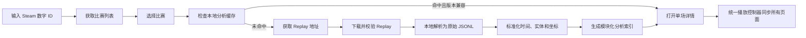

# Dota Lens 单场复盘分析模块 PRD

> 文档状态：评审稿 Draft 0.2  
> 更新时间：2026-07-19  
> 游戏机制基线：普通模式 `7.41d`；Turbo 使用独立规则配置  
> 当前实现基线：`dota-lens/0.4`、`product-modules/1.2`、`lane-pair/1.1`  
> 目标：先确认产品定义和分析口径，本文件通过评审前不直接作为已完成实现说明。

## 1. 文档目的

本 PRD 重新定义 Dota Lens 从比赛获取、Replay 解析到单场复盘的全部产品模块，重点解决以下问题：

1. 线上普通消耗、换血、抓单和小规模冲突被误判为团战。
2. 同一时间但发生在地图不同位置的事件被错误合并。
3. 团战位置使用阵亡位置均值，导致中心点偏向追击尾声或错误区域。
4. 地图轨迹、打钱热力图、眼位和团战使用的坐标来源不统一。
5. 分析结论没有稳定区分事实、确定性推导、规则模型和缺失数据。
6. 各页面已有功能较多，但缺少统一的数据契约、降级规则和验收标准。
7. 10 分钟线况、20 分钟转型、塔下 TP 支援和肉山盾等关键节点没有统一识别口径。
8. 团战事实没有稳定转化成针对十名玩家、可核验且可执行的复盘建议。

本文档的直接读者是产品负责人、Replay 解析开发、分析算法开发和桌面端前端开发。

## 2. 当前实现审计

### 2.1 当前团战识别逻辑

当前解析器 `ProductAnalysis.buildCombatModule` 的主要逻辑如下：

1. 只使用英雄死亡事件创建战斗候选。
2. 相邻英雄死亡间隔不超过 20 秒时，归入同一组。
3. 战斗时间固定扩展为第一名英雄死亡前 10 秒至最后一名英雄死亡后 10 秒。
4. 时间窗口内所有伤害、治疗、控制和技能/物品使用者都会被加入参与者，不检查这些事件是否发生在同一地点。
5. 战斗中点附近 13.5 个地图百分比单位内的英雄也会被加入参与者，仅仅在附近也可能被当作参战。
6. 参与者不少于 6 人，或窗口内死亡不少于 3 人，即标记为 `teamfight`。
7. 死亡不少于 2 人标记为 `skirmish`，其余标记为 `pickoff`。
8. 团战位置优先取所有阵亡英雄死亡时位置的算术平均值；没有阵亡位置时，取时间中点十名英雄位置的平均值。

### 2.2 当前逻辑造成的问题

| 问题 | 直接原因 | 用户看到的结果 |
| --- | --- | --- |
| 线上消耗被算作团战 | 固定死亡窗口吸收窗口内全部技能、伤害和附近英雄 | 普通换血出现“团战”卡片 |
| 无死亡团战完全缺失 | 候选事件只由死亡触发 | 高强度 5v5 拉扯但无人阵亡时没有记录 |
| 跨地图事件混入 | 事件只按时间过滤，没有空间过滤 | 上路抓单混入同时发生的下路消耗 |
| 追击尾声代表整场团战 | 位置主要由阵亡点决定 | 团战中心落在树林、基地或逃跑路径末端 |
| 参与人数虚高 | 使用时间窗口内全部施法者，加上附近英雄 | 未真正出手的英雄也被记为参战 |
| 团战起止不准确 | 固定前后各扩展 10 秒 | 战斗前闲逛和战后刷兵被包含 |
| 地区名称错误 | `laneForPosition` 和 `regionCode` 是少量坐标条件 | 下路路径显示在野区，河道和边线边界跳动 |

### 2.3 当前坐标逻辑

当前代码存在两类主要坐标：

| 来源 | 当前转换 |
| --- | --- |
| `interval.x/y` 实体格坐标 | 按 `64..191` 映射为 `0..100`，同时翻转 Y 轴 |
| 金钱事件世界坐标 | 先执行 `world / 128 + 128`，再按实体格坐标映射 |

当前问题不是单一缩放公式一定错误，而是缺少“坐标来源类型、地图版本、原始值、转换版本和校准结果”。一旦某类事件的输入不是预期坐标空间，系统仍会静默转换并输出一个看似合理的位置。

## 3. 产品目标与非目标

### 3.1 本轮目标

1. 建立统一的时间、玩家、实体和地图坐标契约。
2. 将战斗事件明确分为单向消耗、线上换血、抓单、小规模冲突和团战。
3. 团战同时考虑参战人数、双方参与结构、技能、伤害、控制、死亡、持续时间和反击关系。
4. 使用时空聚类发现战斗，不再以死亡事件作为唯一入口。
5. 使用战斗强度峰值和有效战斗事件计算位置，不再使用阵亡点简单平均。
6. 所有分析都显示证据等级、置信度、关键理由和缺失字段。
7. 重新定义所有桌面端模块的功能、输入、算法、输出、降级状态和验收标准。

### 3.2 非目标

1. 不把规则模型包装成职业教练的唯一正确答案。
2. 在没有逐单位实体、技能状态或战争迷雾重建时，不输出伪精确结论。
3. 不在本轮训练端到端黑盒模型取代可解释规则。
4. 不因为一次低伤害、早阵亡或未插真眼，直接给玩家人格化负面结论。
5. 不要求所有历史比赛都能下载到 Replay；产品必须明确展示数据缺失原因。

## 4. 产品原则

### 4.1 先发现事件，再给事件分类

系统先依据时间和空间找出一个真实发生的战斗片段，再判断它属于消耗、换血、抓单、小规模冲突或团战。分类标签不能反过来决定候选事件是否存在。

### 4.2 时间相近不等于同一事件

同一秒可能在上路和下路同时发生战斗。任何战斗合并都必须同时满足时间连续、空间连续、参与者连续中的至少两个条件。

### 4.3 附近不等于参战

参与者必须有可核验的主动或被动战斗行为。只在附近但没有伤害、受伤、施法、控制、治疗或死亡的英雄记为“附近英雄”，不能直接记为“有效参战者”。

### 4.4 评分与置信度分离

- 评分表示表现、强度或价值。
- 置信度表示系统有多少证据支持这个结论。
- 低置信度不能通过高评分掩盖。

### 4.5 缺失即降级

无法取得关键字段时，模块必须隐藏对应结论或改为事实展示。禁止使用默认值制造完整分析。

## 5. 数据处理链路



### 5.1 数据层级

| 等级 | 名称 | 定义 | 示例 | UI 标识 |
| --- | --- | --- | --- | --- |
| L0 | 原始事实 | Replay 或比赛接口直接提供 | 423.18 秒造成 287 点英雄伤害 | 事实 |
| L1 | 确定性推导 | 使用固定公式聚合，不含判断阈值 | 30 秒内中立生物金钱 214 | 推导 |
| L2 | 规则模型 | 使用可配置阈值或游戏知识判断 | 该片段更像小规模冲突 | 模型 |
| L3 | 反事实建议 | 比较实际选择和可选行动 | 此时回线收益可能高于继续刷野 | 建议 |
| LX | 不可计算 | 关键字段缺失 | 无兵线实体，无法证明漏掉几个兵 | 数据不足 |

### 5.2 通用证据结构

每个 L2、L3 输出必须包含：

```json
{
  "evidence": {
    "level": "model",
    "confidence": 0.86,
    "reasons": ["active_players_6", "hero_damage_high", "two_sided_response"],
    "sources": ["combat_log_damage", "combat_log_ability", "interval_position"],
    "missing": ["exact_fog_geometry"]
  }
}
```

置信度默认由数据覆盖、坐标准确度、角色识别、候选标签差距和规则版本完整性共同组成，不得只按事件数量增加。

## 6. 全局数据基础

### 6.1 统一时间契约

每个事件保留以下字段：

| 字段 | 说明 |
| --- | --- |
| `demo_tick` | Replay 原始 tick，可用时必须保留 |
| `event_seq` | 同一 tick 内稳定排序号 |
| `game_time_ms` | 相对号角/比赛时钟的有符号毫秒时间 |
| `game_second` | 用于索引的整数秒，不覆盖毫秒原值 |
| `display_time` | UI 格式化结果，不写回分析数据 |
| `time_source` | `combat_log`、`interval`、`derived` 等 |

规则：

1. 准备阶段的负时间必须保留，不能全部裁剪到 0 秒。
2. 事件聚类使用毫秒时间；逐秒图表可以使用 `game_second`。
3. 多来源事件合并时先校准时钟偏移，再排序。
4. 所有模块共用一个全局播放时间，不自行维护独立时间轴。

### 6.2 玩家、英雄和单位身份

统一身份字段：

- `player_slot`：0 至 9 的稳定玩家槽位。
- `team`：`radiant` 或 `dire`。
- `hero_id`：英雄静态 ID。
- `entity_handle`：Replay 中单位实体标识。
- `owner_slot`：召唤物、幻象、守卫或可控单位的归属玩家。
- `life_index`：单位每次创建/重生的生命周期编号。

召唤物、幻象和持续伤害必须先归因到玩家，再进入玩家贡献统计。无法确认归属的事件保留为 `unattributed`，不能随意计入最后控制它的英雄。

### 6.3 统一地图坐标契约

所有模块必须调用同一个 `MapCoordinateService`，禁止在页面或模块内重复写缩放公式。

建议数据结构：

```json
{
  "raw": { "x": 142.5, "y": 83.0, "space": "entity_cell" },
  "world": { "x": 1856.0, "y": -5760.0 },
  "map": { "x_pct": 61.42, "y_pct": 85.83 },
  "patch": "7.41d",
  "transform_version": "map-transform/2.0",
  "confidence": 0.98
}
```

支持的坐标空间：

| `space` | 含义 | 转换要求 |
| --- | --- | --- |
| `entity_cell` | 实体格坐标 | 使用该地图版本的 cell 原点和尺寸 |
| `world_units` | Dota 世界坐标 | 使用世界边界和 minimap 投影 |
| `map_percent` | 已标准化百分比 | 只校验方向和范围，不重复转换 |
| `unknown` | 无法确认来源 | 不进入位置模型，只保留原始值 |

实现规则：

1. 原始坐标和坐标空间必须一起存储。
2. 坐标空间不能通过数值大小静默猜测；只能由事件类型适配器明确指定。
3. X/Y 方向、Y 轴翻转和 minimap 裁切仅在服务内部处理一次。
4. 地图版本必须根据比赛 patch 绑定；无法确定 patch 时使用兼容配置并降低置信度。
5. 轨迹、打钱、眼位、击杀、目标和团战全部输出同一种 `map.x_pct/y_pct`。
6. 前端只消费标准化坐标，不再自行做 `/128`、偏移或翻转。

### 6.4 地图区域识别

目标实现不再使用少量 `x/y` 条件判断区域，而是使用按地图版本维护的多边形和地标数据：

- 上、中、下三路兵线走廊。
- 天辉/夜魇主野区、三角区和基地。
- 河道、肉山区域、魔方区域、莲花池、神符点。
- 高地入口、塔周边和兵营区域。
- 中立营地、远古营地和可用路径节点。

区域结果包含 `region_id`、中文名、最近地标、到边界距离和匹配置信度。点落在多个区域时按用途返回主区域和上下文标签，例如 `bottom_lane + dire_t1_area`。

### 6.5 坐标校准与验收

每个地图版本至少维护以下校准点：双方泉水、六座一塔、四个神符点、肉山、两座魔方和三条兵线的代表点。

建议验收门槛：

- 已知地标转换误差中位数不超过 128 世界单位。
- P95 地标误差不超过 256 世界单位。
- minimap 上所有点均位于 `0..100` 范围内，越界点必须记录诊断而非强行夹紧后当作正确结果。
- 同一原始位置在所有模块中的标准化结果完全一致。

### 6.6 版本化关键节点规则

固定分钟只表示“需要检查的决策节点”，不能单独决定比赛阶段，也不能自动把附近事件判成团战。所有时间、区域、掉落物和目标规则必须来自 `patch_mechanics/{patch}/{game_mode}.json`，不得散落在分析代码中。

普通模式 `7.41d` 的首版节点配置如下：

| 时间或周期 | 事实节点 | 分析用途 |
| --- | --- | --- |
| 0:00 | 第一波兵与开局赏金神符 | 开局分路、抢符投入和第一波到线成本 |
| 每 30 秒 | 三路产生新一波兵 | 兵线机会、线野循环和推线成本的最小时间窗 |
| 2:00 起每分钟 | 旗手兵波次 | 对线续航、范围金钱与兵线价值修正 |
| 2:00、4:00 | 圣水神符 | 中路续航、辅助协防和河道控制 |
| 每 3 分钟 | 莲花池生成 | 边路线权、消耗恢复和 3/4/5 号位路线价值 |
| 4:00 起每 4 分钟 | 野区赏金神符 | 团队可靠金钱、辅助顺路资源和区域控制 |
| 5:00 起每 5 分钟 | 攻城车波次 | 推塔、守塔、越塔风险和 TP 支援重点窗口 |
| 5:00 起昼夜切换 | 视野范围和肉山位置相关变化 | 夜间抓人、视野风险和肉山所在区域必须按实际状态判断 |
| 6:00 起每 2 分钟 | 强化神符 | 中路清线、抢符、边路游走和技能爆发窗口 |
| 7:00 起每 7 分钟 | 智慧圣坛 | 辅助等级、经验资源让渡和边区冲突 |
| 每 7:30 | 兵线属性与赏金升级 | 兵线价值、清线耗时和漏线损失修正 |
| 10:00 | 第一份完整对线报告 | 比较双方补反、净值、经验、等级、塔血和辅助影响，不等于强制结束对线期 |
| 15:00 起 | 每波增加近战兵；首个肉山移动节点 | 安全兵线价值上升；肉山区域按实体位置和 patch 配置更新 |
| 20:00 | 中期转型检查点、首个痛苦魔方 | 检查对刷线、刷野、目标控制和小规模冲突的重心变化，不硬切比赛阶段 |
| 肉山阵亡后 8 至 11 分钟 | 肉山复活不确定窗口 | 分成“确定未刷新”和“可能已刷新”两个信息状态 |
| 拾取不朽之守护后 5 分钟 | 盾的有效窗口 | 记录持盾者、使用/回收、推进收益和送盾风险 |

补丁规则要求：

1. `patch` 和 `game_mode` 无法确认时，不输出精确倒计时建议。
2. 7.41 调整了早期边路兵线交汇，并改变了肉山、魔方、莲花池等地图目标关系；区域和路径必须绑定地图版本。
3. 关键节点只提高候选事件优先级。比如 10 分钟塔下 2v2 仍是 `skirmish`，但可因越塔和 TP 响应进入“关键战斗”。
4. 时间表同时生成 `scheduled_at_ms`、`window_start_ms`、`window_end_ms` 和 `mechanics_version`，允许客户端显示“即将发生/正在发生/已经错过”。

### 6.7 双方独立的比赛阶段状态机

比赛不能只用一个全局“对线期结束时间”。天辉和夜魇可以在不同时间进入转线、刷钱或目标阶段，因此每 30 秒分别输出双方的 `macro_phase`，并另行输出可叠加的 `tactical_state`。

`macro_phase`：

| 阶段 | 定义 |
| --- | --- |
| `laning` | 核心和同线辅助仍以固定对位、补反和线权为主要行为 |
| `lane_transition` | 出现换线、推掉一塔、核心进入野区或辅助持续跨线支援，但资源分配尚未稳定 |
| `farm_distribution` | 团队形成收线、主野区、三角区和危险线的稳定资源分工 |
| `map_control` | 行为重心转为占据敌方区域、压缩资源、布置目标视野和抓人 |
| `high_ground` | 团队围绕二塔后区域、兵营和高地攻防组织行动 |

`tactical_state` 可同时包含 `farming`、`pushing`、`defending`、`smoke_move`、`objective_setup`、`combat`、`recovery`。

阶段判断特征至少包含：

1. 三名核心在各自分路走廊、己方野区和敌方区域的时间占比。
2. 线上小兵与中立生物收入占比，以及最近 3 分钟变化趋势。
3. 双方一塔存活、塔血、兵线交汇点和攻城车推进事件。
4. 英雄平均聚集度、跨线移动、TP/双生之门使用和换线次数。
5. 开雾、眼位前移、敌方区域停留和肉山/魔方准备行为。
6. 战斗频率、平均规模和战后目标转化。

时间仅作为先验：`0-10` 分钟偏向 `laning`，`10-20` 分钟偏向 `lane_transition`，`20` 分钟后偏向 `farm_distribution/map_control`。当行为证据相反时必须覆盖时间先验，并显示阶段置信度、开始时间和触发原因。

## 7. 战斗与团战识别 vNext

### 7.1 战斗事件分类

`kind` 只表达战斗规模和交互方式，目标争夺使用 `context_tags` 表达，避免一场战斗同时需要多个互斥标签。

| `kind` | 中文显示 | 核心定义 |
| --- | --- | --- |
| `harass` | 单向消耗 | 一方造成有效伤害或施压，另一方没有形成足够反击，无死亡 |
| `lane_trade` | 线上换血 | 同一路线关系中的双方均有有效输出，但强度和影响未达到小规模冲突 |
| `pickoff` | 抓单/单杀 | 伤害和控制高度集中到一名目标，并产生击杀或迫使其完全退出战场 |
| `skirmish` | 小规模冲突 | 有明确双方交战和技能交换，但人数或强度未达到团战门槛 |
| `teamfight` | 团战 | 双方多人持续投入，达到人数硬门槛和综合强度阈值 |

上下文标签包括：

`lane`、`tower_dive`、`tower_dive_offense`、`tower_dive_defense`、`tp_response`、`rune`、`wisdom_rune`、`lotus`、`bounty`、`roshan_attempt`、`roshan_bait`、`roshan_contest`、`roshan_steal`、`pit_pickoff`、`aegis`、`tormentor`、`tower`、`high_ground`、`smoke`、`buyback`、`chase`。

规则：目标附近发生冲突不会自动升级为团战。比如两人在肉山坑附近插眼被抓，仍然可以是 `pickoff + roshan`。

`kind` 与 `importance` 必须分离。`kind` 表达战斗规模，`importance` 表达复盘优先级；塔下 TP 救援、肉山争夺、高地和买活战即使不满足 `teamfight` 人数门槛，也可以是 `important` 或 `critical`。

### 7.2 战斗原子事件

先将原始日志清洗为以下战斗原子：

| 原子 | 进入条件 | 默认位置 |
| --- | --- | --- |
| 英雄伤害 | 敌对英雄之间的有效结算伤害 | 受伤目标在该时刻的位置 |
| 主动技能 | 主动施放且与战斗有关，排除被动和重复日志 | 目标位置；无目标时使用施法者位置 |
| 主动物品 | 主动使用且影响自己或交战单位 | 使用者或目标位置 |
| 控制 | 可归因的眩晕、沉默、缠绕、减速等 | 被控制者位置 |
| 有效治疗/护盾 | 战斗期间对英雄的有效恢复或保护 | 被保护英雄位置 |
| 英雄死亡 | 真实英雄生命周期结束 | 阵亡英雄位置 |
| 买活/重生 | 作为战斗阶段和收益信息，不单独触发团战 | 英雄出生位置 |
| 防御塔攻击/伤害 | 塔锁定、弹道命中或塔对英雄的有效伤害 | 受击英雄位置，同时关联塔实体 |
| TP 开始/完成/打断 | 回城卷轴、飞鞋和可识别的全局传送事件 | 起点与落点分别保存，不用位置跳变替代事实事件 |
| 肉山状态 | 受到伤害、目标切换、阵亡和复活状态变化 | 当前肉山实体或对应坑位 |
| 盾与掉落物 | 产生、拾取、转移、使用、回收或过期 | 物品实体位置或持有者位置 |

清洗规则：

1. 排除自残、无敌期间的零伤害、纯显示事件和重复事件。
2. 反射伤害、召唤物、幻象和持续伤害保留来源类型并归因给所有者。
3. 持续伤害 tick 可以累计伤害，但单纯 DoT tick 不持续延长战斗结束时间。
4. 同一施法在同 tick 产生多条日志时按 `cast_id` 或稳定去重键合并。
5. 普攻不计入技能释放数，但计入伤害和双方反击关系。
6. 治疗中的自然恢复和普通吸血不计入主动支援次数；数值仍可作为存活分析辅助证据。
7. TP 位置突变只能作为事件缺失时的中置信度推导；存在施法、modifier 或物品日志时必须优先使用事实链。
8. 肉山坑外的英雄互殴与肉山争夺分开记录；只有肉山受击、进坑、封锁入口或阻止对手打盾等证据才能标记 `roshan_contest`。

### 7.3 候选战斗生成

#### 7.3.1 时空图聚类

每个战斗原子作为一个节点。默认满足以下任一组合时建立连接：

1. 时间差不超过 6 秒，世界距离不超过 1800，且至少共享一名参与者或攻击链。
2. 时间差不超过 3 秒，其中一个原子缺少位置，但双方共享参与者。
3. 明确的持续控制、追击伤害或同一次技能链连接两个原子。

仅有时间接近、没有空间或参与者关系的事件不能连接。

#### 7.3.2 候选起止

1. `contact_start` 为第一条有效战斗原子，而不是第一名英雄死亡前固定 10 秒。
2. `review_start = max(比赛开始时间, contact_start - 10 秒)`，固定向前追溯最多 10 秒，用于观察集结、走位、开雾、插眼、排眼和先手准备。
3. 前置追溯窗口不计入有效战斗持续时间、伤害强度和参战人数；只有在 `contact_start` 后发生有效战斗行为的英雄才进入 `active`。
4. `contact_end` 为最后一条可延长战斗的有效原子后 4 秒。
5. 连续 5 秒没有新主动输出、控制、有效治疗或目标接触时视为脱战。
6. 单纯 DoT、附近移动或切换装备不能重置脱战计时。
7. 候选超过 60 秒时必须检查强度低谷并拆分，不能无限合并拉扯和二次开战。

#### 7.3.3 合并规则

两个候选片段只有同时满足以下条件才合并：

- 间隔不超过 7 秒。
- 两个中心点距离不超过 1800 世界单位。
- 有效参与者 Jaccard 相似度不低于 0.35，或存在可证明的连续追击链。

#### 7.3.4 拆分规则

满足任一条件时优先拆分：

- 强度低于脱战阈值持续至少 5 秒。
- 两个空间簇中心距离超过 2500 世界单位。
- 同一时间存在互不共享参与者的两个战斗簇。
- 追击目标远离原战场，且原战场其余玩家已停止交战。

#### 7.3.5 关键上下文候选召回

死亡和英雄伤害不是唯一候选入口。以下事实应创建“待确认战斗候选”，再由通用强度和分类规则决定 `kind`：

1. 敌方英雄进入存活防御塔的防守区域并攻击、控制或追击守方英雄。
2. 防守方在塔下冲突开始前后完成 TP，导致局部人数、控制链或输出关系发生变化。
3. 肉山受到英雄或可归属单位伤害，同时敌方英雄进入肉山区域、造成干扰或布置战斗行为。
4. 肉山、盾、塔、兵营、魔方附近出现开雾破除、多人控制、关键物品使用或买活回场。
5. 战斗没有死亡但造成多人低血撤退、关键技能全交或直接改变目标归属。

这些入口只能提高召回，不能绕过第 7.6 节团战硬门槛。候选缺少双方有效交互时可以最终归类为 `non_combat/objective_attempt`，并保留未成立理由供黄金样本学习。

### 7.4 有效参与者判定

参与者分成两层：

| 类型 | 定义 | 是否计入团战人数 |
| --- | --- | --- |
| `active` | 造成/承受有效英雄伤害、施放有效技能或物品、造成控制、提供有效保护、击杀或阵亡 | 是 |
| `nearby` | 位于战斗半径内但没有可核验战斗行为 | 否 |

补充规则：

1. 只受到一次极小范围溅射且没有其他行为时，标记为边缘参与者，不直接提高人数门槛。
2. 召唤物行为归因到所有者后，所有者可成为有效参与者。
3. 全程在附近但未出手的玩家保留给职责分析，不能改变战斗类型。
4. 每名参与者记录 `first_action`、`last_action`、`active_seconds`、`presence_seconds` 和 `participation_confidence`。

### 7.5 战斗强度指标

每个候选片段计算：

- `active_total`：有效参与人数。
- `radiant_active`、`dire_active`：双方有效参与人数。
- `active_duration`：真正发生有效行为的秒数，不是卡片总跨度。
- `hero_damage`：对真实英雄造成的结算伤害。
- `damage_hp_equivalent`：总英雄伤害除以参战英雄中位最大生命值。
- `meaningful_casts`：去重后的有效技能和物品次数。
- `unique_casters`：发生有效施法的英雄数。
- `control_seconds`：可归因控制总时长，同时保留重叠控制时长。
- `effective_heal_or_shield`：战斗中产生实际价值的治疗或保护。
- `deaths`、`buybacks`、`reincarnations`。
- `retaliation_ratio`：较低输出一方伤害和有效行为占较高一方的比例。
- `target_concentration`：伤害集中到第一目标的比例。
- `objective_impact`：战斗后 30 秒内发生的塔、肉山、魔方或兵营结果。

### 7.6 团战硬门槛

以下为评审用默认值，最终必须进入可版本化配置，不能散落在代码中。

一个候选片段只有全部满足以下硬条件，才允许进入 `teamfight` 判定：

1. 有效参与人数不少于 5 人。
2. 双方各有至少 2 名有效参与者。
3. 有效战斗持续不少于 5 秒。
4. 至少满足一项高强度证据：
   - 至少 1 名英雄死亡；
   - 至少 3 名英雄合计施放 6 次有效技能/物品；
   - `damage_hp_equivalent >= 1.5`；
   - 控制、爆发和双方反击共同达到强度模型阈值。
5. 团战综合分不少于 65 分。

2v2 无论技能、伤害或死亡强度多高，都固定标记为 `skirmish`，不能升级为 `teamfight`。目标争夺和买活等内容只作为上下文标签与强度信息，不改变这一规则。

死亡不是团战的必要条件。一个高强度 5v5 逼退战，如果人数、伤害、技能和持续时间达到门槛，仍可识别为团战。

### 7.7 团战综合分

| 维度 | 分值 | 计算方向 |
| --- | ---: | --- |
| 参与结构 | 0 至 25 | 总人数、双方人数和平衡程度 |
| 伤害强度 | 0 至 25 | `damage_hp_equivalent`、爆发峰值、受影响目标数 |
| 技能与控制 | 0 至 20 | 有效施法数、施法英雄数、控制和关键技能 |
| 减员与买活 | 0 至 15 | 双方死亡、买活、重生和关键英雄减员 |
| 持续与结果 | 0 至 15 | 双方反击、有效持续时间、目标转化 |

规则：

- 参与人数多但几乎没有伤害和技能，不能仅靠人数成为团战。
- 多次死亡但发生在长时间追击链不同位置时，先拆分再评分。
- 目标争夺最多增加结果分，不绕过人数和双方参与硬门槛。
- 输出总分的同时必须输出每一维分数、触发理由和未满足项。

### 7.8 非团战分类逻辑

#### 单向消耗 `harass`

- 没有英雄死亡。
- 低输出一方的反击比例低于 0.25。
- 没有重要目标结果。
- 强度分低于小规模冲突阈值。

#### 线上换血 `lane_trade`

- 事件中心位于当前分路的兵线走廊。
- 双方都有有效输出，反击比例不低于 0.25。
- 没有英雄死亡，或仅发生不会结束生命周期的特殊重生事件。
- 主要参与者属于当前对线组合，且没有明显的异路多人到场。
- 综合分低于 40。

#### 抓单/单杀 `pickoff`

- 至少产生一名英雄死亡或确定性完全退出战场。
- 主要伤害对第一目标的集中度不低于 0.65。
- 被攻击方最多只有一名有效响应者，或响应明显晚于击杀完成。
- 1v1 使用 `solo_kill` 子类型；多人击杀孤立目标使用 `gank` 子类型。

#### 小规模冲突 `skirmish`

- 存在双方有效反击或多名目标。
- 不满足团战人数、持续时间或综合分硬门槛。
- 典型场景包括 2v2、2v3、小规模神符争夺和未扩大的塔下冲突。

### 7.9 线上消耗排除器

为解决当前误判，分类前必须计算 `lane_context`：

1. 使用实际位置落点判断是否处于兵线走廊，不只依据比赛时间。
2. 使用前 7 分钟分路结果判断主要对线组合。
3. 事件参与者未出现明显异路到场。
4. 没有死亡、买活、塔/肉山等结果。
5. 技能、伤害和持续时间低于小规模冲突阈值。

满足以上条件时，事件只能是 `harass` 或 `lane_trade`，不能因为时间窗口中附近人数较多升级为团战。

### 7.10 团战位置计算

#### 7.10.1 事件位置

- 伤害、控制和死亡默认使用目标英雄位置。
- 指向性技能可同时保留施法者和目标位置。
- 无目标范围技能使用施法者位置与影响目标位置的加权中心。
- 治疗和护盾使用受益者位置。
- 缺少位置的事件可以参与强度统计，但不能影响空间中心。

#### 7.10.2 峰值窗口

1. 以 1 秒为步长计算 3 秒滚动强度。
2. 选择强度最高的 3 秒作为主交战峰值。
3. 只使用峰值窗口及其前后 2 秒的有效位置计算主战场。
4. 追击尾声和战前试探不会支配主战场中心。

#### 7.10.3 空间中心

使用加权几何中位数，不使用简单算术平均：

| 事件 | 默认权重 |
| --- | ---: |
| 英雄死亡 | 8 |
| 关键控制 | 4 |
| 英雄伤害 | 按生命值占比，1 至 5 |
| 有效技能/物品 | 2 |
| 有效治疗/保护 | 1 |

第一次计算后剔除距离中心超过 2500 世界单位的离群事件并重新计算。如果存在两个均有足够强度的空间峰，则拆成两个战斗，而不是取两者中点。

#### 7.10.4 位置输出

```json
{
  "position": {
    "world_x": 2140,
    "world_y": -1650,
    "x_pct": 63.2,
    "y_pct": 59.7,
    "region_id": "dire_bottom_jungle_t1_entry",
    "landmark": "夜魇下路一塔入口",
    "scatter_radius_world": 720,
    "located_event_ratio": 0.91,
    "confidence": 0.93,
    "method": "peak_window_weighted_geomedian"
  }
}
```

UI 必须用散布半径画出战场范围。置信度低时显示“约在该区域”，不能只给一个确定的针点。

### 7.11 团战阶段

每场 `teamfight` 和高强度 `skirmish` 拆分为：

| 阶段 | 定义 |
| --- | --- |
| `setup` | 从 `review_start` 到 `contact_start`，即正式接触前最多 10 秒的集结、开雾、插眼、排眼和绕后 |
| `initiation` | 第一条高价值控制、爆发或明确先手至双方形成反击 |
| `clash` | 主要伤害、控制、治疗和减员发生的核心交换 |
| `cleanup` | 一方失去战斗能力后的追击、撤退和收尾 |
| `conversion` | 战后 30 秒内的塔、肉山、魔方、兵线和地图资源转化 |

阶段边界由强度曲线和行为变化决定。单场卡片显示主战场位置，各阶段保留自己的中心点和路径。

### 7.12 团战视野分析

每场战斗分别为双方输出：

- Combat Log 实际可见伤害事件占比，证据等级为事实。
- 战斗开始、峰值和结束三个时点的假眼几何覆盖。
- 真眼或真实视野对隐身单位、眼位和关键区域的覆盖。
- 开战前 90 秒内附近插眼、排眼和眼位失效记录。
- 首次发现敌人到正式接触的时间差。
- 战场是否位于高低坡、树林边缘或视野盲区，能取得地形数据时才输出。

几何覆盖必须标记为估算。没有高低坡、树木和动态战争迷雾时，禁止写成“当时一定看见”。真眼准备只有在存在隐身威胁、敌方眼位或对应战术需求时才进入职责评分。

### 7.13 团战贡献与职责审计

产品名称可以保留“内鬼雷达”作为轻量入口，但正式结果使用“职责完成度”。系统先展示事实，再展示规则判断。

#### 通用事实

- 到场时间、首次有效行动、有效参战时长和存活时长。
- 英雄伤害、承伤、控制、治疗、护盾、技能和物品使用。
- 伤害目标分布、关键减员目标贡献和击杀转化。
- 战前眼位、真眼、排眼和战后目标转化。
- 是否死亡、死亡位置、死亡前有效贡献和是否完成关键任务。

#### 分位置职责

| 位置 | 重点检查 |
| --- | --- |
| 1 号位 | 安全输出时间、关键目标伤害、核心物品使用、生存和收割 |
| 2 号位 | 爆发窗口、切入时机、技能命中、侧翼压力和关键目标限制 |
| 3 号位 | 先手/反手、吸收关键资源、制造空间、控制覆盖和撤退通道 |
| 4 号位 | 连接战场、先后手技能、控制链、关键物品和侧翼视野 |
| 5 号位 | 战前视野、保护核心、救人、反手、消耗品和有效换命 |

约束：

1. 不知道技能冷却、魔法、沉默、眩晕、缴械、施法距离或目标无敌状态时，不得断言“有技能没放”。
2. 先手位低伤害不能自动判定划水。
3. 辅助未插真眼不能固定扣分，必须先确认真眼需求和物品可用性。
4. 玩家未参战不能直接判错，需要检查死亡、TP 状态、路径、正在防守的目标和战斗是否可预见。
5. 角色识别置信度低于 0.65 时，只展示通用事实，不输出位置职责排名。
6. 低置信度结果不生成红色“问题玩家”标签。

### 7.14 关键战斗优先级

新增与 `kind` 正交的 `importance`：

| 等级 | 默认分数 | 产品行为 |
| --- | ---: | --- |
| `normal` | 0-39 | 保留在完整战斗列表，默认不打断主复盘 |
| `important` | 40-69 | 进入关键时间轴和对应玩家报告 |
| `critical` | 70-100 | 进入单场摘要、自动生成战前/战中/战后复盘 |

优先级分由以下证据组成：

| 维度 | 分值 | 示例 |
| --- | ---: | --- |
| 目标价值 | 0-30 | 肉山、盾、高地、兵营、魔方、重要塔 |
| 局势摆动 | 0-25 | 团队净值/经验变化、连续减员、核心死亡或盾被消耗 |
| 资源投入 | 0-20 | 多个大招、买活、BKB、多人 TP、开雾 |
| 响应与时机 | 0-15 | 塔下救援、肉山抢夺、关键节点前后的快速集结 |
| 战后转化 | 0-10 | 塔、肉山、兵营、地图控制或反向丢失资源 |

硬提升规则：

1. `tower_dive_defense + tp_response` 至少为 `important`。
2. 发生敌我争夺的肉山击杀、抢盾或肉山团至少为 `important`；抢肉山、抢盾、多人买活肉山战默认为 `critical`。
3. 高地兵营、遗迹、多人买活和决定性盾推进默认为 `critical`。
4. 目标附近单纯插眼被抓不硬提升为肉山团，仍按真实目标影响评分。

### 7.15 越塔强杀与队友 TP 支援

#### 7.15.1 越塔事实门槛

同时满足以下条件才标记 `tower_dive`：

1. 防守塔在事件开始时存活，且使用当前 patch 的塔防守区域。
2. 至少一名进攻方英雄进入该区域，对守方英雄造成伤害、控制或持续追击。
3. 存在塔仇恨、塔对英雄伤害、守方英雄受压/死亡，或进攻者越过兵线和塔的安全边界等至少一项直接证据。
4. 单纯推塔、路过塔区或在塔边清兵不算越塔。

输出 `dive_start`、第一名被追击者、第一名越塔者、塔仇恨和塔伤害、双方起始人数、双方起始生命/魔法、兵线位置和塔血。

#### 7.15.2 TP 响应链

对 `dive_start - 8 秒` 至 `dive_start + 15 秒` 的传送建立完整链路：

- `tp_cast_start`：谁、从哪里、向哪座建筑或单位开始传送。
- `tp_complete` / `tp_interrupted`：是否到达、耗时和打断原因。
- `arrival_first_action`：落地后第一次伤害、控制、治疗、救人或无有效行动。
- `local_number_before/after`：TP 前后局部有效人数变化。
- `response_latency_ms`：越塔事实成立到 TP 开始及到达的延迟。
- `turnaround_result`：救下队友、换人、反杀、守塔、过量支援或无结果。

同一建筑连续多人 TP 时保留施法顺序和实际持续时间，不假设每个人都是固定 3 秒到达。位置突变只能作为缺少 TP 日志时的备选推导。

#### 7.15.3 分类和建议

- 2v2 越塔反打仍为 `skirmish + tower_dive_defense + tp_response`，但至少是关键战斗。
- 达到 5 人和综合强度门槛后才升级为 `teamfight`。
- 防守方未 TP 不能直接判错。必须检查存活、TP/飞鞋持有与冷却、魔法、可传送建筑、正在承担的兵线/目标，以及到达时战斗是否仍可挽救。
- 多人同时 TP 也不能自动判好，需要计算是否造成另一路大额漏线、塔丢失或目标过度投入。

逐玩家建议至少回答：越塔是否可预见、支援是否可执行、谁最适合 TP、实际到达是否改变局部人数、未支援者换取了什么资源，以及支援后是否完成反杀/守塔/撤退。

### 7.16 肉山、盾与肉山团战

#### 7.16.1 肉山状态机

按 patch 和模式维护：

`alive -> under_attack -> killed -> guaranteed_dead -> respawn_uncertain -> alive_confirmed`

每次肉山生命周期记录：

- 肉山当前实体、坑位和移动状态。
- 尝试开始/结束、攻击方、参与者、起始和结束生命值。
- 击杀时间、最后一击、击杀队伍和第几次击杀。
- 掉落物产生、拾取者、拾取时间、转移/使用/回收/过期。
- 下一次“确定未刷新”结束时间和“可能刷新”窗口。

普通模式 7.41d 默认使用肉山阵亡后 8-11 分钟复活窗口，以及盾拾取后 5 分钟有效期；最终数值仍从版本配置读取。

#### 7.16.2 肉山事件分类

| 类型 | 判定 |
| --- | --- |
| `roshan_attempt` | 一方真实攻击肉山，但敌方没有形成有效干扰 |
| `roshan_bait` | 打肉山主要用于迫使敌方进入预设区域，随后发生主动先手 |
| `roshan_contest` | 双方围绕肉山伤害、入口封锁、抢夺或阻止击杀产生有效交互 |
| `roshan_teamfight` | `roshan_contest` 同时满足团战硬门槛 |
| `roshan_steal` | 最后一击或关键掉落物被非主要攻击方取得 |
| `pit_pickoff` | 肉山上下文中的抓单，不自动升级为肉山团 |

正式战斗仍只向前追溯 10 秒；另建最多 90 秒的 `objective_setup_window`，展示推线、开雾、入口眼位、反眼、扫描、敌方最后可见位置和集结路线，但不把这段准备时间计入团战持续时间或参战人数。

#### 7.16.3 肉山团总览

肉山复盘必须同时展示：

1. 战前：三路兵线、双方存活人数、关键技能/物品、TP/买活、坑区视野和真眼、敌方最后可见信息。
2. 战中：谁先开肉山、肉山伤害占比、谁负责封入口、第一名暴露英雄、先手、关键控制、最后一击和掉落物归属。
3. 战后：持盾者、盾剩余时间、盾是否被消耗、5 分钟内击杀/塔/兵营/区域收益，以及为保盾放弃的资源。
4. 失败方：是否在肉山已不可争时继续送人，或在可争窗口没有推线、视野、TP、关键技能等前置条件。

盾评价不能只看“是否死亡”。有计划地用盾换塔、兵营或关键技能可以是正收益；没有目标转化且在安全期外单独送盾才是负面证据。

### 7.17 逐玩家单场分析报告

每名玩家生成一份由事实驱动的单场报告，按以下五部分组织：

1. **对线 0-10 分钟**：3/5/7/10 分钟补反、净值、经验、等级、塔血、死亡、恢复投入和同线搭档影响。
2. **转型 10-20 分钟**：离线/入野时点、收线与刷野比例、关键物品和等级窗口、TP 支援、神符/智慧/莲花和一塔转化。
3. **20 分钟后资源与地图**：安全线、危险线、野区效率、团队资源冲突、刷钱路线与目标到场成本。
4. **关键战斗**：只优先解释 `important/critical` 战斗中的到场、先手/反手、输出、控制、保护、视野、死亡和目标转化。
5. **训练结论**：最多 3 条高价值建议，按预计影响和证据置信度排序，避免用大量低价值提示淹没用户。

角色重点不是固定扣分表，而是建议候选的优先顺序：

| 位置 | 优先复盘问题 |
| --- | --- |
| 1 号位 | 10 分钟补刀/等级、进入野区时点、安全线利用、关键装后参战、盾持有和推进转化 |
| 2 号位 | 中路对位、2/4/6 分钟神符、等级/装备强势期、跨线支援、爆发目标和肉山节奏 |
| 3 号位 | 线权与压制、塔下攻守、先手/反手、危险线、肉山入口封锁和团队空间 |
| 4 号位 | 离线收益、控符/智慧、TP 响应、开雾路线、控制链、侧翼信息和目标视野 |
| 5 号位 | 核心对线环境、拉野与恢复资源、守塔 TP、保护/救人、入口视野和危险信息传递 |

当角色置信度不足时退回“核心/辅助/通用事实”，不能套用错误位置模板。

每条建议使用统一结构：

```json
{
  "player_slot": 3,
  "time_window_ms": [598000, 620000],
  "category": "tp_response",
  "fact": "10:04 对方越塔后 4.2 秒开始 TP，10:08 到达并完成首次控制",
  "assessment": "支援改变局部人数并守住一塔",
  "alternative": null,
  "expected_impact": "保住核心并形成 2 换 1",
  "evidence_ids": ["combat-8", "tp-31", "tower-2"],
  "confidence": 0.94,
  "missing": []
}
```

报告约束：

- 先写事实，再写判断；无法构造可信替代行为时不强行给建议。
- 建议必须说明时间、地点、实际行为、可选行为、收益/风险和证据。
- 净值、补刀和经验高度相关，不能重复加权后伪装成三条独立问题。
- 英雄职责、技能语义、冷却或战争迷雾不完整时，只输出可验证事实和低/中置信度提示。
- 单场报告评价决策和执行，不评价玩家人格，不使用“内鬼”“梦游”等结论性措辞。

### 7.18 可补充的进阶分析维度

| 维度 | 用户问题 | 首版实现 |
| --- | --- | --- |
| 兵线先行 | 打架前是否先处理了危险兵线，输了团是否同时丢塔 | 战前 45 秒三路线位置、死亡时间和推线方向 |
| 人数与到场 | 为什么这波少人，谁能按时到 | TP、传送门、移动路径、死亡/复活和预计到达时间 |
| 关键技能与物品 | 团队是否在无大招、无 BKB 或低蓝时接团 | 实际冷却/库存可用时给事实，否则仅展示已使用记录 |
| 等级与装备强势期 | 是否错过 6 级、关键装到手后的主动窗口 | 等级变化、物品入栏、随后 2 分钟目标与战斗行为 |
| 视野先手权 | 谁先看见谁，开战是否经过无视野坡口 | Combat Log 可见性、眼位生命周期和地形置信度 |
| 开雾质量 | 开雾是否找到目标，路线是否提前暴露 | 开雾开始/破除、路径、首次发现和目标价值 |
| 目标交换 | 放肉山/塔/魔方是否换到足够资源 | 同期塔、兵线、野区、击杀和净值变化 |
| 防御资源 | 守塔时是否有塔防、兵线和可用支援，攻方是否错误硬上 | 防御塔血、塔防效果、兵线实体、TP 和召唤物 |
| 阵容任务 | 谁负责先手、保护、持续输出、爆发和区域封锁 | 英雄/技能语义库可用后建立阵容任务，首版只列实际行为 |
| 追击与撤退 | 团战已经结束后是否继续追击并丢掉目标或送人 | 强度低谷、敌我复活时间、路径、目标截止时间和二次死亡 |
| 买活纪律 | 买活是否能赶到并改变结果 | 买活时点、到达时间、贡献、战后目标和经济代价 |
| 高地攻防 | 是否带线、等盾、等关键技能后再上高 | 三路线、盾时间、技能物品、买活和兵营结果 |

这些维度按数据覆盖逐项启用，不允许从最终比分反推“当时应该怎么做”。

## 8. 信息架构与模块总览

### 8.1 一级页面

1. 比赛列表
2. Replay 库
3. 解析任务
4. 设置与诊断

### 8.2 单场详情页签

1. 发育复盘
2. 打钱分析
3. 地图轨迹
4. 视野分析
5. 出装技能
6. 战斗团战
7. 完整时间轴
8. 玩家对比
9. 数据覆盖

### 8.3 模块依赖总览

| 模块 | 核心用途 | 主要输入 | 主要输出 |
| --- | --- | --- | --- |
| 账号与比赛列表 | 找到要复盘的比赛 | Steam ID、OpenDota 列表/详情 | 比赛行、数据状态、解析入口 |
| Replay 与任务 | 获取并解析原始比赛 | Replay URL、本地文件、解析器 | 原始 JSONL、分析包、任务日志 |
| 发育复盘 | 理解英雄分段成长 | 每秒快照、金钱、经验、位置 | 发育曲线、阶段、关键转折 |
| 对线分析 | 判断前 10 分钟线优线劣 | 分路、补反、经验、等级、支援路线 | 对位结果、辅助影响、证据 |
| 打钱分析 | 回看金钱来源和路线 | 金钱事件、单位击杀、位置、兵线/野区状态 | 热力图、线野循环、建议 |
| 地图轨迹 | 理解移动和地图行为 | 统一位置、目标、死亡、眼位 | 可播放轨迹和地图事件 |
| 视野分析 | 分析插眼、排眼和发现价值 | 眼位生命周期、可见性、单位位置 | 眼位地图、时间轴、评分 |
| 出装技能 | 回看购买、物品栏和加点 | 购买、库存、技能等级、使用 | 出装时间线、技能/物品执行 |
| 战斗团战 | 分类战斗并复盘执行 | 完整战斗原子、位置、视野、角色 | 战斗列表、阶段、贡献和结果 |
| 完整时间轴 | 统一检索所有事件 | 所有模块事件索引 | 可筛选事件流和跳转 |
| 玩家对比 | 对比十名玩家整场表现 | 终局统计、角色、聚合指标 | KDA、补反、净值、伤害、视野 |
| 数据覆盖 | 告诉用户哪些结论可信 | 字段覆盖、版本、错误 | 精度、缺失项和受影响功能 |
| 设置与诊断 | 管理运行环境 | 路径、端口、缓存、日志 | 服务状态、修复和导出诊断 |

## 9. 各模块功能与实现逻辑

### 9.1 账号与比赛列表

#### 功能

- 输入 Steam 数字 ID，支持 Steam32 和 Steam64 的明确识别与转换。
- 获取比赛列表并分页或增量加载。
- 展示英雄、胜负、时间、时长、K/D/A、补刀、反补、模式和本地解析状态。
- 点击比赛进入独立详情页面；未解析时自动创建解析任务。

#### 实现逻辑

1. 先读取本地缓存，随后请求远端增量数据。
2. 列表接口缺少反补等字段时，按顺序尝试比赛详情、本地 Replay 分析包。
3. 三个来源都没有时显示“待解析”或 `-`，禁止用 0 代替未知。
4. 每场比赛显示 `远端未解析`、`可下载 Replay`、`下载中`、`解析中`、`可分析`、`Replay 不可用` 等独立状态。
5. 同一比赛只允许一个活动解析任务，重复点击复用任务并打开进度。

#### 验收

- 输入用户 ID 后能够稳定读取比赛列表。
- 反补未知与真实 0 次可以被用户区分。
- 点击比赛无需滚动到列表底部，直接进入详情页。

### 9.2 Replay 库与解析任务

#### 功能

- 管理本地 `.dem`、压缩 Replay、原始 JSONL 和分析包。
- 显示下载、解压、解析、索引、失败和完成进度。
- 支持重试、取消、查看日志、打开文件位置和删除缓存。

#### 实现逻辑

任务状态机：

`queued -> resolving -> downloading -> verifying -> decompressing -> parsing -> indexing -> ready`

失败状态保留 `stage`、错误码、可重试性和日志位置。应用启动时检测未完成任务，只有文件校验通过才从断点恢复。

#### 数据校验

- Replay match ID 必须与所选比赛一致。
- 下载完成后校验文件长度和可解压性。
- 解析器版本、分析 schema、地图配置和 patch 规则写入 manifest。
- 旧分析包不兼容时重新索引原始 JSONL，不必重复下载 Replay。

### 9.3 单场详情公共框架

#### 功能

- 固定显示比赛 ID、双方比分、胜者、时长、所选玩家和数据状态。
- 十名玩家横向概览支持点击切换分析对象。
- 页签切换不改变全局时间和玩家选择。

#### 实现逻辑

- `selected_player_slot`、`playhead_ms`、`time_range`、`map_filters` 存在统一状态仓库。
- 页面模块只订阅需要的状态，不创建独立播放计时器。
- 选中任何战斗、眼位、出装或时间轴事件时，同步更新时间并高亮地图对象。

### 9.4 发育复盘

#### 功能

- 以单英雄为中心展示净值、经验、等级、补刀、反补、生命和魔法随时间变化。
- 标记死亡、击杀、关键物品、转线、线野循环、版本化关键节点和团战阶段。
- 在曲线背景显示双方 `macro_phase`，允许比较“仍在对线”和“已经转入资源分配”的时间差。
- 支持拖动、缩放和区间选择，不使用静态图片图表。

#### 实现逻辑

1. 使用每秒快照生成基础曲线，保留真实采样间隔。
2. 净值和经验变化先计算差分，再把购买、死亡和资源事件叠加为注释。
3. 默认展示所选英雄，同时允许添加同位置对手或队友进行对比。
4. 缩放只改变 X 轴时间窗口，不改变图表容器和英雄头像布局。
5. 数据断点超过 3 秒时显示断线，不使用长直线伪造连续数据。
6. 10:00、20:00 等检查点可点击展开当时快照，但不使用竖线直接宣称阶段已经切换。

### 9.5 前 10 分钟对线分析

#### 功能

- 判断优势、均势、劣势和线崩风险。
- 正确建立 1/5 号位与 3/4 号位的对位关系，3 号位主要对位敌方 1 号位。
- 解释 4/5 号位游走、拉野、死亡或离线如何影响核心经验和补刀。

#### 实现逻辑

1. 使用 0:45 至 7:00 的位置占比识别分路。
2. 结合 10 分钟净值、补刀、经验和队内资源排序识别 1 至 5 号位。
3. 在 3、5、7、10 分钟创建对线检查点，并保留 30 秒滚动趋势。
4. 对位核心比较等级、经验、补刀、反补、净值、死亡、消耗品和受压时间。
5. 辅助影响比较同线时间、核心单吃经验时间、拉野/叠野、支援路线、离线期间核心收益和死亡。
6. 单项差距先标准化，再按位置权重形成线况分；角色或分路置信度不足时不输出总等级。
7. 1 分钟等早期阶段没有真实野区击杀时，禁止生成“已经形成线野双收”建议。

10 分钟报告至少输出：

| 证据组 | 单人/对位 | 整条边路 |
| --- | --- | --- |
| 补反 | 核心补刀、反补和 30 秒趋势 | 双方核心差值、远程兵/旗手兵/攻城车结果 |
| 经济 | 核心净值、消耗品净投入 | 双人合计净值仅作交叉校验，不重复进入总分 |
| 经验 | 核心经验、等级、距离下一级 | 双人合计经验、核心单吃经验秒数和辅助等级代价 |
| 生存 | 击杀、死亡、被迫回城和低血受压 | 防守塔血、塔下时间和越塔事件 |
| 辅助影响 | 拉野、叠野、控符、莲花、智慧、眼位和游走 | 辅助离线前后核心补刀/经验/死亡变化 |
| 线权 | 当前兵线和最近 2 分钟推线方向 | 攻城车波次的塔伤、守塔与 TP 支援 |

系统同时给出 `lane_result_at_10` 和完整 `lane_result_timeline`。10 分钟结论是对前 10 分钟的总结，不把 9:50 的大优势因 10:05 一次死亡完全覆盖，也不把 10 分钟后的事件倒灌进对线评分。

#### 降级规则

- 缺少逐单位兵线实体时，只能说“补刀落后”，不能断言具体漏了哪只兵。
- 缺少防御塔伤害和兵线位置时，不输出确定性的推线权结论。
- 4 号位不在地图采样范围内时，不推断其正在拉野或游走。

### 9.6 打钱分析

#### 功能

- 按小兵、中立、远古、英雄、防御塔、信使、肉山、假眼、召唤物和其它来源统计收益。
- 在真实 minimap 上展示金钱热力图、击杀单位位置和实际打钱路线。
- 前 20 分钟优先分析收线、刷野、线野循环、拉野、叠野和双野。
- 20 分钟后继续分析刷线、刷野和危险线分配，并把肉山、魔方、推塔与频繁小规模冲突作为路线机会成本。
- 提供“实际选择”和“可选资源”的对比建议。

#### 实现逻辑

1. 每笔金钱事件保留来源、单位、时间、玩家和标准化位置。
2. 热力图按 5 分钟时间段和地图网格聚合，缩放后可查看单笔事件。
3. 连续的线、野、线事实事件组成“已观察到的线野循环”，不能只按英雄移动路径猜测。
4. 拉野和叠野优先使用 `camps_stacked`、`creeps_stacked`、单位击杀与营地位置验证。
5. 路线评价使用收益、风险、移动时间、资源失效时间和团队目标成本。
6. “安全兵线”需要综合敌方已知/最后出现位置、己方视野、塔状态、TP/传送门、英雄威胁范围和目标时间。
7. 缺少兵线实体、野怪刷新框状态或敌方战争迷雾时，只展示事实路线和有限风险提示，不生成伪精确最优路线。
8. 20 分钟只调整资源和目标权重；若双方仍保持固定分路则保留 `laning/lane_transition`，若 15 分钟已稳定分区刷钱则提前进入 `farm_distribution`。
9. 每个 60 秒窗口计算线上收入、中立收入、移动空窗、战斗投入和目标准备时间，识别“高效刷钱”“为团队让资源”“无收益移动”三种不同原因。

#### 建议输出

每条建议必须包含：

- 时间窗口。
- 实际行动与实际收益。
- 候选行动与预计收益范围。
- 路程和资源截止时间。
- 可见敌人、最后出现敌人和有效眼位。
- 放弃的团队目标或兵线成本。
- 证据等级、置信度和缺失数据。

### 9.7 地图轨迹

#### 功能

- 在真实 Dota minimap 上按秒播放十名英雄位置。
- 展示单英雄轨迹、停留区、死亡、击杀、目标、眼位和打钱事件。
- 支持时间范围、玩家、队伍和图层筛选。

#### 实现逻辑

1. 只消费统一 `MapCoordinateService` 的标准化位置。
2. 对瞬移、死亡回泉和长距离异常跳点建立单独轨迹段，不画穿地图直线。
3. 快速拖动时使用抽样轨迹；暂停或放大时加载完整逐秒点。
4. 鼠标悬停地图点显示原始时间、来源、区域和坐标置信度。
5. 坐标来源不明的点不绘制，并在数据覆盖页计数。

### 9.8 视野分析

#### 功能

- 展示每个假眼和真眼的位置、放置者、放置时间、结束时间、存活时长和结束原因。
- 支持按玩家、队伍、眼类型、进攻/防守、时间和评分筛选。
- 在地图上显示眼位范围，在下方时间轴点击快速查看单眼详情。
- 统计眼位存活期间发现敌方单位的次数、首次发现、有效发现和击杀转化。

#### 实现逻辑

1. 使用实体生命周期匹配放置、销毁、反眼、自然到期和未知结束。
2. 假眼普通视野与真眼真实视域分开表示，不能使用同一个圆代表两种能力。
3. “发现”优先使用敌人可见性从不可见到可见的状态变化，并检查该眼是否是候选贡献来源。
4. 同一敌人连续可见只算一次发现，离开可见状态达到配置时长后再次出现才形成新发现。
5. 进攻/防守分类结合当时双方建筑、控制区域、兵线和目标，不再只用地图对角线二分。
6. 眼位评分由存活价值、独占覆盖、有效发现、目标准备、击杀转化、重叠浪费和被快速反掉组成。
7. 没有战争迷雾、树木和高低坡重建时，覆盖范围标记为几何估算。

### 9.9 出装技能

#### 功能

- 中文显示物品和技能名称、图标、购买/获得时间、技能等级和使用记录。
- 展示每个时间点物品栏变化和关键物品窗口。
- 将物品、技能使用与战斗、死亡、打钱和目标事件关联。

#### 实现逻辑

1. 使用静态资源版本库把内部 key 映射到中文名和图标。
2. 购买事件、库存快照和物品使用分开存储；掉落、出售、拆分、合成和中立物品单独标记。
3. 加点去重后按真实等级显示，天赋和特殊技能独立分类。
4. “出装有问题”必须结合比赛 patch、英雄、对手威胁、经济时点和装备是否可用。
5. 缺少完整物品状态时只展示时间线，不评价“该按却没按”。

### 9.10 战斗团战

#### 功能

- 默认显示全部战斗类型，并提供“关键战斗”“仅团战”“越塔/TP”“肉山/盾”“高地/买活”等筛选。
- 战斗列表显示类型、关键等级、时间、人数、伤害、技能、死亡、目标、位置、置信度和分类理由。
- 选中战斗后展示地图范围、阶段、双方视野、事件流、伤害拆解和职责完成度。

#### 页面布局

- 左侧战斗列表建议宽度 300 至 360px，可折叠。
- 中央战斗地图在 1440x900 窗口下可视边长不少于 520px。
- 右侧为战斗总览和双方结果；下方为可展开的十名玩家贡献表和事件时间轴。
- 单个战斗内容不放进过小的多层卡片；长表使用整行布局和展开详情。
- 点击阶段、玩家或事件时，地图和全局播放时间同步跳转。

#### 实现逻辑

完整逻辑以第 7 章为准。页面必须展示：

- 当前标签和候选标签分数。
- 触发团战的硬门槛、未满足门槛和分类理由。
- 主战场中心、散布半径和位置置信度。
- 有效参与者与仅附近英雄的区别。
- `setup/initiation/clash/cleanup/conversion` 阶段。
- 视野事实和几何估算的区别。
- 职责评分、证据、限制和不评分原因。
- `kind` 和 `importance` 的独立依据，避免把“关键 2v2”错误显示为团战。
- 越塔事件的塔范围、TP 落点、响应延迟和局部人数变化。
- 肉山事件的尝试、争夺、击杀、掉落物、盾剩余时间和战后转化。

### 9.11 完整时间轴

#### 功能

- 汇总击杀、伤害、技能、物品、金钱、眼位、目标、打钱、TP、肉山/盾、关键节点、比赛阶段和系统事件。
- 支持分类、玩家、队伍、时间范围、区域和证据等级筛选。
- 点击事件跳转到对应页面和全局时间。

#### 实现逻辑

1. 所有事件使用统一 `event_id`、时间和位置结构。
2. 同一原始事件被多个模块引用时只存一份事实，由关系字段连接。
3. 大列表使用虚拟滚动和按时间分块加载。
4. 默认折叠高频普通伤害和金钱事件，用户可展开查看逐条事实。
5. 筛选和搜索不改变原始事件顺序。
6. 关键节点显示计划时间与真实事件；例如肉山复活使用 8-11 分钟窗口，不能伪造一个精确刷新秒数。

### 9.12 玩家对比

#### 功能

展示十名玩家：英雄/玩家、K/D/A、补刀/反补、净值、GPM、XPM、英雄伤害、承伤、治疗和视野。

#### 实现逻辑

1. 最终统计优先使用本地 Replay 事实，远端数据作为缺失补充并标记来源。
2. 反补未知显示 `-`，不能显示 0。
3. 角色标签使用前 10 分钟角色模型并显示置信度。
4. 视野列拆分为假眼、真眼、反眼和模型评分，鼠标悬停显示口径。
5. 点击玩家后切换所有单英雄分析模块和该玩家单场报告，但不重置当前时间。

### 9.13 数据覆盖

#### 功能

- 明确展示本场比赛已取得的字段、精度、来源和缺失原因。
- 告诉用户缺失字段具体影响哪些分析，不只显示一个覆盖百分比。

#### 实现逻辑

按模块输出：

- `available`：字段完整，可计算。
- `partial`：有部分数据，只能降级计算。
- `missing`：关键字段缺失。
- `invalid`：字段存在但校准或校验失败。

示例：“逐英雄位置可用，但坐标校准失败，因此地图轨迹、打钱位置、眼位范围和团战位置暂停展示。”

### 9.14 设置与诊断

#### 功能

- 配置 Steam ID、Dota 路径、Replay 缓存、解析器端口和数据保留策略。
- 显示本地解析器版本、服务状态、地图配置、静态资源和最近错误。
- 提供启动/重启服务、端口检测、导出诊断包和清理缓存。

#### 实现逻辑

1. 桌面应用启动时负责拉起本地解析服务，不要求用户手工开启终端。
2. 健康检查区分进程存在、端口可访问、解析器可处理样本三个层级。
3. 占用端口时显示占用进程和可操作建议，不静默失败。
4. 诊断包默认移除 Steam 凭证和不必要的个人信息。

### 9.15 逐玩家复盘报告

#### 功能

- 十名玩家均可打开独立报告，默认聚焦当前 Steam ID 对应玩家。
- 报告分为对线、转型、发育路线、关键战斗和训练建议五段。
- 每条结论可点击跳转到地图、曲线、战斗或原始时间轴证据。
- 支持按事实、正向执行、可改进项和不可计算筛选。

#### 实现逻辑

1. 报告生成器只消费各模块已产出的事实与证据 ID，不重新从最终比分猜测原因。
2. 建议优先级综合影响范围、重复次数、可执行性和置信度；单场最多展示 3 条主要建议。
3. 同一根因导致的多个结果合并，例如“辅助离线无收益”导致的经验落后和补刀下降不能拆成两次重复扣分。
4. 正向执行与问题使用同一证据标准，避免报告只有负面评价。
5. 低置信度结论进入“待核验”，不进入主要训练建议。
6. 报告保存 `analysis_version`、`patch`、字段覆盖和生成时间，规则更新后允许只重建报告索引。

## 10. 战斗模块目标数据契约

### 10.1 `combat/2.1`

建议新增 `combat/2.1`，示例结构如下：

```json
{
  "id": "combat-17",
  "kind": "teamfight",
  "subtype": null,
  "context_tags": ["tower", "high_ground"],
  "importance": {
    "level": "critical",
    "score": 82,
    "reasons": ["high_ground_objective", "buyback_committed", "barracks_conversion"]
  },
  "match_context": {
    "radiant_macro_phase": "high_ground",
    "dire_macro_phase": "high_ground",
    "tactical_states": ["pushing", "defending", "combat"],
    "mechanics_version": "7.41d/default"
  },
  "start_ms": 1438200,
  "end_ms": 1467100,
  "active_duration_ms": 21400,
  "classification": {
    "score": 78,
    "threshold": 65,
    "candidate_scores": {
      "harass": 3,
      "lane_trade": 5,
      "pickoff": 18,
      "skirmish": 61,
      "teamfight": 78
    },
    "hard_gates": {
      "active_total": { "value": 7, "required": 5, "passed": true },
      "both_teams": { "value": "4v3", "required": "2v2", "passed": true },
      "active_seconds": { "value": 21.4, "required": 5, "passed": true },
      "high_intensity": { "value": true, "required": true, "passed": true }
    },
    "reasons": ["active_players_7", "two_sided_response", "damage_hp_eq_2_4", "deaths_3"],
    "confidence": 0.91
  },
  "position": {
    "world_x": 2140,
    "world_y": -1650,
    "x_pct": 63.2,
    "y_pct": 59.7,
    "region_id": "dire_bottom_jungle_t1_entry",
    "scatter_radius_world": 720,
    "confidence": 0.93,
    "method": "peak_window_weighted_geomedian"
  },
  "intensity": {
    "hero_damage": 7260,
    "damage_hp_equivalent": 2.4,
    "meaningful_casts": 18,
    "unique_casters": 7,
    "control_seconds": 9.2,
    "deaths": 3,
    "retaliation_ratio": 0.61
  },
  "participants": {
    "active": [0, 1, 3, 4, 5, 7, 9],
    "nearby": [6]
  },
  "special_context": {
    "tower_dive": null,
    "teleports": [],
    "roshan": null,
    "aegis": null
  },
  "phases": [],
  "events": [],
  "vision": {},
  "contributions": [],
  "evidence": {
    "level": "model",
    "sources": ["damage", "ability", "item", "death", "interval_position", "ward"],
    "missing": ["exact_fog_geometry"]
  }
}
```

兼容策略：

- 前端同时识别 `product-modules/1.2`、`combat/2.0` 和 `combat/2.1`。
- 旧数据只显示“旧版规则”，不混用新版评分。
- 有原始 JSONL 时只重新生成分析索引，不重新下载 Replay。

### 10.2 `match-phase/1.0`

每 30 秒为双方分别保存 `macro_phase`、`tactical_states`、置信度、触发特征、开始时间和前一阶段。节点记录 10/20 分钟的时间先验值与最终行为判定，便于检查“按时间猜错阶段”的问题。

### 10.3 `objective-state/1.0`

按实体生命周期保存塔、肉山、盾、魔方、兵营和遗迹状态。肉山必须包含确定未刷新和可能刷新两个时间边界；盾必须包含持有者、拾取、消耗、回收/过期和转化事件。

### 10.4 `player-report/1.0`

报告只保存模块结论引用、证据 ID、建议优先级和生成版本，不复制原始战斗或经济事实。规则升级时允许重新生成报告，同时保留旧版本供差异检查。

## 11. 数据依赖与降级矩阵

| 缺失数据 | 仍可展示 | 必须停用或降级 |
| --- | --- | --- |
| 英雄逐秒位置 | 伤害、死亡、技能和总量 | 战斗位置、到场、路线、热力图、眼位覆盖 |
| 毫秒事件时间 | 秒级事件顺序 | 逐帧技能链、精确先手和反应时间 |
| 英雄伤害 | 死亡、技能和位置 | 强度、伤害贡献、无死亡团战识别 |
| 技能/物品使用 | 伤害、死亡和位置 | 技能密度、职责执行、关键技能分析 |
| 控制/治疗 | 伤害和死亡 | 控制链、保护贡献和部分角色评分 |
| 眼位生命周期 | Combat Log 可见比例 | 眼位范围、存活、插眼责任和发现价值 |
| 可见性状态 | 几何眼位范围 | 真实发现、当时是否看见和安全路线判断 |
| 逐单位兵线实体 | 补刀和金钱事实 | 具体漏兵、真实安全兵线和推线权 |
| 野怪营地实体/刷新框 | 中立金钱和击杀 | 证明空营、精确拉野和双野机会 |
| 技能冷却/状态 | 已发生施法 | “技能可用却没放”和精确责任判断 |
| 防御塔实体/塔伤害 | 塔附近英雄伤害与死亡 | 确认越塔、塔仇恨、塔血和守塔价值 |
| TP 施法/完成事件 | 位置采样中的疑似瞬移 | 精确响应延迟、打断原因和多人 TP 顺序 |
| TP 库存/冷却/魔法 | 已发生的 TP 事实 | 判断“当时是否可以支援”和未 TP 责任 |
| 肉山实体与生命状态 | 肉山击杀和掉落日志 | 尝试开始、打肉速度、放弃、抢夺和坑位状态 |
| 盾生命周期 | 肉山击杀时间 | 持盾者、剩余时间、使用/回收和盾转化分析 |
| 买活状态和费用 | 已发生买活 | 判断是否可买、买活代价和未买活责任 |
| 地形和树木状态 | 标准化位置 | 真实战争迷雾、坡上坡下和树林视野 |
| 地图 patch 配置 | 原始事件列表 | 区域、地标、路线和规则型建议 |

## 12. UI 状态与文案规则

### 12.1 状态文案

| 状态 | 文案示例 |
| --- | --- |
| 事实 | “本次战斗造成 7,260 点英雄伤害” |
| 推导 | “主战场中心位于夜魇下路一塔入口附近” |
| 模型 | “更符合小规模冲突，团战门槛 4/5 项通过” |
| 低置信度 | “位置证据不足，约发生在夜魇下半区” |
| 不可计算 | “缺少技能状态，无法判断关键技能是否可用” |

### 12.2 禁止文案

- 不写“你在梦游”，改为“该时间段未检测到有效资源或战斗行为”。
- 不写“这个眼完全没用”，改为“当前数据未检测到独占发现或目标转化”。
- 不写“辅助没插真眼导致输团”，除非真眼需求、可购买性、位置和战斗影响均有证据。
- 不写“这里一定有一波安全兵”，除非真实兵线实体和风险信息完整。
- 不写“这是团战”，同时隐藏分类依据和置信度。

## 13. 质量指标

### 13.1 黄金样本

建立不少于 30 场人工标注比赛，覆盖：

- 前 10 分钟频繁线上换血。
- 2v2、2v3、3v3 和 5v5 战斗。
- 无死亡逼退团、长时间拉扯和多次进场。
- 肉山、魔方、塔下、高地和野区战斗。
- 同时发生在地图不同位置的两场冲突。
- 幻象、召唤物、持续伤害、买活和重生。
- 不同地图 patch 和不同采样完整度。
- 10 分钟大优势、优势、均势、劣势和大劣势的三路检查点。
- 越塔后无人支援、单人 TP、多人连续 TP、TP 被打断和 TP 过量投入。
- 无人争夺的肉山、假打肉山、肉山团、抢肉山、抢盾和持盾零转化。

人工标注字段包括类型、起止时间、有效参与者、附近英雄、主战场中心、阶段、上下文标签和关键证据。至少 20% 样本由两人独立标注，用于检查标准本身是否一致。

同一批比赛至少形成：

- 40 个三路 10 分钟线况标签，五档结果均有样本。
- 20 个越塔片段，其中至少 10 个包含 TP 开始/完成/打断。
- 20 个肉山生命周期，其中至少 10 个有敌我争夺，至少 3 个包含抢夺或掉落物归属变化。
- 50 个逐玩家建议窗口，人工同时标注“可建议、仅事实、证据不足”。

只有 `complete/adjudicated` 的冻结标签进入跨比赛样本库；草稿不得训练。预测新比赛时排除该比赛自身标签，保留相似样本、相似度和规则基线。学习结果可以纠正上下文、重要度和分类，但不能绕过 2v2 不升级团战等硬门槛。

### 13.2 建议验收指标

| 指标 | 目标 |
| --- | ---: |
| `teamfight` 精确率 | 不低于 95% |
| `teamfight` 召回率 | 不低于 85% |
| 线上消耗误报为团战 | 不高于 3% |
| 有效参与者 F1 | 不低于 0.92 |
| 战斗开始/结束中位误差 | 不超过 3 秒 |
| 主战场中心中位误差 | 不超过 400 世界单位 |
| 主战场中心 P90 误差 | 不超过 800 世界单位 |
| 地图区域分类准确率 | 不低于 95% |
| 双地点同时战斗正确拆分率 | 不低于 95% |
| 10 分钟补反/净值/经验快照数值误差 | 0 |
| 10 分钟五档线况与人工标签一致率 | 不低于 85% |
| 越塔事件召回率 | 不低于 95% |
| 塔边普通清兵误报越塔 | 不高于 2% |
| TP 开始/完成/打断识别 F1 | 不低于 0.95 |
| 越塔 + TP 进入关键战斗召回率 | 不低于 98% |
| 肉山击杀、盾拾取和盾结束时间准确率 | 100% |
| 有争夺肉山事件召回率 | 不低于 95% |
| 无争夺打肉误报肉山团 | 不高于 2% |
| 比赛阶段与人工 30 秒窗口一致率 | 不低于 85% |
| 主要玩家建议具备可点击证据 | 100% |
| 证据不足仍输出确定性责任判断 | 0 次 |

指标门槛为评审默认值，最终需要结合人工标注一致性调整。

## 14. 核心验收用例

| 编号 | 场景 | 预期结果 |
| --- | --- | --- |
| C01 | 1v1 对线普攻消耗，无反击 | `harass`，不是团战 |
| C02 | 1v1 双方技能换血，无死亡 | `lane_trade` |
| C03 | 2v2 对线连续 30 秒零散换血，中间多次脱战 | 拆成多个换血片段，不合成团战 |
| C04 | 1v1 单杀 | `pickoff/solo_kill` |
| C05 | 三人绕后击杀落单核心 | `pickoff/gank` |
| C06 | 2v2 神符争夺，双方多技能一人死亡 | `skirmish + rune` |
| C07 | 3v2 持续交战，多技能两人死亡 | 达到分数时为 `teamfight`，否则 `skirmish`，必须解释 |
| C08 | 5v5 高伤害逼退，无人死亡 | 可识别为 `teamfight` |
| C09 | 上路抓单同时下路换血 | 输出两个独立事件 |
| C10 | 主团结束后追击 20 秒在远端击杀 | 主团加 `cleanup`，距离/脱战超阈值时拆成抓单 |
| C11 | 同一队五人经过战场但只有两人出手 | 仅两人为 `active`，其余为 `nearby` |
| C12 | 持续伤害在脱战后继续跳数 | 不因 DoT 无限延长战斗 |
| C13 | 肉山坑外插眼被抓 | `pickoff + pit_pickoff`，不自动变团战 |
| C14 | 战斗峰值在河道，最后阵亡在野区 | 主战场仍定位河道，野区属于收尾阶段 |
| C15 | 坐标空间未知 | 保留战斗强度，位置显示不可用并降低置信度 |
| C16 | 10:00 核心补刀领先但双人经验落后、辅助游走无收益 | 展示原始领先并将整路线况降级，解释辅助离线代价 |
| C17 | 9:00 一塔已破，核心稳定进入野区并由辅助接危险线 | 允许提前进入 `lane_transition/farm_distribution` |
| C18 | 20:00 双方仍固定分路且一塔均存活 | 不按时间硬切，保留对线/转型状态并说明证据 |
| C19 | 三名英雄在塔边清兵推塔，没有攻击守方英雄 | 不标记越塔，也不创建关键战斗 |
| C20 | 对方越塔，队友 TP 落地控制并反杀 | `tower_dive_defense + tp_response`，显示响应延迟和反打结果 |
| C21 | 2v2 越塔反打，伤害和技能很高 | `skirmish` 不升级团战，但 `importance >= important` |
| C22 | 队友未 TP，但卷轴冷却或没有可用建筑 | 只展示不可支援事实，不输出未支援责任 |
| C23 | 三人无敌方干扰击杀肉山 | `roshan_attempt`，不是肉山团，记录掉落和持盾者 |
| C24 | 双方 5v5 争夺肉山并产生多人减员 | `teamfight + roshan_contest`，独立展示肉山和英雄事件链 |
| C25 | 肉山坑入口抓死落单辅助后撤退，未碰肉山 | `pit_pickoff`，不标记 `roshan_teamfight` |
| C26 | 肉山阵亡后第 9 分钟没有视野确认 | 状态为 `respawn_uncertain`，不显示确定已刷新 |
| C27 | 持盾 5 分钟没有击杀或建筑转化后被回收 | 显示零转化事实，结合可用目标后才生成建议 |
| C28 | 多人连续 TP 守塔成功，但另一路同期丢塔 | 同时展示守塔收益和过量投入成本，不只按反杀评价 |
| C29 | 缺少技能冷却和 TP 库存，只知道玩家没参战 | 报告进入“证据不足”，不判定划水或拒绝支援 |

## 15. 实施顺序

### P0：基础正确性

1. 建立统一时间和坐标结构。
2. 为每类原始事件声明坐标空间。
3. 完成地标校准、地图多边形和跨模块一致性测试。
4. 数据覆盖页接入坐标校验结果。
5. 建立 `patch_mechanics`，先录入 7.41d 普通模式的兵线、昼夜、目标和掉落物时间规则。
6. 采集塔实体/塔伤害、TP 开始/完成/打断、肉山生命和盾生命周期事实。

### P1：战斗发现

1. 建立战斗原子和去重规则。
2. 实现时空图聚类、起止、合并和拆分。
3. 区分有效参与者和附近英雄。
4. 先输出候选事件与调试特征，不立即启用职责评分。
5. 增加越塔 + TP、肉山受击/争夺、目标买活等关键上下文候选入口。

### P2：分类与定位

1. 实现五类战斗分类、硬门槛和综合分。
2. 实现线上消耗排除器。
3. 实现峰值窗口、加权几何中位数和散布范围。
4. 使用黄金样本调参并冻结 `combat-rules/1.0`。
5. 实现与战斗类型正交的关键等级，以及塔下/TP/肉山上下文状态机。
6. 使用冻结标签跨比赛学习，同时保留硬门槛和规则基线。

### P3：阶段、视野与职责

1. 拆分战斗阶段和目标转化。
2. 接入眼位、实际可见性和战前准备。
3. 将角色模型从 `core/support` 升级为 1 至 5 号位。
4. 在证据充分时启用职责完成度。
5. 实现双方独立比赛阶段、10 分钟线况报告和 20 分钟转型检查。
6. 生成十名玩家的事实报告，最后启用最多 3 条高置信度训练建议。

### P4：桌面端页面

1. 重做战斗筛选、地图、阶段、贡献表和事件时间轴。
2. 所有模块接入统一播放控制器。
3. 完成大窗口、高 DPI、最小宽度和长内容布局验收。
4. 增加“关键战斗”“越塔/TP”“肉山/盾”入口及关键节点总时间轴。
5. 玩家对比表接入可跳转的逐玩家复盘报告。

## 16. 当前实现与目标实现差异

| 能力 | 当前 | 目标 |
| --- | --- | --- |
| 候选入口 | 英雄死亡 | 全量有效战斗原子 |
| 时间分段 | 死亡间隔 20 秒，固定前后 10 秒 | 强度曲线、脱战和事件连续性 |
| 空间分段 | 无 | 世界坐标时空聚类 |
| 团战分类 | 参与人数或死亡数 | 硬门槛加五维综合分 |
| 无死亡团战 | 不支持 | 支持 |
| 线上消耗 | 容易混入 | 独立 `harass/lane_trade` |
| 参与者 | 窗口内行为或附近 | `active` 与 `nearby` 分离 |
| 团战位置 | 阵亡点均值 | 峰值窗口加权几何中位数 |
| 地图区域 | 少量坐标条件 | patch 版本化多边形和地标 |
| 战斗阶段 | 无 | 准备、先手、交战、收尾、转化 |
| 职责角色 | 核心/辅助二分 | 1 至 5 号位和证据门槛 |
| 置信度 | 主要按事件数 | 覆盖、坐标、角色、分类差距和规则版本 |
| 比赛阶段 | 主要按分钟显示 | 双方独立行为状态机，10/20 分钟仅作检查点 |
| 关键战斗 | 与团战类型混在一起 | `importance` 与 `kind` 正交，关键 2v2 也能重点复盘 |
| 越塔与 TP | 依赖普通伤害/死亡窗口 | 塔事实、TP 链、人数变化、救援与机会成本 |
| 肉山与盾 | 结果型目标事件 | 尝试、争夺、击杀、掉落、盾窗口和战后转化状态机 |
| 玩家建议 | 聚合贡献和通用文案 | 十名玩家均有证据引用、反事实约束和最多 3 条主要建议 |

## 17. 待产品评审项

请优先修改或确认以下内容：

- [ ] 团战最低人数是否固定为总计 5 人、双方至少 2 人。
- [x] 2v2 极高强度战斗永远保持“小规模冲突”，不升级为团战。
- [x] 关键 2v2 可通过 `importance` 进入重点复盘，不需要伪装成团战。
- [x] 10 分钟生成完整线况报告，但不强制结束对线期。
- [x] 20 分钟作为中期转型检查点，实际阶段由双方行为状态机决定。
- [x] 越塔 + TP 和有争夺的肉山事件必须作为独立候选入口。
- [ ] 团战综合分默认阈值是否使用 65 分。
- [ ] `important/critical` 默认分界是否使用 40/70。
- [x] 战斗成立后固定向前追溯最多 10 秒；该窗口只用于准备阶段复盘，不计入有效战斗时长和参战人数。
- [ ] 候选事件时间连接阈值是否使用 6 秒。
- [ ] 空间连接半径是否使用 1800 世界单位。
- [ ] 追击拆分距离是否使用 2500 世界单位。
- [ ] 脱战判定是否使用连续 5 秒无有效行为。
- [ ] 线上换血和单向消耗是否需要在主战斗列表默认显示。
- [ ] “内鬼雷达”是否保留为入口名称，正式指标使用“职责完成度”。
- [ ] 团战位置中位误差 400 世界单位是否符合产品预期。
- [ ] 黄金样本数量和人工标注方式是否可执行。
- [ ] 每名玩家最多 3 条主要训练建议是否符合信息密度预期。
- [ ] 哪些模块进入下一开发版本 P0，哪些暂时只保留事实展示。

## 18. 文档关系

本文件是新的分析逻辑评审稿，不覆盖以下现有文档：

- `PRD.md`：整体产品和 Replay 数据方向。
- `DESKTOP-FRONTEND-PRD.md`：桌面端页面与视觉框架。
- `FARM-TEAMFIGHT-ANALYSIS-SPEC.md`：现有打钱与团战规则。

评审通过后，应把最终决策同步回主 PRD，并将冲突的旧团战规则标记为废弃，避免开发同时遵循两套口径。

## 19. 游戏机制研究基线

本次新增需求于 2026-07-19 核对，官方更新列表中当前游戏性版本为 7.41d。产品不得假设未来版本继续沿用相同地图和时间规则。

主要参考：

- DOTA2 国服官方 [更新日志](https://www.dota2.com.cn/news/gamepost/index.htm)
- DOTA2 国服官方 [7.41 版本概览](https://www.dota2.com.cn/article/details/20260325/220462.html)
- DOTA2 国服官方 [7.41 完整游戏性更新](https://www.dota2.com.cn/article/details/20260325/220463.html)
- DOTA2 国服官方 [7.41d 游戏性版本](https://www.dota2.com.cn/article/details/20260605/220483.html)
- Liquipedia Dota 2 Wiki [Lane Creeps](https://liquipedia.net/dota2/Lane_Creeps)
- Liquipedia Dota 2 Wiki [Runes](https://liquipedia.net/dota2/Runes)
- Liquipedia Dota 2 Wiki [Time of Day](https://liquipedia.net/dota2/Time_of_Day)
- Liquipedia Dota 2 Wiki [Town Portal Scroll](https://liquipedia.net/dota2/Town_Portal_Scroll)
- Liquipedia Dota 2 Wiki [Roshan](https://liquipedia.net/dota2/Roshan)
- Liquipedia Dota 2 Wiki [Aegis of the Immortal](https://liquipedia.net/dota2/Aegis_of_the_Immortal)
- Liquipedia Dota 2 Wiki [Tormentor](https://liquipedia.net/dota2/Tormentor)

官方资料用于确认当前版本和 7.41 地图/机制变化；社区 Wiki 用于补足可执行的周期、生命周期和交互细节。上线前仍应以 Replay 的 `patch`、本地游戏资源和回归样本校验配置。本文关于阶段识别、关键等级和逐玩家建议的部分属于产品分析设计，不是 Valve 提供的官方胜负评价标准。
