# DOTA LENS 布局、字体与模块分布优化 PRD

| 项目 | 内容 |
| --- | --- |
| 文档状态 | 待评审 |
| 优先级 | P0 |
| 编写日期 | 2026-07-23 |
| 验证版本 | 本地 Parser v1.5.0 |
| 验证比赛 | 8908420184 |
| 比赛版本 | Dota 2 7.41 |
| 验证分辨率 | 1024 x 720、1280 x 800、1460 x 920 |
| 涉及范围 | 4 个一级页面、10 个单场详情页、共用侧栏、比赛摘要、详情页签、底部时间轴 |

## 1. 文档目的

本次优化不是再次全局放大或缩小字体，而是建立稳定的字体层级和内容最小尺寸，并重新分配高密度页面的空间。

需要优先解决以下问题：

1. 视野分析总览在字体放大后被固定高度裁切，核心数据的辅助说明不可见。
2. 战斗团战右侧面板只有 260px，1024 宽窗口下降至 220px，文字被迫截断或过度换行。
3. 战斗列表宽度不足，战斗类型、TP 支援、持续追击等关键标签被省略。
4. 左侧 216px 主导航只能按窗口宽度自动收起，用户无法主动控制。
5. 单场顶部比赛信息占用空间偏多，但 1024 宽窗口又直接隐藏模式、开始时间和版本，信息缺少可发现入口。
6. 玩家评分、玩家对比、打钱分析也存在文本截断或固定高度溢出，需要和本次改造一并治理。
7. 所有页面需要形成统一的截图验收和 DOM 溢出检测标准。

## 2. 审查方法与结论

### 2.1 审查方法

- 使用真实比赛 `8908420184` 和真实 Replay 分析包。
- 1460 x 920 验证全部 10 个单场详情页。
- 1280 x 800 验证比赛、Replay、任务、设置 4 个一级页面。
- 1024 x 720 对发育、打钱、视野、战斗、玩家评分、玩家对比执行压力测试。
- 对可见文本执行 `scrollWidth > clientWidth` 和 `scrollHeight > clientHeight` 检查。
- 对主要面板记录实际宽高、横向溢出和纵向溢出。
- 所有截图保存在 `docs/layout-audit-2026-07-23/`。

### 2.2 总体结论

| 页面 | 1460 x 920 实测 | 1024 x 720 实测 | 优先级 |
| --- | --- | --- | --- |
| 视野分析 | 总览高 50px，发生纵向溢出；地图/列表/详情为 535/321/348px | 总览高 46px；地图/列表/详情为 391/254/275px；至少 30 项截断 | P0 |
| 战斗团战 | 列表 218px；地图 726px；右侧信息 260px；多项列表文字截断 | 列表 180px；地图 520px；右侧信息 220px；底部贡献表横向溢出 | P0 |
| 玩家评分 | 玩家列表/主区/证据栏为 190/754/260px；8 项截断 | 140/570/210px；页头横向溢出；至少 30 项截断 | P0 |
| 玩家对比 | 评分说明和数据证据 8 项截断 | 11 项截断，部分数值单元格也被裁切 | P1 |
| 打钱分析 | 总览高 54px、逐单位栏高 38px，均发生纵向溢出 | 资源时钟发生纵向溢出 | P1 |
| 发育复盘 | 未检测到文字裁切 | 未检测到文字裁切 | P2 |
| 地图轨迹 | 未检测到文字裁切，地图 872px、检查器 340px | 本轮不作为压力场景 | P2 |
| 出装技能 | 未检测到文字裁切，但小窗口会隐藏事件面板 | 本轮不作为压力场景 | P1 |
| 完整时间轴 | 未检测到文字裁切 | 本轮不作为压力场景 | P2 |
| 数据覆盖 | 未检测到文字裁切，但左侧摘要存在较大空白 | 本轮不作为压力场景 | P2 |
| 4 个一级页面 | 1280 x 800 均未检测到裁切 | 保持现有结构，接入新字体和侧栏规则 | P2 |

说明：自动检查最多返回 30 项，因此“30 项截断”代表至少 30 项，不代表总数只有 30。

## 3. P0 问题一：视野分析

### 3.1 当前截图

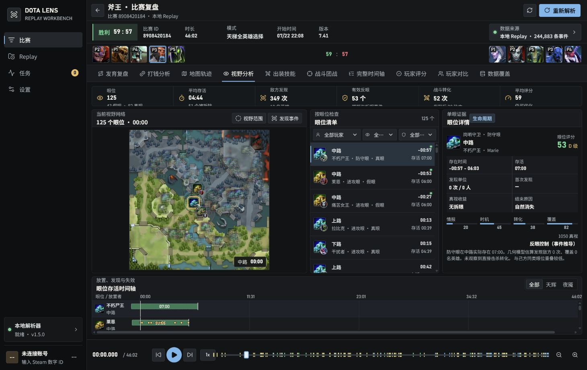

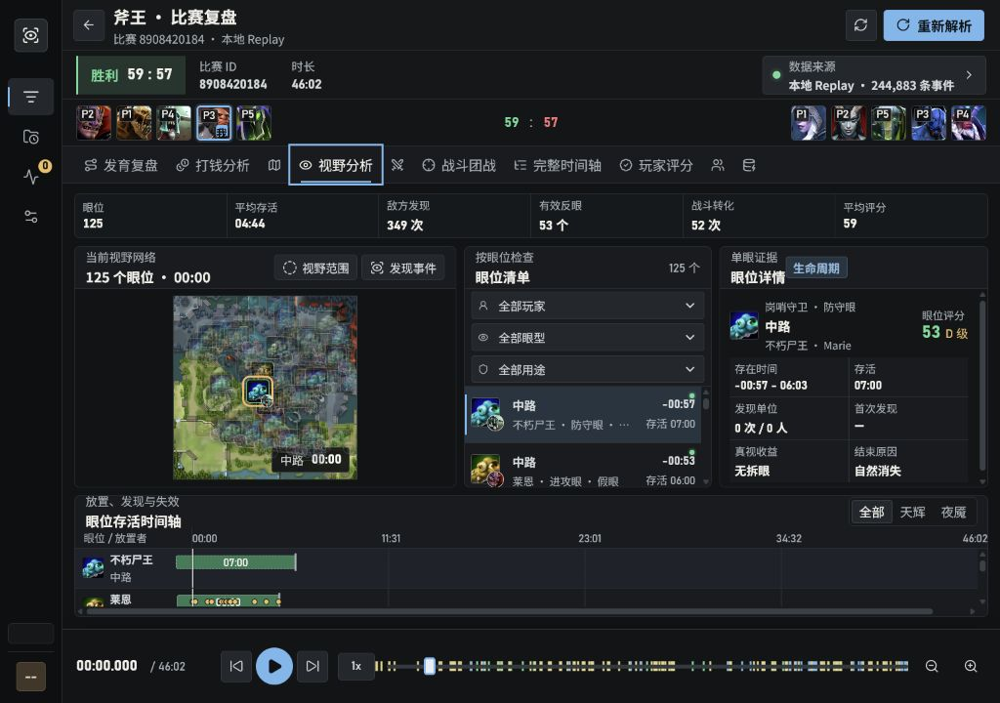

### 3.2 根因

1. 总览使用 6 列布局，但容器固定为 50px；低高度窗口又被压缩为 46px。
2. 每个指标实际包含“标题、主值、辅助说明”三层文本，50px 无法容纳。
3. 辅助说明使用单行省略，父容器又限制高度，导致以下内容不可见：
   - `43 假眼 · 82 真眼`
   - `51 个被拆除`
   - `10 名英雄`
4. 1024 宽窗口仍保留地图、眼位列表、眼位详情三列，单列宽度降至 254px 和 275px。
5. 眼位存活条把完整时间文字放在很短的条形内部，短眼位的 `00:05`、`00:17`、`00:39` 必然被裁切。
6. CSS 中存在先改为两列、后又被更晚规则覆盖为三列的情况，断点行为不统一。

### 3.3 目标布局

#### 1460px 及以上

```text
┌──────────────────────────────────────────────────────────────────────┐
│ 6 项视野总览，固定两行信息，最小高度 64px                            │
├──────────────────────────┬──────────────────┬────────────────────────┤
│ 地图 min 520px           │ 眼位清单 320px   │ 眼位详情 min 360px     │
│ 保持正方形               │ 筛选 + 列表      │ 评分 + 发现 + 生命周期 │
├──────────────────────────────────────────────────────────────────────┤
│ 眼位存活时间轴，可折叠，默认高度 150px                               │
└──────────────────────────────────────────────────────────────────────┘
```

#### 1024px 至 1279px

```text
┌──────────────────────────────────────────────────────────────────────┐
│ 6 项视野总览，仍显示主值与辅助说明，最小高度 64px                    │
├────────────────────────────────────┬─────────────────────────────────┤
│ 地图 min 520px                     │ 侧面板                           │
│                                    │ [眼位清单] [眼位详情] 两个页签   │
├──────────────────────────────────────────────────────────────────────┤
│ 可折叠时间轴，默认 128px                                             │
└──────────────────────────────────────────────────────────────────────┘
```

### 3.4 总览指标规格

总览不再使用三行堆叠，而改成两行结构：

| 指标 | 第一行 | 第二行 |
| --- | --- | --- |
| 眼位 | `眼位 125` | `43 假眼 · 82 真眼` |
| 平均存活 | `平均存活 04:44` | `51 个被拆除` |
| 敌方发现 | `敌方发现 349 次` | `10 名英雄` |
| 有效反眼 | `有效反眼 53 个` | 保留现有辅助说明 |
| 战斗转化 | `战斗转化 52 次` | 保留现有辅助说明 |
| 平均评分 | `平均评分 59` | 保留现有评分分布 |

规格要求：

- 总览最小高度 64px，禁止低高度窗口把它压缩到 46px。
- 标题 11px，主值 16px，辅助说明 11px，行高分别为 16/20/16px。
- 重要主值使用语义色，普通说明保持中性灰。
- 辅助说明不得使用不可恢复的裁切；空间不足时允许一行内紧凑排布。
- 1024px 仍显示六项辅助说明，不通过 `display:none` 隐藏。

### 3.5 眼位时间轴规格

- 左侧眼位拥有者和类型固定宽度 120px。
- 存活时间小于 45 秒时，不在条形内部绘制完整时间文字。
- 短条只显示颜色和结束标记，时间通过悬停提示、选中详情和时间轴顶部状态显示。
- 存活时间足够长时，条内显示 `07:00` 等持续时间。
- 当前选中眼位的时间条需要明显描边，并自动滚动到可视区域中部。
- 时间轴支持折叠为 42px 的全局密度条，释放地图高度。

### 3.6 视野页验收

- `125`、`43 假眼 · 82 真眼`、`04:44`、`51 个被拆除`、`349 次`、`10 名英雄` 在三档分辨率中均可直接看到。
- 1460 宽度下眼位详情不小于 360px。
- 1024 宽度下不再同时硬挤三个主面板。
- 眼位时间轴不再出现短时长文字被切成几个像素的问题。
- `.ward-summary-item`、`.ward-list-main` 的关键字段 DOM 溢出断言为 0。

## 4. P0 问题二：战斗团战

### 4.1 当前截图

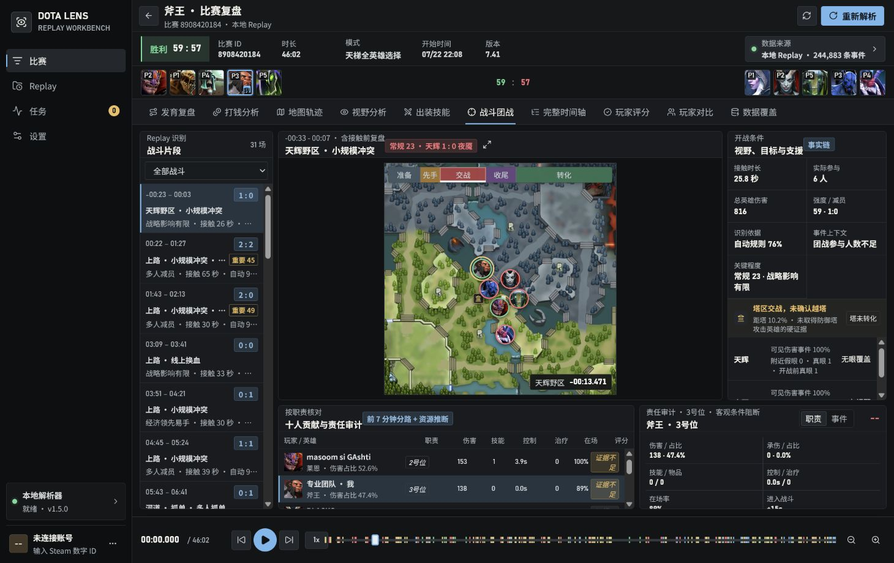

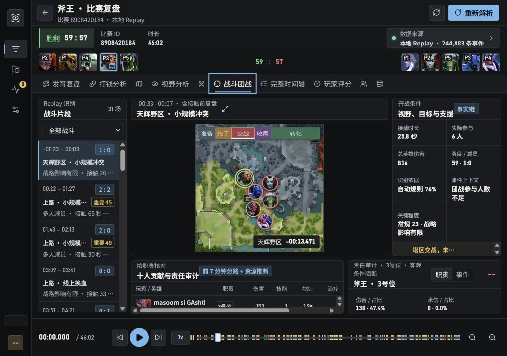

### 4.2 根因

1. 右侧“视野、目标与支援”被固定为 260px，1024 宽窗口下降到 220px。
2. 战斗列表固定为 218px，1024 宽窗口下降到 180px。
3. 列表标题只有约 132px 可用空间，`上路 · 小规模冲突 · TP 支援 / 高强度` 等文字被截断。
4. 低高度窗口把底部贡献和责任面板压到 110px，贡献表出现横向滚动。
5. 右侧信息同时承载开战条件、视野、目标、支援和上下文，多模块共享一个窄列。

### 4.3 目标布局

#### 1460px 及以上

```text
┌──────────────┬───────────────────────────────────┬────────────────────┐
│ 战斗列表     │ 主战场地图                        │ 战斗上下文          │
│ 248-260px    │ min 560px                         │ min 340px           │
│ 标题最多两行 │                                   │ 视野/目标/支援      │
├──────────────┴──────────────────────┬────────────┴────────────────────┤
│ 十人贡献与职责审计 min 520px       │ 个人责任/技能/事件 min 360px    │
└─────────────────────────────────────┴─────────────────────────────────┘
```

#### 1024px 至 1179px

```text
┌────────────┬─────────────────────────────────────────────────────────┐
│ 战斗列表   │ 主战场地图                                              │
│ 200-220px  ├─────────────────────────────────────────────────────────┤
│            │ [战斗概览] [视野目标] [十人贡献] [个人责任] [事件]      │
│            │ 单面板页签，不再保留 220px 右侧窄栏                     │
└────────────┴─────────────────────────────────────────────────────────┘
```

### 4.4 面板规格

#### 战斗列表

- 桌面宽度 248px 至 260px，紧凑窗口宽度 200px 至 220px。
- 战斗名称允许最多两行，行高 17px。
- 时间、比分、重要性保持单独列，不与标题抢宽度。
- 第二行只保留“结果、接触时长、置信度”三个字段。
- 选中某场战斗后，列表继续保持自动滚动并让选中项居中。

#### 地图

- 1460 宽度下地图面板不小于 560px。
- 地图保持正方形内容区，面板多出的空间用于阶段条和地图工具。
- 放大地图时，战斗上下文与底部详情暂时折叠，并提供明确的返回按钮。

#### 战斗上下文

- 桌面最小宽度 340px，推荐 360px。
- “开战条件、视野、目标、支援”改为面板内页签或折叠组。
- 关键结论可以换两行，禁止用省略号隐藏完整判断。
- 数值标题 11px、主值 14px、正文 12px、辅助说明 11px。

#### 底部贡献区

- 高度不得低于 190px。
- 十人贡献表主列保持固定，次要列允许横向滚动。
- 个人责任、技能伤害和事件流改为同一区域内的页签。
- 1024 宽窗口下，底部只显示一个详情页签，不并排压缩为 110px 高。

### 4.5 战斗页验收

- 1460 宽度下右侧上下文面板不小于 340px。
- 1024 宽度下不存在 220px 的右侧信息栏。
- 战斗类型、TP 支援、持续追击等完整标题可通过两行直接阅读。
- 贡献表在默认视图中不出现面板级横向溢出。
- 所有重要判断不依赖省略号才能维持布局。

## 5. 共用外壳优化

### 5.1 左侧导航伸缩

现状：

- 默认宽度 216px。
- 小于 1280px 时自动变成 64px。
- 没有用户主动伸缩入口，也不保存用户偏好。

需求：

- 展开宽度：216px。
- 收起宽度：64px。
- 在品牌区域右侧增加折叠图标按钮，收起后按钮保留并提供悬停说明。
- 用户选择写入本地设置，切换页面和重启应用后保持。
- 1280px 及以上首次使用默认展开，之后尊重用户选择。
- 1024px 至 1279px 首次使用默认收起；用户展开时采用覆盖式侧栏，不挤压主内容。
- 侧栏动画时长 160ms 至 200ms，并支持系统“减少动态效果”设置。
- 收起状态下导航图标、任务数量、解析器状态灯和账号头像必须保留。

收起后可为主页面释放 `216 - 64 = 152px`，优先分配给地图和右侧分析面板。

### 5.2 单场顶部比赛摘要

当前共同区域截图可参考任意详情页：

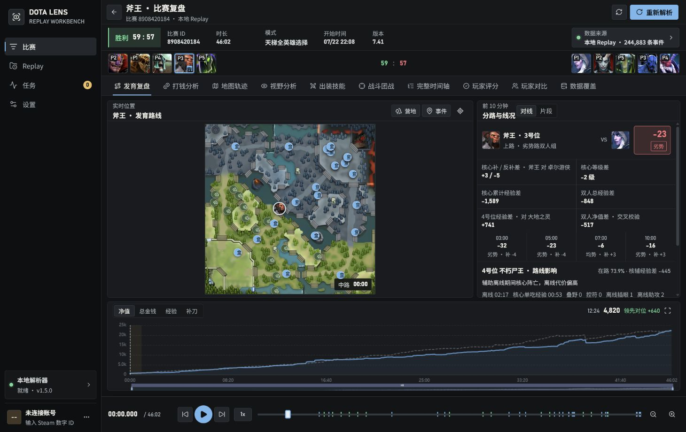

目标规格：

| 元素 | 当前主要问题 | 新规格 |
| --- | --- | --- |
| 胜负与比分 | 视觉权重略高 | 标签 12px、比分 15px，结果区宽 104px |
| 比赛 ID | 可保留 | 标签 10px、值 12px |
| 时长 | 可保留 | 标签 10px、值 12px |
| 模式 | 文本较长 | 标签 10px、值 12px，最大宽度 150px |
| 开始时间 | 小窗口直接消失 | 标签 10px、值 12px；紧凑模式进入“更多信息” |
| 版本 | 小窗口直接消失 | 标签 10px、值 12px；紧凑模式进入“更多信息” |
| 数据来源 | 占宽较多 | 桌面 188px；紧凑模式只显示状态灯和“本地 Replay” |

布局要求：

- 1180px 及以上单行高度 52px。
- 1024px 至 1179px 高度 46px，只保留结果、比赛 ID、时长、模式和来源。
- 被收起的开始时间和版本必须能从“更多信息”弹层查看，不能无提示消失。
- 顶部信息字体可以缩小，但详情正文和数据表不得跟随缩小。

### 5.3 详情页签

- 页签文字 12px，图标 14px，高度 38px。
- 1460px 及以上显示全部图标和文字。
- 1024px 至 1279px 允许水平滚动或使用“更多”菜单，不再零散隐藏两个页签文字。
- 当前页签必须始终可见并自动滚动到视口中。
- 图标按钮提供悬停说明。

## 6. 字体与颜色规范

### 6.1 字体层级

| 角色 | 字号/行高 | 使用位置 |
| --- | --- | --- |
| 页面标题 | 18/24px | 一级页面、单场标题 |
| 模块标题 | 14/20px | 面板标题 |
| 大型关键数值 | 18/22px | 比分、总评分、关键总览 |
| 常规关键数值 | 15-16/20px | 眼位数、平均存活、战斗数值 |
| 正文 | 12/18px | 分析说明、表格主体 |
| 控件文字 | 12/16px | 页签、按钮、筛选器 |
| 辅助说明 | 11/16px | 时间、来源、置信度、单位 |
| 图表坐标 | 11/14px | 坐标轴和极短标签 |

约束：

- 除图表刻度外，不新增小于 11px 的可见文字。
- 不使用视口宽度动态缩放字体。
- 重要文字不使用 `overflow:hidden` 作为默认布局手段。
- 允许省略的内容必须同时具备悬停全文或详情入口。
- 中文正文保持 1.45 至 1.55 行高。

### 6.2 重要数据颜色

| 语义 | 用途 |
| --- | --- |
| 绿色 | 胜利、通过、正收益、有效视野 |
| 红色 | 失败、风险、明显失误、被拆除 |
| 琥珀色 | 需要复核、证据不足、关键时间节点 |
| 蓝色 | 当前选中、信息、程序推导 |
| 中性灰 | 普通标签、单位、辅助说明 |

同一模块最多使用一个主强调色和一个风险色，避免所有数值同时高亮。

## 7. 逐页模块分布审查

### 7.1 比赛列表

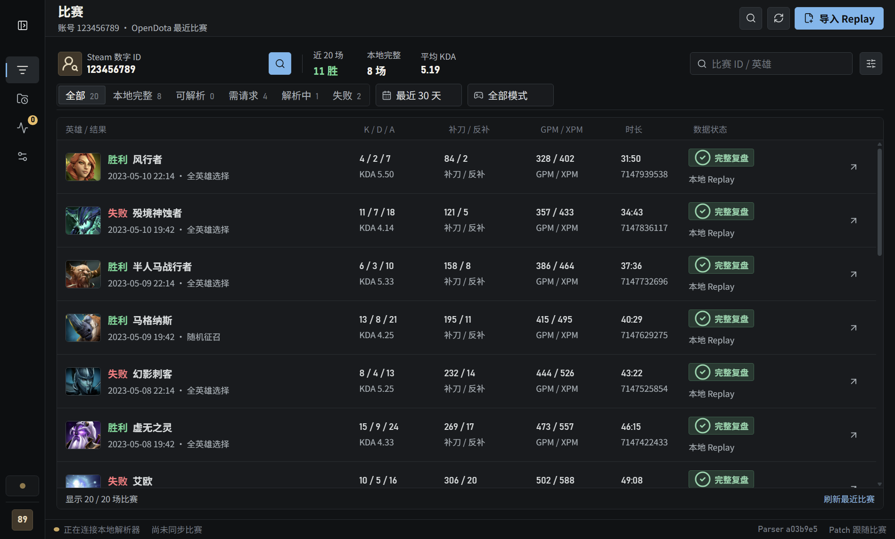

实测结果：

- 已成功读取匿名测试账号的 20 场比赛。
- 补刀和反补均可显示。
- 1280 x 800 未检测到文本裁切。

改造要求：

- 接入可伸缩侧栏。
- 保持表格主体 12px、辅助说明 11px。
- 小窗口出现横向滚动时固定“英雄/结果”首列和操作末列。
- 不改变当前比赛状态颜色和点击进入复盘流程。

### 7.2 Replay 库

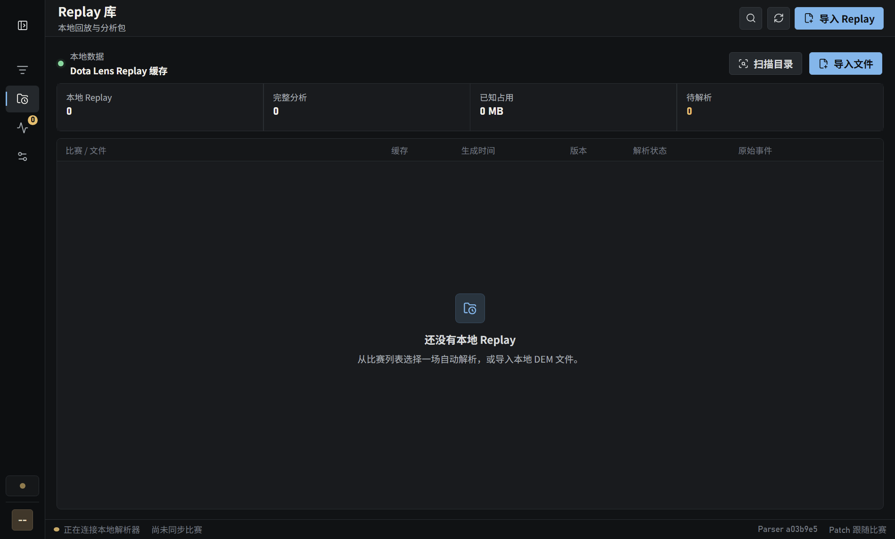

实测结果：未检测到裁切。

改造要求：

- 仅接入字体令牌与侧栏伸缩。
- 文件名允许两行，路径使用单行省略并提供完整悬停提示。
- 文件列表保持表头固定。

### 7.3 解析任务

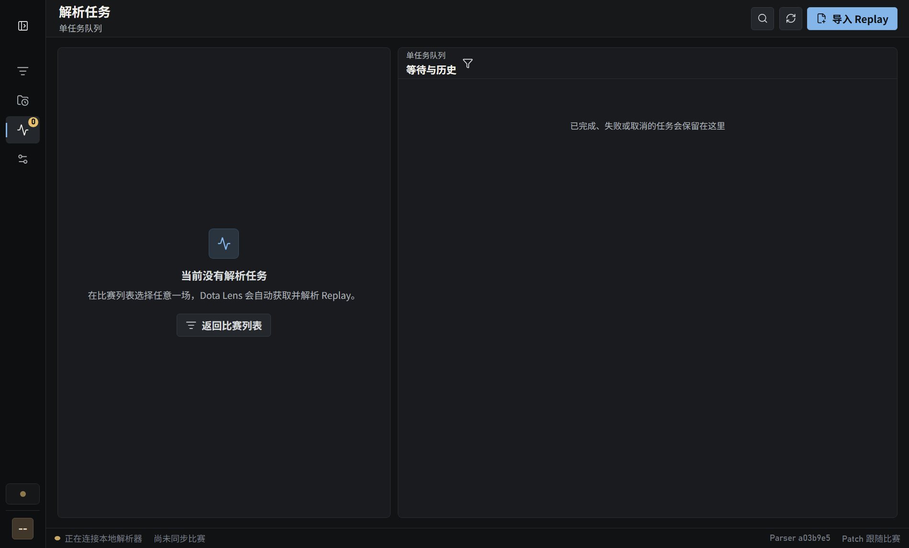

实测结果：未检测到裁切。

改造要求：

- 任务列表和任务详情的宽度比例保持约 36/64。
- 错误原因允许多行，取消、重试、打开报告按钮不能被压缩。
- 接入统一 12px 正文和 11px 辅助说明。

### 7.4 设置

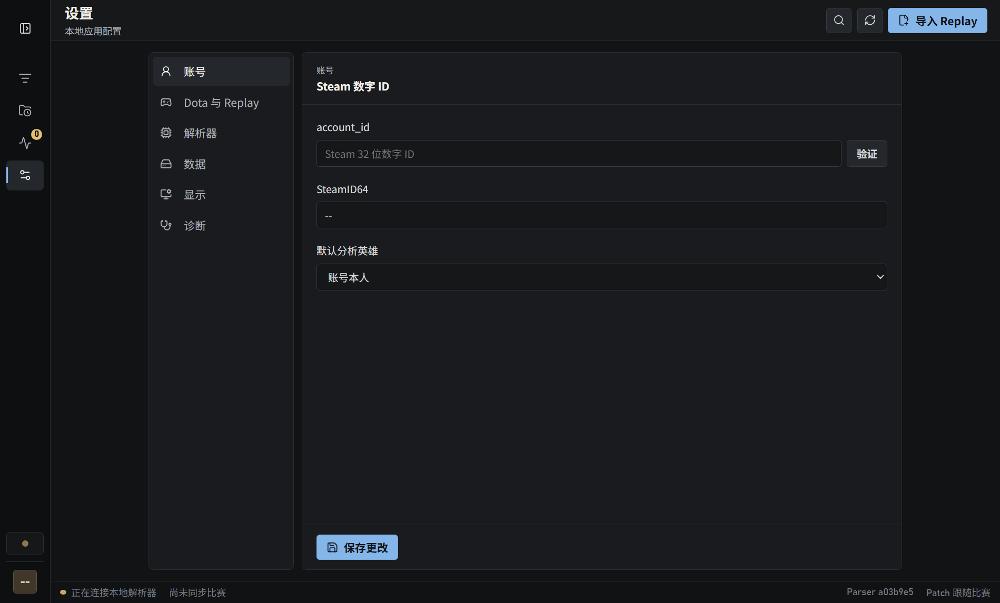

实测结果：未检测到裁切。

改造要求：

- 设置子导航桌面最小 180px。
- 小窗口可切换为顶部页签。
- 路径输入和选择文件夹按钮保持同一行，错误说明在下一行完整展示。

### 7.5 发育复盘


实测结果：

- 桌面地图/对线判断为 779/433px，曲线高 190px。
- 1024 宽度为 534/394px，未检测到裁切。

改造要求：

- 保持地图和对线判断约 64/36 分配。
- 曲线高度不低于 180px。
- 对线结论正文使用 12px，不随顶部摘要缩小。
- 只应用共用字体、颜色和侧栏规则。

### 7.6 打钱分析

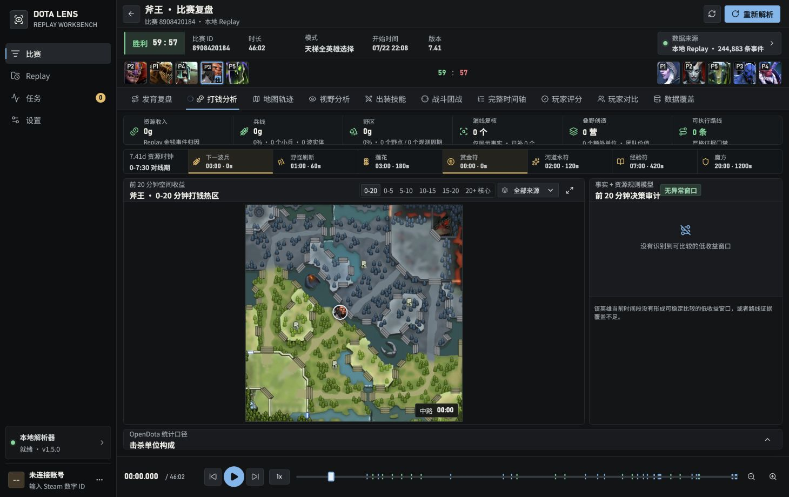

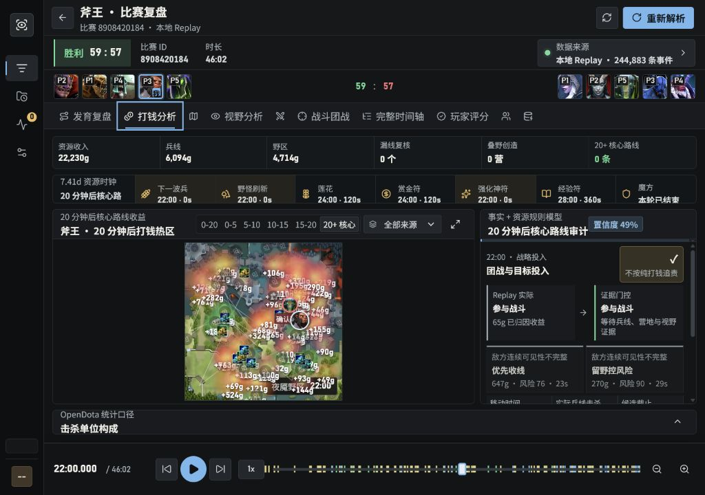

实测问题：

- 总览高 54px，辅助说明发生纵向溢出。
- 逐单位统计栏高 38px，也存在纵向溢出。
- 诊断为空时仍固定占用 358px。

改造要求：

- 总览最小高度 64px，使用与视野总览相同的两行指标结构。
- 资源刷新时钟高度不低于 46px，小窗口允许横向滚动。
- 诊断有内容时地图/诊断约 70/30；无内容时地图自动扩展，空状态改为窄提示栏。
- 逐单位统计折叠标题高度不低于 44px。
- 1024 宽窗口下诊断作为右侧抽屉或地图下方页签。

### 7.7 地图轨迹

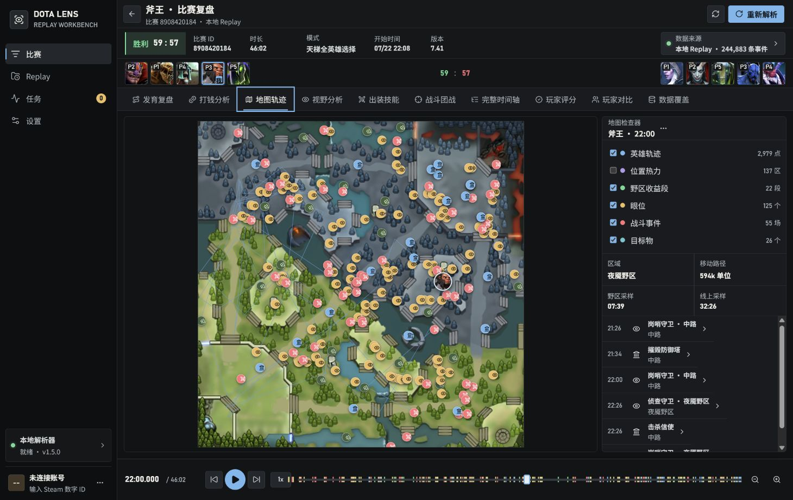

实测结果：

- 地图 872px，检查器 340px。
- 未检测到文字裁切。

改造要求：

- 保持地图主导，桌面检查器最小 320px、推荐 340px。
- 1024 宽窗口下检查器可折叠为右侧抽屉。
- 图层开关不覆盖地图；大量标记时提供密度筛选，不通过缩小图标文字解决。

### 7.8 出装技能

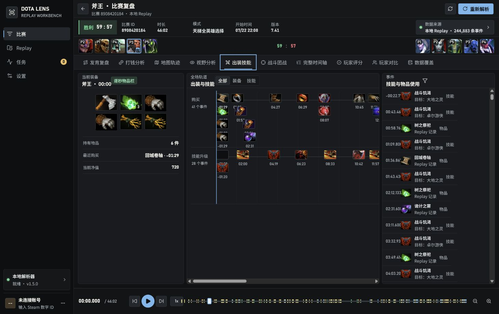

实测结果：

- 当前装备/出装轨道/事件为 310/564/330px。
- 桌面未检测到文字裁切。
- 现有小窗口规则会直接隐藏事件面板。

改造要求：

- 小窗口不得无入口隐藏事件面板，改为“出装轨道/使用事件”页签。
- 中间轨道保持横向滚动，左侧时间标签固定。
- 装备与技能名称 12px，时间 11px，图标不低于 28px。

### 7.9 完整时间轴

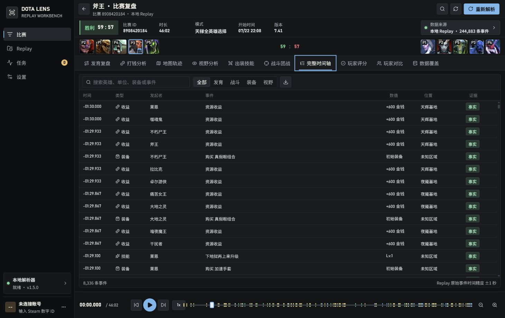

实测结果：未检测到裁切。

改造要求：

- 保持全宽表格。
- 表头固定，时间和类型列固定。
- 主体 12px、时间与证据标签 11px。
- 1024 宽窗口允许表格内部横向滚动，不压缩列到不可读。

### 7.10 玩家评分

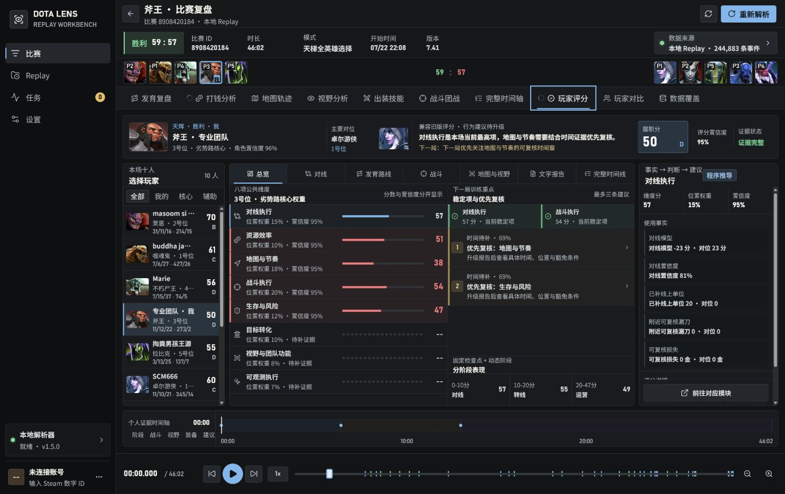

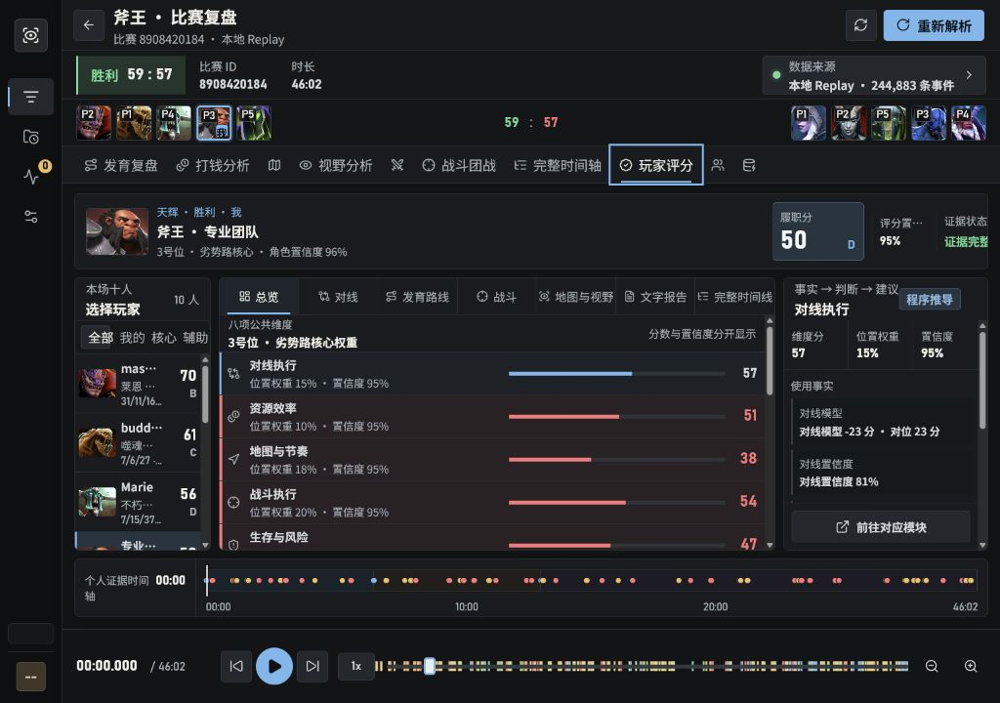

实测问题：

- 桌面玩家列表/主区/证据栏为 190/754/260px。
- 玩家名、英雄和位置说明共 8 项截断。
- 1024 宽窗口变为 140/570/210px，页头横向溢出并出现至少 30 项截断。

目标布局：

- 1460 宽度：玩家列表 210px、主区自适应、证据栏 310px 至 330px。
- 1024 至 1179px：玩家列表改为 56px 英雄头像轨道，证据栏改为可打开的 320px 抽屉。
- 页头小窗口改为两行，优先保留玩家身份、总评分、结论和下一局重点。
- 玩家列表中玩家名允许两行；英雄、位置和 KDA 使用独立的辅助行。
- 证据栏正文 12px，禁止为了保持三列而缩成 210px。
- 报告模块页签支持横向滚动，当前页签始终可见。

### 7.11 玩家对比

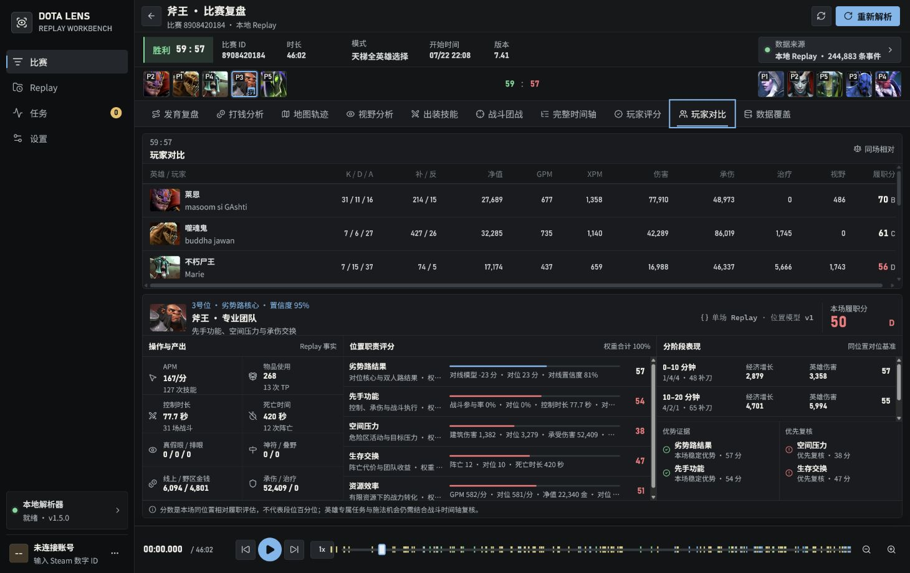

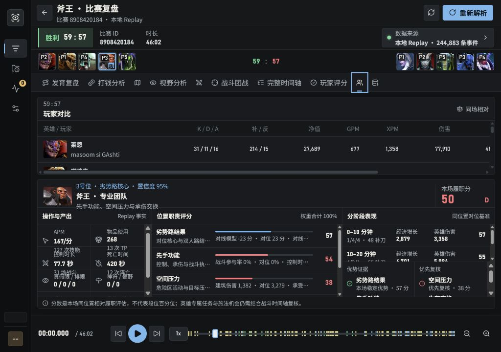

实测问题：

- 桌面有 8 项评分说明或证据文本截断。
- 1024 宽窗口有 11 项截断，包含线上/野区金钱等数值。
- 当前比分表高 250px，只能同时看到少量玩家。

改造要求：

- 比分表桌面高度 290px 至 320px，保持内部滚动。
- 首列英雄/玩家固定，数据列允许横向滚动。
- 位置职责说明允许两行，不再强制压为 154px 单行。
- 低于 1280px 时，下方报告改为“基础数据、位置评分、阶段表现、优缺点”四个页签。
- 数值 12px 至 13px，说明 11px 至 12px。

### 7.12 数据覆盖

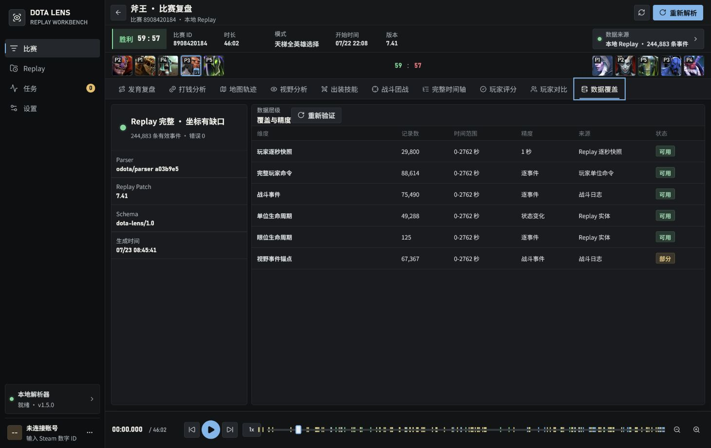

实测结果：未检测到裁切。

改造要求：

- 桌面保持摘要 + 表格结构。
- 小于 1180px 时摘要改成顶部横向元数据条，表格使用全宽。
- 减少左侧摘要下方无意义空白，但不影响覆盖状态辨识。

## 8. 响应式分布矩阵

| 可用宽度 | 侧栏 | 高密度页面策略 | 顶部摘要 |
| --- | --- | --- | --- |
| 1440px 及以上 | 默认 216px，可收至 64px | 允许地图 + 列表 + 详情三列 | 全字段单行 |
| 1280-1439px | 默认 64px，可展开 | 三列仅在满足最小宽度时保留 | 全字段或紧凑单行 |
| 1180-1279px | 默认 64px | 地图 + 页签侧面板两列 | 紧凑单行 |
| 1024-1179px | 64px，展开时覆盖 | 主工作区 + 抽屉/页签，不并排三个窄栏 | 核心字段 + 更多信息 |
| 小于 1024px | 桌面应用不作为主支持范围 | 显示最小窗口提示 | 不继续压缩字体 |

## 9. 实施范围

### 9.1 预计修改文件

| 文件 | 修改内容 |
| --- | --- |
| `styles.css` | 字体令牌、侧栏状态、详情摘要、页面网格、断点和溢出规则 |
| `index.html` | 侧栏折叠按钮、紧凑信息入口、视野/战斗/玩家评分的页签容器 |
| `app.js` | 侧栏状态持久化、抽屉和页签状态、选中项自动定位、紧凑模式信息展示 |
| 前端测试 | DOM 溢出断言、关键字段可见性、响应式截图 |

### 9.2 实施阶段

#### 阶段 A：P0 共用外壳

- 建立字体和间距令牌。
- 增加侧栏手动折叠和持久化。
- 压缩顶部比赛摘要。
- 统一 1024/1180/1280/1440 断点，清理相互覆盖的规则。

#### 阶段 B：P0 高密度页面

- 重做视野总览、窄窗两列模式和眼位时间轴标签。
- 重做战斗右侧上下文、列表宽度和窄窗页签模式。
- 调整玩家评分页头、玩家列表和证据抽屉。

#### 阶段 C：P1 页面

- 修复打钱总览和逐单位栏溢出。
- 优化玩家对比表和下方报告分布。
- 为出装技能小窗口补充事件页签。

#### 阶段 D：P2 与回归

- 接入其余页面字体令牌。
- 优化地图、完整时间轴、数据覆盖和一级页面。
- 完成四档截图和自动溢出测试。

## 10. 验收标准

### 10.1 功能验收

- 左侧导航可手动展开和收起，重启后保持状态。
- 窄窗口展开侧栏时不挤压主工作区。
- 所有原有页面、筛选、时间跳转、地图交互和报告入口保持可用。
- 战斗选择后仍自动将当前战斗滚动到列表中部。

### 10.2 视觉验收

- 1024 x 720、1280 x 800、1460 x 920、1920 x 1080 均生成基准截图。
- 页面主体不存在横向溢出；允许滚动的表格和时间轴除外。
- 视野总览所有主值和辅助说明完整显示。
- 战斗右侧上下文在桌面不小于 340px。
- 玩家评分证据栏在桌面不小于 310px，窄窗口改用抽屉。
- 顶部比赛摘要在 1180px 以上保持单行。
- 正文不小于 12px，辅助说明不小于 11px。

### 10.3 自动化断言

以下关键区域的可见元素需要满足：

```text
scrollWidth <= clientWidth + 1
scrollHeight <= clientHeight + 1
```

例外必须登记在白名单中，仅允许：

- 明确设计为横向滚动的表格。
- 出装轨道和完整时间轴。
- 可滚动的战斗、眼位和玩家列表容器。

重点检测选择器：

- `.ward-summary-item`
- `.ward-list-main`
- `.combat-row-title`
- `.combat-vision-panel`
- `.combat-contribution-panel`
- `.player-score-header`
- `.player-score-roster-row`
- `.player-score-evidence-panel`
- `.player-report-dimension`
- `.farm-summary-item`

## 11. 非本期范围

- 不修改 Replay 解析逻辑。
- 不修改战斗识别、视野评分、打钱路线和玩家评分算法。
- 不重做地图坐标换算。
- 不改变比赛数据字段。
- 不在本期增加新的分析模块。

本期只处理布局、字体、颜色、模块分布、可读性与响应式交互。

## 12. 评审建议

建议按以下顺序评审：

1. 确认侧栏 216/64px 与窄窗覆盖式展开方案。
2. 确认视野总览两行信息结构和窄窗“列表/详情”页签。
3. 确认战斗窄窗改为主地图 + 单详情页签，不保留 220px 右栏。
4. 确认玩家评分窄窗使用头像轨道和证据抽屉。
5. 确认字体层级，尤其是正文 12px、辅助 11px、顶部元数据 10/12px。
6. 评审通过后按阶段 A、B、C、D 实施。
