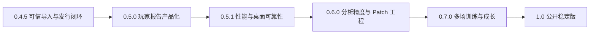

# Dota Lens 历史 PRD 总审计与统一开发路线图

> 审计日期：2026-07-26  
> 审计对象：本地工作区、历史产品 PRD、专题规则文档、实施计划、发行报告和当前自动化测试  
> 本地分支：`codex/trusted-replay-import-0.4.5`  
> 本地 HEAD：`f00520f`  
> 当前源码版本：桌面端 `0.4.5`、本地 API `1.6.0`  
> 当前报告协议：`player-report/3.0`  
> 文档目的：建立唯一的项目现状、需求继承关系和后续开发顺序，避免继续按过时 PRD 或未回填的计划重复开发。

## 1. 结论摘要

Dota Lens 已经完成了从早期“Web/小程序 + 云端服务”设想向“Windows 桌面端 + 本地 Replay 解析”的产品转型。当前真正成立的产品主线是：

> 用户输入 Steam 数字 ID 查看比赛；可以从比赛列表下载 Replay，也可以手动导入 `.dem` 或 `.dem.bz2`；本地 Parser 解析完整 Replay；用户选择本场玩家后，在十个单场模块中查看事实、推导、评分和可回放证据。

0.4.5 的本地工程基线已经通过，但按当前决定没有发布到 Git。更准确的阶段判断是：

| 层级 | 当前判断 |
| --- | --- |
| 公开发行版 | GitHub 公开主线和标签仍停在 `0.4.2` |
| 本地安装包 | `Dota-Lens-Setup-0.4.5-x64.exe` 已完成全流程验收 |
| 当前源码 | `0.4.5` 本地工程基线通过，仍保留未提交的 0.5.0 预览内容 |
| 当前开发内容 | 同时混入了 `0.5.0` 的玩家报告定位、战斗时机和十人贡献图表 |
| 0.5.0 玩家报告 | 已完成可定位纵向链路和战斗时机第一阶段，但 `player-report/4.0`、完整评分链和 15 场回归未完成 |
| 0.6.0 精度工程 | 多 Patch、连续可见性、兵线/营地生命周期、职责门禁已完成第一版，尚未完成跨 Patch 真值验收 |
| 0.7.0 多场训练 | 尚未开始 |
| 1.0 公开稳定版 | 尚未达到签名、更新、迁移、崩溃恢复和 Windows 兼容门槛 |

因此，推荐的统一顺序是：

1. 保留已通过的 `0.4.5` 本地工程基线，Git 发布延后。
2. 继续完成 `0.5.0` 玩家报告产品化。
3. 然后做 `0.5.1` JSON、首屏、任务与桌面可靠性。
4. 再进入 `0.6.0` 战斗、打钱、视野、地图和 Patch 精度。
5. 最后建设 `0.7.0` 多场训练和 `1.0` 稳定发行能力。

## 2. 审计口径

### 2.1 状态定义

| 状态 | 定义 |
| --- | --- |
| 已发布 | 已进入公开仓库和正式安装包，并完成对应发行验收 |
| 已实现并验证 | 当前源码存在，且有自动测试或真实 Replay 验证；不代表已公开发布 |
| 部分完成 | 主体已存在，但关键数据、精度、样本或产品闭环仍缺失 |
| 仅有方案 | 只有 PRD、设计或实施计划，当前代码没有形成完整交付 |
| 已替代 | 新文档或新实现已覆盖旧规则 |
| 已取消 | 产品已明确不再开发 |

### 2.2 完成判定原则

一项需求只有同时满足以下证据，才允许写“完成”：

1. 当前代码存在。
2. 自动测试通过。
3. 至少一个真实 Replay 验证通过。
4. 用户可从正式界面进入。
5. 若属于桌面发行能力，当前版本 EXE 完成安装、启动、运行、冷重启和卸载冒烟。

只写在 PRD、计划勾选完成、浏览器开发模式可见或旧版本曾经通过，都不能自动等同于当前版本已发布。

## 3. 产品方向的最终继承关系

### 3.1 产品形态

| 历史方向 | 当前处理 |
| --- | --- |
| Web 或小程序消费端 | 已延期，不属于当前产品主线 |
| Windows 本地解析助手 | 已升级为完整 Windows 桌面客户端 |
| 轻量云端 API、对象存储 | 当前不建设，保留为未来可选能力 |
| OpenDota 作为深度分析来源 | 已替代；OpenDota 只负责比赛列表、基础元数据和可用 Replay 信息 |
| 本地 Replay 作为完整事实源 | 当前主线 |
| 浏览器 `127.0.0.1` 页面 | 只用于研发调试，不是交付产品 |

### 3.2 当前产品边界

当前应继续坚持：

- 本地优先、离线可用、用户数据默认不上传。
- Replay 是单场深度分析事实源。
- OpenDota 故障不影响本地 Replay、已有报告和 Replay 库。
- 事实、程序推导、模型估算和缺失数据必须分开展示。
- 所有明确结论都应能跳转到时间、位置和事件。
- 缺少关键证据时降级，不使用前端造数或“看起来合理”的默认值。

当前明确不做：

- 比赛进行中的实时提示。
- 自动操作 Dota 2。
- 社区、好友、战队、付费和内容发布。
- 全量复制 OpenDota 的英雄统计、排行榜和职业比赛产品。
- 把机器学习输出直接当作事实。
- 在没有战争迷雾、资源生命周期或技能可用性证据时给确定负面结论。

## 4. 历史文档总览与权威级别

### 4.1 基础产品与桌面端

| 文档 | 原作用 | 当前权威级别 | 处理方式 |
| --- | --- | --- | --- |
| `POC-REPLAY-PARSER.md` | 验证普通解析入口和原始 JSONL 技术路线 | 历史技术依据 | 保留，不再表示当前产品状态 |
| `PRD.md` | v0.1 MVP 总纲 | 产品愿景依据 | 产品形态和旧里程碑已被桌面路线替代 |
| `DESKTOP-FRONTEND-PRD.md` | Windows 桌面信息架构和页面规范 | 桌面 IA 基线 | 保留四个一级入口和工作台原则；旧字号、页签数量和便携 EXE 表述由后续文档覆盖 |
| `DOTA-LENS-ANALYSIS-MODULES-PRD.md` | 单场模块、数据契约、降级和质量标准 | 分析契约基线 | 保留事实优先、统一时间/坐标、Patch 和降级矩阵；旧版本号和旧规则不作为现状 |
| `DOTA-LENS-LAYOUT-TYPOGRAPHY-OPTIMIZATION-PRD.md` | 字体、侧栏、视野、战斗和玩家评分布局审计 | 布局验收参考 | 与当前代码和最新布局测试联合使用，不能单独代表未实施 |

### 4.2 战斗、打钱、视野和地图

| 文档 | 原作用 | 当前权威级别 | 处理方式 |
| --- | --- | --- | --- |
| `FARM-TEAMFIGHT-ANALYSIS-SPEC.md` | 早期打钱、团战和机制规格 | 历史规则 | 旧固定阶段和旧路线算法已替代 |
| `DOTA-LENS-COMBAT-FARM-JUDGMENT-LOGIC.md` | 0.4.0 程序逻辑快照 | 历史实现说明 | 用于理解旧问题，不作为最终规则 |
| `DOTA-LENS-COMBAT-FARM-RESEARCH-DECISIONS.md` | 回答战斗、责任和打钱待决问题 | 当前语义裁决 | 作为战斗和打钱规则的主要产品依据 |
| `DOTA-LENS-COMBAT-FARM-OPTIMIZATION-PLAN.md` | 将研究结论转为分阶段实施 | 当前专题实施依据 | 第 15、16 节覆盖更早状态 |
| `AUTOMATIC-COMBAT-EVENT-RECOGNITION-PLAN.md` | 自动识别、弱监督和学习边界 | 学习方案依据 | 保留硬门槛优先和无真值不宣称准确率原则 |
| `DOTA-LENS-OPTIMIZATION-ROADMAP.md` | 全模块依赖和落地记录 | 当前模块历史总账 | 第 22 至 25 节为最新状态；更早章节只作历史 |

### 4.3 玩家报告

| 文档 | 协议/目标 | 当前处理 |
| --- | --- | --- |
| `DOTA-LENS-PLAYER-REPORT-PRD.md` | `player-report/1.x`、五项职责 | 历史起点 |
| `DOTA-LENS-PLAYER-ANALYSIS-REPORT-PRD.md` | `player-report/2.0`、八维报告 | 未成为稳定实现基线，已由 V3 替代 |
| `DOTA-LENS-PLAYER-ANALYSIS-REPORT-V3-PRD.md` | `player-report/3.0`、比赛简报/深度分析、10 维和五位置 | 当前实现基线 |
| `DOTA-LENS-0.5.0-PLAYER-REPORT-PRODUCTIZATION-PRD.md` | 建议 `player-report/4.0`、完整评分链和事件定位 | 当前目标 PRD，尚未完成 |
| `2026-07-25-player-report-event-localization.md` | 结论定位、复盘条和返回上下文 | 已实施专题 |
| `2026-07-25-combat-timing-behavior-diagnostics*` | 空间到场、首次行动和行为模式 | 已实施第一阶段 |
| `2026-07-25-combat-contribution-chart-drilldown*` | 十人镜像图、当前/全场和五维雷达 | 当前源码已实现主体，但计划勾选状态未回填 |

### 4.4 版本审计与发行文档

| 文档 | 当前用途 |
| --- | --- |
| `DOTA-LENS-0.4.0-EVALUATION-REPORT.md` | 历史阶段基线，证明早期主链路和第一版战斗事实成立 |
| `DOTA-LENS-0.4.2-PRODUCT-AUDIT-AND-NEXT-ROADMAP.md` | 当前最完整的整体审计基线 |
| `DOTA-LENS-0.4.3-EXE-SMOKE-REPORT.md` | 当前最后一份完整 EXE 安装到卸载验收证据 |
| `docs/releases/v0.4.2.md`、`v0.4.3.md` | 版本发布说明 |
| `CHANGELOG.md` | 源码版本变更总账 |
| 本文 | 从 2026-07-26 起的统一现状和版本路线总控文档 |

## 5. 已废弃、已取消和不得恢复的需求

以下内容不应再次进入开发计划：

1. 人工标注页面和面向用户的标注工作流。
2. 用人工标签直接覆盖程序分类。
3. 旧版“20 秒死亡聚类就是团战”。
4. 只按战斗半径把附近玩家算作参战。
5. 固定核心/辅助两类责任公式。
6. `combat_or_idle` 把未知空窗直接称为梦游。
7. 低收入窗口直接判定玩家低效。
8. 未知敌人固定加风险分、在野区固定减风险分等常量捷径。
9. 缺少兵线、营地、视野或路线证据时输出“固定多赚 X 金”。
10. 隐藏敌人离开视野后继续使用其真实 Replay 坐标给建议。
11. 每场团战都要求辅助插真眼。
12. 证据不足时输出“技能没交”“应该 TP”“一定安全”。
13. 已取消的战斗页面 A2 重排方案；当前保留原版地图优先布局和已实现的十人图表。
14. 未接真实行为的假设置。

人工真值仍可用于内部固定 Replay 验收，但不恢复产品标注页。

## 6. 当前工程与发行事实

### 6.1 版本状态

| 项目 | 当前事实 | 判定 |
| --- | --- | --- |
| GitHub 公开主线 | 最新公开提交为 `5c5f126`，公开发行标签为 `v0.4.2` | 公开用户仍处于 0.4.2 |
| 本地分支 | `codex/trusted-replay-import-0.4.5` | 开发分支 |
| 本地 HEAD | `f00520f` | 仅包含专题设计提交，主体实现仍在工作区 |
| `package.json` | `0.4.5` | 源码版本 |
| Parser API | `1.6.0` | 与 0.4.5 前端检查一致 |
| 摘要协议 | `dota-lens/1.0` | 当前实现 |
| 产品模块协议 | `product-modules/2.10` | 当前实现 |
| 玩家报告协议 | `player-report/3.0` | 尚未升级 4.0 |
| 定位协议 | `player-report-localization/1.0` | 已实现 |
| 战斗时机协议 | `player-combat-timing/1.0` | 已实现第一阶段 |
| 最新本地安装包 | `Dota-Lens-Setup-0.4.5-x64.exe` | 本地 EXE 全流程验收通过，尚未发布 |

### 6.2 工作区状态

- 当前有 `65` 条 Git 工作区状态记录。
- 已跟踪文件差异涉及 `24` 个文件，约 `5,274` 行新增、`385` 行删除。
- 另有新的前端模块、测试、Parser 类、专题文档和宣传素材未跟踪。
- 当前不能把工作区直接称为可发布分支，也不适合继续混入新的大功能。

### 6.3 本轮自动验证

2026-07-26 本轮实际执行结果：

| 验证 | 结果 |
| --- | --- |
| 前端测试 | `65/65` 通过 |
| 桌面端测试 | `3/3` 通过 |
| Parser 测试 | `127/127` 通过，真实 Replay 离线 E2E 未跳过 |
| Vite 生产构建 | 通过 |
| 最终 `.dem` EXE 冒烟 | `26/26` 通过 |
| 最终 `.dem.bz2` EXE 冒烟 | `26/26` 通过 |
| 最终 EXE 布局矩阵 | `9/9` 通过 |
| Git diff 检查 | 无空白错误；只有 LF/CRLF 提示 |

构建仍有两个性能告警：

- 主应用 JS：`564.51 kB`，gzip `172.74 kB`。
- 图表运行时 JS：`586.97 kB`，gzip `197.44 kB`。

### 6.4 当前版本剩余发行事项

- 本地安装包、真实 Replay、错误 Match ID、冷重启、卸载和布局矩阵已经通过。
- 按用户决定，本轮不整理公开提交、不推送、不打标签、不创建 GitHub Release。
- 商业代码签名、正式图标、自动更新、回滚和更完整的 Windows/DPI 矩阵仍未完成。

## 7. 当前产品信息架构

### 7.1 一级页面

当前四个一级入口符合桌面产品方向：

1. 比赛
2. Replay
3. 任务
4. 设置

### 7.2 单场详情

当前源码实际有十个单场页签：

1. 发育复盘
2. 打钱分析
3. 地图轨迹
4. 视野分析
5. 出装技能
6. 战斗团战
7. 完整时间轴
8. 玩家评分
9. 玩家对比
10. 数据覆盖

历史文档中的 7、9、10 个页签冲突，以当前十页信息架构为准。玩家评分继续使用现有页签，不新建重复报告页。

## 8. 逐模块完成矩阵

### 8.1 主流程、解析和桌面端

| 模块 | 当前状态 | 已有能力 | 关键缺口 |
| --- | --- | --- | --- |
| Steam ID 与比赛列表 | 已实现并验证 | 最近比赛、反补、状态、账号缓存、OpenDota 521 降级、高分私密对局说明 | 首次使用且无缓存时仍依赖 OpenDota |
| 比赛打开确认 | 已实现并验证 | 打开已有复盘、重新解析、任务入口 | 文案仍可精简 |
| 自动 Replay 流程 | 已实现主体 | 下载、重试、解析、取消和错误阶段 | Replay 元数据仍依赖上游可用性 |
| 本地 Replay 导入 | 已实现并完成 EXE 验收 | `.dem`、`.dem.bz2`、目录扫描、离线分析 | 更多异常结束和旧 Patch 样本 |
| Replay 身份可信闭环 | 已实现并完成 EXE 验收 | 内部 Match ID 校验、账号自动匹配、手动选玩家、选择持久化、不再默认第一人 | 扩大不同年份和匿名账号样本 |
| Patch 来源与门禁 | 已实现并验证 | confirmed、inferred、ambiguous、unknown；不可信时停用 Patch 强结论 | Patch 边界样本仍不足 |
| 任务取消和历史 | 部分完成 | 前端最近任务持久化、刷新恢复、取消和错误状态 | Parser 中心任务账本、跨 Parser 重启完整恢复未完成 |
| 设置与诊断 | 部分完成 | 真实账号/目录设置、Parser/Java/内存/数据目录诊断、脱敏导出 | 日志、磁盘、权限、端口冲突和自动修复不足 |
| Windows 发行 | 本地候选通过 | 0.4.5 安装、启动、撤销、解析、冷重启、布局和卸载均通过 | 未发布；无商业签名、正式图标、自动更新和回滚 |

### 8.2 数据基础

| 模块 | 当前状态 | 已有能力 | 关键缺口 |
| --- | --- | --- | --- |
| 原始事件与逐秒快照 | 已实现并验证 | gzip 原始 JSONL、逐秒英雄状态、毫秒时间、暂停对齐 | 更多暂停、异常结束和旧 Patch 回归 |
| 分模块存储 | 已实现并验证 | 摘要、快照、玩家报告和模块按需读取 | farm 按玩家/时间的轻量 API 未完成 |
| 数据覆盖 | 已实现主体 | available/partial/missing/invalid、影响结论和抑制原因 | 所有结论卡尚未完全直达原始证据 |
| 坐标服务 | 已实现第一版 | 后端统一世界坐标、百分比、区域和地标；禁止前端造数 | 多 Patch P50/P95 校准未完成 |
| 多 Patch 地图 | 部分完成 | 7.33 前、7.33-7.40、7.41 profile 和 Replay 动态锚点 | 当前 Patch 持续维护、寻路网格、完整地形和树木状态 |
| 中文元数据 | 已实现主体 | 英雄头像、物品和技能中文资源，本地离线图标 | 更早 Patch、神杖/魔晶/天赋和复杂技能语义不足 |

### 8.3 单场分析模块

| 模块 | 当前状态 | 已有能力 | 关键缺口 |
| --- | --- | --- | --- |
| 发育复盘 | 部分完成 | 路线、曲线、前十分钟对线、片段和统一时间 | 地图首屏尺寸、塔血量、精确拉野状态和更多对线回归 |
| 对线分析 | 部分完成 | 1-5 号位、对位、补刀/经验/等级、双人组和辅助路线 | 动态路线状态仍需更多真实局校准 |
| 打钱来源 | 已实现主体 | 兵线、中立、战斗、目标、其它和击杀单位表 | 少量金钱仍依赖同场估值 |
| 兵线/营地生命周期 | 已实现第一版 | 逐单位、波次、营地观察周期、死亡和收益归因 | 真实刷新、拉野、叠野归属、队友资源占用仍不完整 |
| 打钱路线建议 | 部分完成 | 角色、资源、可见性、队友优先级、截止时间和战略免责门禁；20 分钟后核心持续分析 | 仍以直线距离为下限；缺 NavMesh、英雄清线清野模型和完整反事实 |
| 地图轨迹 | 已实现主体 | 真实底图、轨迹、事件、目标和统一时间 | 图层聚合、跨 Patch 误差报告和统一放大体验 |
| 眼位生命周期 | 已实现主体 | 插眼者、真假眼、位置、存活、拆除、筛选、时间轴和评分 | 归因发现、独占覆盖和评分基准仍需校准 |
| 眼位地图交互 | 已实现并验证 | 100%-400% 缩放、滚轮、拖动、复位和坐标稳定 | 默认首屏仍偏小 |
| 连续可见性 | 部分完成 | confirmed/probable/last_seen/unknown，烟雾、隐身、真眼和高度第一版 | 树木存亡、完整射线遮挡和复杂战争迷雾 |
| 出装技能 | 已实现主体 | 中文图标、购买/库存轨道、技能升级和使用事件 | 关键装备窗口 Patch 化、复杂技能可用性和因果评价 |
| 战斗发现与分类 | 部分完成 | 五类、时空聚类、2v2/2v3 约束、追击切分、重要性 | 没有独立真值集的精确率/召回率；长片段和边界接触仍需回归 |
| 战斗地点与参与者 | 部分完成 | 加权主战场、有效参与者、阶段中心和地图联动 | 跨 Patch 中心误差、双战场、召唤物和复杂位移样本不足 |
| TP/越塔/肉山 | 已实现第一阶段 | TP 链、确认越塔、肉山尝试、8-11 分钟窗口、盾生命周期 | 买活、抢肉/抢盾、连续生命和机会成本样本不足 |
| 战斗职责 | 部分完成 | 位置职责、证据门禁、十人责任评分组件 | 完整关键技能可释放、目标可救性、英雄专属职责不足 |
| 十人贡献图 | 已实现并通过当前测试 | 当前团战/全场、十人同位置配对、八指标、未参与置灰、五维雷达和事件下钻 | 专题计划未回填；当前版本 EXE 和更多真实战斗未验收 |
| 战斗时机 | 已实现第一阶段 | 空间到场、首次有效行动、首轮窗口、行为模式和发生点跳转 | 只有少量真实 Replay；旅行时间仍是坐标距离近似 |
| 完整时间轴 | 已实现主体 | 筛选、虚拟列表、搜索和时间联动 | 收藏、关键事件摘要和跨模块统一实体 ID 可增强 |
| 玩家对比 | 已实现主体 | 十人统计、英雄和角色 | 同位置一键对比和更多职责维度 |

### 8.4 玩家报告

| 能力 | 当前状态 | 说明 |
| --- | --- | --- |
| 比赛简报/深度分析双模式 | 已实现 | 当前使用 `player-report/3.0` |
| 10 维与五位置权重 | 已实现主体 | 位置模板和缺失门禁已有 |
| 根因、后果和跨维度封顶 | 部分完成 | 稳定根因 ID、后果合并和 6 分封顶已有；完整 4.0 数学链未完成 |
| 一句话、三个时刻、优点、问题、训练目标 | 部分完成 | 结构已收敛，但三个时刻仍偏阶段故事 |
| 结论事件定位 | 部分完成 | 对线、打钱和战斗可跳转并有界播放 |
| 眼位/购买/死亡/目标/TP 结论生产器 | 未完成 | 前端已有导航映射，Parser 尚未生产完整洞察 |
| 战斗时机具体问题 | 已实现第一阶段 | 能给出多个发生点和对应战斗 |
| `player-report/4.0` | 未完成 | 基础分、行为修正、最终分和三路去重尚未建立 |
| 可重算评分审计 | 未完成 | 当前不能完整复算每个维度到综合分 |
| 低分但无确定批评解释 | 部分完成 | 有文案基础，尚未按 4.0 评分链完整验收 |
| 15 场五位置回归 | 未完成 | 发布门槛是 15 个不同 Replay、每个位置 3 场 |
| Golden 与人工内容 QA | 未完成 | 不恢复产品标注页，只维护内部固定输出 |

### 8.5 长期能力

| 能力 | 当前状态 |
| --- | --- |
| 最近 5/10/20 场趋势 | 未完成 |
| 同英雄、同位置、同 Patch 聚类 | 未完成 |
| 重复问题识别 | 未完成 |
| 训练目标进度 | 未完成 |
| 本地玩家档案 | 未完成 |
| 足量样本后的百分位 | 未完成，且样本不足时禁止展示 |

## 9. 当前最重要的五个风险

### 9.1 版本和发行基线失真

公开版本、本地安装包、源码版本、协议版本和未提交功能不一致。继续开发会让以后很难回答“哪一版包含什么”以及“哪个安装包可以复现问题”。

### 9.2 玩家报告承诺高于当前评分协议

页面已经能显示简报、深度分析和具体发生点，但底层仍是 `player-report/3.0`。用户会自然认为分数、根因和建议已经完全可审计，而 `4.0` 的基础分、行为修正、最终分和去重链尚未实现。

### 9.3 算法第一版被误解为精度完成

多 Patch、连续可见性、兵线/营地、战斗分类和路线建议都已有第一版，但没有完整跨 Patch 真值矩阵。程序不变量通过不能替代“团战是否识别正确”“战场中心是否准确”。

### 9.4 性能和单体代码继续恶化

主应用和图表块均超过 500 kB。`app.js`、`styles.css` 和 `ProductAnalysis` 仍承担大量跨模块职责，新功能继续直接堆入会放大首屏、回归和维护成本。

### 9.5 桌面发行仍不完整

没有代码签名、正式图标、自动更新、回滚、崩溃恢复、Schema 迁移和完整 Windows/DPI 矩阵。当前适合公开测试，不适合称为稳定版。

## 10. 统一开发路线图

## 11. 阶段一：0.4.5 可信本地 Replay 发行闭环

### 11.1 目标

把当前“源码已实现”变成一个版本号、提交、安装包、测试证据和公开发布完全一致的版本。

### 11.2 必做事项

1. 冻结 0.4.5 范围：可信本地 Replay、玩家身份、Match ID、Patch 来源、离线导入和必要修复。
2. 将当前混合工作区按主题整理为可审查提交。
3. 将玩家报告定位、战斗时机和十人图表明确归入 `0.5.0-dev`，不能在 0.4.5 发布说明中含糊混写。
4. 回填可信 Replay 和十人图表实施计划的真实勾选状态。
5. 使用项目内 JDK 重新构建 Parser JAR。
6. 打包 `Dota-Lens-Setup-0.4.5-x64.exe`。
7. 使用固定 Replay 验证：
   - 账号自动匹配。
   - 账号不在十人名单时不默认第一人。
   - 手动选玩家并在重启后保持。
   - 内部 Match ID 正确和错误两种情况。
   - confirmed、inferred、ambiguous、unknown Patch。
   - OpenDota 断网时本地导入仍可分析。
8. 完成安装、启动、解析、取消、冷重启、卸载和四档视口冒烟。
9. 更新 Changelog、发行说明、SHA-256、Git 标签和 GitHub Release。

### 11.3 发布门槛

- 前端 `65/65`、桌面端 `3/3` 和 Parser 全量测试保持通过。
- 可选本地 Replay E2E 在发布环境真正执行，不再跳过。
- 安装包内 API 必须为 `1.6.0`。
- 本地导入不依赖 OpenDota。
- 错误 Replay 不删除用户源文件。
- 不可信 Patch 不生成 Patch 依赖的强结论。
- GitHub 主线、标签、Release、安装包和应用内版本一致。

### 11.4 非目标

- 不在这一阶段实现 `player-report/4.0`。
- 不继续扩大战斗算法、路线算法或新页面。
- 不将当前开发预览直接称为正式 0.5.0。

### 11.5 2026-07-26 实施结果

- 本地范围、版本和协议已冻结。
- Parser JAR、JRE、生产前端和 `0.4.5` NSIS 安装包已重建。
- `.dem`、`.dem.bz2`、错误 Match ID、账号匹配、人工选择、Patch、撤销、
  冷启动和卸载均有机器可读证据。
- 最终布局矩阵 `9/9` 通过；验收中发现的发育地图过小问题已修复。
- 本地工程门槛已关闭。Git 整理和公开发布按用户决定延后，不阻塞继续开发。

## 12. 阶段二：0.5.0 玩家报告产品化

### 12.1 目标

让普通玩家能快速看懂，让硬核玩家能复算，并保证每个明确优缺点都能回到 Replay 事实。

### 12.2 实施顺序

#### A. 评分协议

1. 升级为 `player-report/4.0`。
2. 明确基础分、行为修正和最终分。
3. 固定 `embedded`、`modifier`、`context_only` 三路。
4. 同一根因只扣一次。
5. 单根因跨维度综合影响封顶不超过 6 分。
6. 缺失数据不按 0 分处理。
7. 增加可重算 Parser 测试。

#### B. 普通模式

严格只保留：

1. 一句总评。
2. 三个真实关键事件。
3. 一个优点。
4. 一个主要问题；证据不足时解释为什么不批评。
5. 一个训练目标。

每个明确优点和问题必须包含：

- 时间或时间段。
- 地点。
- Replay 事实。
- 对结果的影响。
- 下一次行动建议。
- “查看这一波”按钮。

#### C. 深度模式

1. 展示 10 维基础分、修正值和最终分。
2. 展示有效位置权重。
3. 展示比较对象和置信度。
4. 展示根因、后果、影响维度和去重路径。
5. 展示被门禁抑制的结论及原因。
6. 战斗页十人图表作为报告的战斗证据入口，不复制成另一套评分。

#### D. 事件生产器

补齐当前缺失的五类报告洞察：

1. 眼位。
2. 购买与关键装备。
3. 死亡。
4. 地图目标。
5. TP 支援。

三个关键时刻必须从全场事件候选中排序，不再固定为对线、中期和后期三段故事。

#### E. 固定 Replay 回归

1. 15 个不同 Replay。
2. 1/2/3/4/5 号位各 3 场。
3. 每场保存输入、角色、预期门禁、Golden 和跳转目标。
4. 所有普通模式优点和问题跳转成功率 100%。
5. 完成人工内容 QA，但不恢复产品标注页。

### 12.3 0.5.0 发布门槛

- 普通模式严格符合五项结构。
- 所有明确优缺点达到 L2 或 L3 定位。
- 所有“查看这一波”选中正确实体和有界时间范围。
- 根因、基础分和行为修正没有重复扣分。
- 低分但无确定批评时给出可理解解释。
- 五位置模板不串位。
- 15 场回归、四档视口、控制台、Parser 全量测试和 EXE 冒烟全部通过。

## 13. 阶段三：0.5.1 性能与桌面可靠性

### 13.1 目标

在玩家报告稳定后，解决 JSON、首屏、冷解析、任务恢复和桌面诊断问题。

### 13.2 必做事项

1. 增加 farm 按玩家和时间范围的轻量 API。
2. 为首屏、切换模块、加载报告和图表初始化增加性能埋点。
3. 将主应用和图表块拆到 500 kB 以下。
4. 继续拆分 `app.js` 的 API、状态、地图、报告和渲染职责。
5. 拆分 `ProductAnalysis` 的事实层、模型层和序列化层。
6. 细分 Replay 冷解析阶段：启动、读取、事实投影、产品分析、摘要、压缩和写盘。
7. 建立 Parser 中心任务账本。
8. 完成日志、磁盘空间、目录权限、端口占用和数据目录诊断。
9. 增加崩溃后任务恢复和失败重试。
10. 增加正式应用图标和基础版本检查。

### 13.3 验收指标

- 已生成报告首屏 P95 不高于 2 秒。
- 40 分钟 Replay 本地解析 P50 不高于 60 秒，P95 不高于 180 秒。
- 时间滑块响应不高于 100 ms。
- 地图和图表交互不低于 30 FPS，目标 60 FPS。
- Parser 重启后任务状态可解释、可恢复或可安全重试。
- 失败提示能够区分网络、文件、权限、磁盘、Patch 和 Parser 错误。

## 14. 阶段四：0.6.0 战斗、打钱、视野、地图和 Patch 精度

### 14.1 地图与 Patch

1. 建立 7.33 前、7.33-7.40、7.41 及后续 Patch 固定回放矩阵。
2. 对兵线、营地、塔、肉山坑、神符和关键地标输出 P50/P95 世界坐标误差。
3. 引入可版本化 NavMesh 或路径成本。
4. 建模树木存亡、高低坡、地形遮挡和复杂视野射线。
5. 未知 Patch 继续只输出事实，不回退到当前版本规则。

### 14.2 战斗

1. 继续清理反射、召唤物、幻象和重复原子事件。
2. 分别验收战斗发现、类型、参与者、中心点和阶段。
3. 补双地点同时冲突、长追击、买活、高地、抢肉、抢盾和无死亡逼退样本。
4. 建立至少 30 场内部固定 Replay 真值集。
5. 有独立真值后才计算精确率、召回率和 F1。
6. 完整关键技能可释放模型必须包含学习、CD、资源、控制、施法距离、合法目标和可挽救性。
7. 完成 TP、位移和全图技能的可达性模型。

战斗质量目标：

- 2v2/2v3 升级为团战为 0。
- 非兵线区域误判线上换血为 0。
- 未完成 TP 被当成支援为 0。
- 隐藏位置泄漏为 0。
- 具备独立真值后，团战精确率目标不低于 95%，召回率不低于 85%。
- 主战场中心中位误差目标不超过 400 世界单位。

### 14.3 打钱

1. 完整兵线逐单位生命周期、队友收线和个人/团队漏线归因。
2. 完整营地刷新、拉野、叠野、清理者和叠野者价值。
3. 建立英雄、等级、装备和技能的清线/清野耗时 profile。
4. 使用路径成本替代直线距离。
5. 综合真实视野、最后出现、敌方威胁、塔、TP、队友资源权和目标截止时间。
6. 每条路线建议必须引用机会 ID、ETA、截止时间、收益范围、风险等级和阻断门禁。
7. 20 分钟后继续重点分析 1/2/3 号位，但团战和地图目标投入必须免责。

### 14.4 视野

1. 分开几何接触、可见性变化和归因发现。
2. 计算眼位独占覆盖、重复覆盖、关键目标准备和可靠转化。
3. 结合战斗准备期评价真眼和假眼，不要求每场辅助都插真眼。
4. 结合玩家当时可知视角给路线和团战建议。
5. 评分公式、证据等级和比较基准全部可展开。

### 14.5 学习模型边界

- 在事实层和硬门槛完成前，不训练端到端结论模型。
- 有至少 100 场、约 5,000 个候选后，机器学习只用于排序和校准。
- 2v2/2v3、数据完整性、TP 完成、技能可用性和类型合法性继续由硬门槛控制。
- 同一比赛片段不得同时进入训练集和验证集。
- 没有独立真值时不宣称语义准确率。

## 15. 阶段五：0.7.0 多场训练与个人成长

### 15.1 目标

从“一场比赛复盘”升级为“长期知道自己反复哪里做错，以及训练是否有效”。

### 15.2 功能

1. 使用本地 SQLite 建立已完整解析比赛档案。
2. 展示最近 5、10、20 场趋势。
3. 按位置、英雄和 Patch 分组。
4. 聚类重复问题和重复优点。
5. 跟踪当前训练目标的出现次数、成功率和最近变化。
6. 支持从趋势问题跳回具体比赛和事件。
7. 样本不足时只展示个人趋势，不展示伪造百分位。

### 15.3 验收

- 只索引完整解析且主体玩家明确的比赛。
- Patch、位置或英雄不一致时不会直接混算。
- 每个长期结论至少能追溯到三场具体比赛。
- 删除本地比赛后，趋势结果能够正确重算。
- 默认不上传个人 Replay 和报告。

## 16. 阶段六：1.0 公开稳定版

### 16.1 发布工程

1. 正式应用图标。
2. Windows 代码签名。
3. 自动更新、下载校验、失败回滚和版本通道。
4. Schema 版本和迁移工具。
5. 崩溃恢复、日志轮转和一键脱敏诊断。
6. 安装、覆盖升级和卸载数据保留策略。

### 16.2 兼容矩阵

- Windows 10/11。
- 非管理员安装。
- 中文路径、空格路径和长路径。
- 100%、125%、150%、200% DPI。
- 1024x720、1280x720、1460x920、1920x1080。
- 当前和至少两个历史 Patch 分析包。

### 16.3 工程质量

- 前端页面、状态和分析模块完成模块化。
- Parser 协议具备向后兼容和迁移测试。
- Electron E2E 覆盖主流程。
- 每个发布版本有安装包哈希、测试报告和固定 Replay 冒烟记录。
- 对外 README 能准确说明数据来源、隐私、限制和故障排查。

## 17. 下一步优先级清单

### P0：立即处理

1. 冻结当前工作区，不再加入新功能。
2. 建立 0.4.5 与 0.5.0-dev 的清晰发布边界。
3. 按可信导入、玩家报告定位、战斗时机、十人图表、文档和测试拆分提交。
4. 回填所有近期实施计划的真实状态。
5. 构建并完成 0.4.5 EXE 全流程冒烟。
6. 让 GitHub 主线、标签、Release 和应用版本一致。

### P1：0.4.5 发布后

1. 实施 `player-report/4.0`。
2. 完成三路计分和可重算评分链。
3. 补齐眼位、购买、死亡、目标和 TP 洞察生产器。
4. 将三个关键时刻升级为真实事件选择器。
5. 建立 15 场、五位置固定 Replay 回归。
6. 完成 0.5.0 四档视口和 EXE 冒烟。

### P2：0.5.0 稳定后

1. farm 轻量 API。
2. 首屏和冷解析性能预算。
3. JS 分包和前后端模块拆分。
4. Parser 中心任务账本与完整诊断。
5. 多 Patch 地图 P50/P95、复杂战争迷雾、NavMesh 和英雄清理模型。

### P3：精度基础稳定后

1. 30 场战斗真值集和语义指标。
2. 多场玩家档案和训练趋势。
3. 足量数据后的弱监督排序。
4. 代码签名、更新、迁移和 1.0 兼容矩阵。

## 18. 推荐的下一个实际开发任务

下一个任务不应是继续修改团战页面样式，也不应立即加入新的评分维度。

推荐直接执行：

> **0.4.5 版本基线整理与 EXE 发行验收。**

原因：

1. 可信 Replay 功能已经有代码和测试，距离用户可用只差发行闭环。
2. 当前工作区混入多条功能线，继续开发会使版本越来越难拆。
3. 0.5.0 的 15 场回归必须建立在稳定安装包、稳定协议和可复现解析器上。
4. 用户反馈只有对应到明确版本和安装包，后续修复才有意义。

完成 0.4.5 后，下一项才是 `player-report/4.0` 的评分协议和测试，而不是先写更多报告文案。

## 19. 文档治理规则

从本文开始执行：

1. 本文维护版本级现状和路线图。
2. `DOTA-LENS-0.5.0-PLAYER-REPORT-PRODUCTIZATION-PRD.md` 维护玩家报告详细规格。
3. `DOTA-LENS-COMBAT-FARM-RESEARCH-DECISIONS.md` 维护领域语义。
4. `DOTA-LENS-COMBAT-FARM-OPTIMIZATION-PLAN.md` 维护战斗/打钱实现细节。
5. 每个专题只保留一份设计和一份实施计划。
6. 旧 PRD 顶部增加“已被哪份文档替代”，不删除历史。
7. 每次发布后必须更新：
   - 版本号。
   - 协议版本。
   - 完成矩阵。
   - 自动测试结果。
   - 固定 Replay 结果。
   - EXE 冒烟报告。
   - 已知限制。
8. “已完成”必须区分源码完成、测试完成、EXE 验收和公开发布。

## 20. 最终阶段判断

当前 Dota Lens 已经不是简单原型，单场 Replay 的事实采集、十个分析页面和本地桌面主流程已具备较完整的产品形态。

但它仍处于：

> **可公开测试的单场复盘工具，尚未成为稳定、可审计、跨 Patch 可靠的正式产品。**

当前最强的部分是：

- 本地 Replay 事实链。
- 逐秒时间与统一地图联动。
- 丰富的单场分析模块。
- 缺失门禁和证据意识。
- 玩家报告可定位纵向链路。
- 十人战斗图表和战斗时机第一阶段。

当前最弱的部分是：

- 版本和发行治理。
- 玩家报告完整评分协议。
- 多样本内容 QA。
- 跨 Patch 地图、视野和技能精度。
- 路线反事实模型。
- 长期多场训练产品。
- Windows 稳定发行工程。

按本文顺序推进，可以避免继续“页面越来越多，但版本、证据和准确性跟不上”的问题，并把现有大量工作逐步收拢成可发布、可验证、可长期维护的产品。
