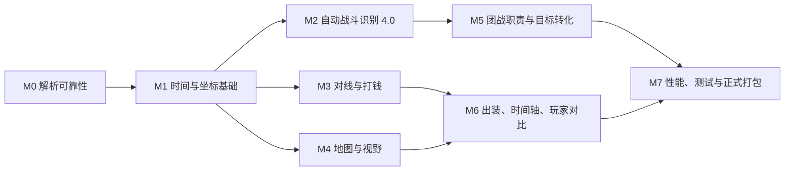

# Dota Lens 全模块优化清单与实施路线

> 文档状态：实施中 Draft 0.7
> 更新时间：2026-07-22
> 依据文档：`DOTA-LENS-ANALYSIS-MODULES-PRD.md`  
> 当前实现基线：桌面端 `0.4.1`、本地 API `1.5.0`、分析包 `dota-lens/1.0`、产品模块 `product-modules/2.10`
> 文档用途：记录优化范围、依赖关系、验收口径和当前实施进度。

## 0. 当前实施进度

本轮从 M0 和战斗识别 2.0 的阻塞项开始，已经落地：

| 项目 | 状态 | 当前结果 |
| --- | --- | --- |
| 比赛打开确认 | 已完成 | 点击比赛先确认“打开已有复盘”或“下载 Replay 并解析”，重新解析需明确选择 |
| Replay 下载重试 | 已完成 | `408/425/429/5xx`、连接超时和连接中断进入指数退避重试，并向任务页暴露重试次数与 HTTP 状态 |
| 中文静态资源 | 已完成第一阶段 | 使用 Dota 2 官方简体中文数据生成 507 个物品和 2438 个技能名称，保留可诊断原始键名兜底 |
| 英雄头像离线资源 | 已完成 | 126 位英雄官方头像全部随桌面包分发；便携 EXE 首屏不再依赖远程 CDN，资源门禁失败数为 0 |
| 暂停时间轴对齐 | 已完成 | 战斗日志改用游戏规则时钟，保留原始 combat timestamp；暂停前后的技能、伤害与英雄位置不再错开 |
| 毫秒统一时间 | 已完成第一阶段 | 产品事件统一输出 `game_time_ms + demo_tick + event_seq`，保留负时间；桌面端共用 `playhead_ms`，合成事件明确标记推导顺序 |
| 战斗时空聚类 | 已完成第一阶段 | 6 秒时间间隔与地图空间联合聚类，分离同时发生在不同区域的战斗 |
| 战斗前追溯 | 已完成 | `review_start` 最多提前 10 秒，分类只使用 `contact_start..contact_end` 的有效接触 |
| 五类战斗分类 | 已完成第一阶段 | 消耗、换血、抓单、小规模冲突、团战；2v2 固定为小规模冲突 |
| 自动战斗识别 4.0 | 已完成第一阶段 | 输出五类候选分数、未校准置信度、解释特征和上下文标签；非兵线区域不再标记线上换血 |
| 追击片段合并 | 已完成第一阶段 | 5 秒内、空间相邻且参与者高度重合的片段自动合并，远距离同时冲突保持分离 |
| TP 支援链 | 已完成事实链第一阶段 | 从 `modifier_teleporting` 还原开始、完成、明确打断、起点、落点、首次行动、到达顺序与局部人数变化；机会成本暂不评分 |
| 越塔事实链 | 已完成第一阶段 | 必须同时满足存活防御塔、塔区、进攻方英雄伤害和防御塔真实伤害；塔边清兵不再直接判定越塔 |
| 肉山与盾 | 已完成事实链第一阶段 | 输出肉山尝试、伤害与观测生命、争夺类型、击杀、8 至 11 分钟复活窗，以及盾的背包确认、消耗/回收和转化 |
| 主战场定位 | 已完成第一阶段 | 使用接触峰值附近事件的加权几何中位数；有效参与者由本地伤害、控制、治疗、施法和死亡重新收敛，并输出离散半径、定位置信度与算法版本 |
| 战斗五阶段 | 已完成第一阶段 | 每个战斗输出准备、先手、交战、收尾和 30 秒转化窗口，各阶段携带独立时间、中心、参与者与事件摘要 |
| 战斗重要性 | 已完成第一阶段 | 类型与重要性正交；按局势摆动、目标转化、资源投入、响应与战略区域输出临时 0 至 100 分及关键原因 |
| 真实模式造数清理 | 已完成坐标阶段 | 无效或缺失坐标不再回退到地图中心，也不再夹到地图边缘；其它非坐标模型仍按模块继续清理 |
| 单一坐标服务 | 已完成第一阶段 | 实体格、世界单位、地图百分比、区域和地标统一由后端服务输出；地图、打钱、眼位与团战已迁移并通过跨模块一致性测试 |
| 数据完整性门禁 | 已完成第一阶段 | 摘要增加 `available/partial/missing/invalid`、模块证据、十人快照、时间覆盖、事件顺序和无效坐标诊断 |
| 桌面布局门禁 | 已完成第一阶段 | Electron 在 1460×920 与最小 1024×720 窗口完成截图和溢出检查；战斗页外层横纵溢出均为 0 |

当前自动化验证：解析器 44 项测试全部通过。三场脱敏真实 Replay 样本已生成 `dota-lens/0.9` 对照分析包，共验证 25,179 条产品时间轴事件：缺失时钟字段 0 条、三键排序错误 0 条，保留 474 条负时间事件和 24,601 条亚秒事件。历史原始文件共有 264,801 条战斗日志被 Replay tick 锚点实质校正，最大校正 49,401 毫秒。223 个战斗片段全部输出五阶段，其中 53 场团战、56 场重要战斗和 8 场关键战斗；4 人及以下片段升级为团战为 0 次。另验证 315 条 TP 引导事实、152 个塔区上下文、8 次肉山尝试和 4 条盾生命周期。以上属于程序不变量与无标注一致性验证，不等同于人工真值精确率。

M1 当前结论：统一时间与统一坐标主链路已经可用，但里程碑尚未全部完成。剩余 P0 是 `DATA-03` 的 patch 多边形、营地、神符和地标校准集；完成前不宣称整个 M1 验收通过。

## 1. 审计结论

当前产品已经打通以下真实链路：

1. Steam 数字 ID 获取 OpenDota 比赛列表。
2. 选择比赛并取得 Replay 元数据。
3. 下载、解压并在本地解析 Replay。
4. 保存原始 JSONL，生成分析摘要和页面模块。
5. 桌面端读取本地分析包并展示十名玩家的逐秒数据。

目前影响体验的核心问题不是“完全没有数据”，而是以下四类问题叠加：

| 问题类型 | 当前表现 | 影响范围 |
| --- | --- | --- |
| 链路可靠性不足 | 新 Replay 节点短暂 502 就永久失败 | 新比赛自动解析 |
| 数据基础不统一 | 坐标、时间、区域和 patch 规则散落 | 地图、打钱、眼位、团战、对线 |
| 规则模型过早下结论 | 缺少实体证据时仍生成路线或责任评价 | 打钱、对线、团战、视野 |
| 前端存在兜底造数 | 模块字段缺失时构造看似真实的贡献或视野 | 团战、地图、演示数据和真实数据边界 |

因此不建议先逐页调整样式。推荐先修解析可靠性和统一数据基础，再重做团战，之后依次优化对线、打钱、视野、出装和其它页面。

## 2. 已确认产品决策

### 2.1 战斗前追溯 10 秒

每个战斗片段使用两个开始时间：

| 字段 | 定义 | 用途 |
| --- | --- | --- |
| `contact_start` | 第一条有效战斗行为发生时间 | 分类、战斗时长、参战人数、强度计算 |
| `review_start` | `contact_start` 前最多 10 秒 | 集结、走位、开雾、插眼、排眼、绕后和先手准备 |

前置 10 秒只属于 `setup` 复盘窗口，不能把路过或正在赶路的英雄算作有效参战者，也不能抬高技能数、伤害量和战斗时长。

### 2.2 2v2 固定为小规模冲突

2v2 无论伤害、技能、死亡或目标价值多高，都固定为 `skirmish`。肉山、神符、塔和买活只增加上下文标签，不把 2v2 升级为 `teamfight`。

以上两项已经同步回主分析 PRD。

### 2.3 移除人工标注主线

人工标注工作台、黄金样本接口、相似度分类器和本地标注数据已从产品中完整移除。战斗识别只使用 Replay 事实、自动规则和固定回放回归集，不再动态读取人工标签覆盖分类结果。

自动优化改用以下门槛：

1. Replay 事实和数据完整性门禁。
2. 2v2、兵线区域、TP 完成和时空分离等程序不变量。
3. 同一 Replay 重跑一致性和阈值扰动稳定性。
4. 多场真实数据分布对比和可点击证据回溯。

没有人工真值时不得宣称已达到团战精确率或召回率目标。完整方案见 `AUTOMATIC-COMBAT-EVENT-RECOGNITION-PLAN.md`。

## 3. 优先级定义

| 优先级 | 定义 | 发布要求 |
| --- | --- | --- |
| P0 | 数据错误、任务失败、伪造结果或会污染多个模块的基础问题 | 下一版必须完成 |
| P1 | 核心复盘价值所需，但不阻塞基本解析和事实查看 | 在基础正确后分模块完成 |
| P2 | 高阶建议、复杂模型、长期数据训练和体验增强 | 数据量、证据和自动门禁满足后实施 |

## 4. 推荐实施总顺序



依赖原则：

1. 坐标统一前不继续微调地图点位。
2. 战斗候选和参战者正确前不继续优化“内鬼雷达”。
3. 数据覆盖门禁完成前不继续添加更多确定性建议。
4. 真实模式禁止造数后，再检查每个模块的空状态和降级状态。

## 5. 解析链路与任务系统

### PARSE-01 新 Replay 下载重试

**优先级：P0**

当前实现：

- 取得 `replay_url` 后只发送一次下载请求。
- 任意非 2xx 状态立即结束任务。
- `HTTP 502` 被归类为通用 `parse_failed`。
- 用户只能手工点击“重新解析”。

真实验证：

- 比赛 `8901985234` 第一次任务在下载阶段收到 Valve Replay 节点 `HTTP 502`，进度停在 25%。
- 同一 URL 稍后手工重试成功，最终解析出 83,182 条事件、79,875,212 字节原始 JSONL。
- 说明 Replay 本身没有损坏，失败来自节点短暂未就绪。

目标优化：

1. 对连接超时、DNS 短暂失败、HTTP 408、425、429 和 5xx 自动重试。
2. 使用 5、10、20、30、60 秒退避，之后每 60 秒重试，默认最长等待 10 分钟。
3. 连续三次失败后重新向 OpenDota 获取比赛详情，检查 Replay URL 或 salt 是否更新。
4. 任务状态新增 `waiting_replay_file`、`retry_attempt`、`next_retry_at`。
5. HTTP 403、410、明确文件不存在且超过可用期限时，才标记为不可恢复。
6. UI 显示“Replay 节点正在准备，系统将在 N 秒后自动重试”，不能显示“本地解析失败”。

验收：

- 模拟前两次 502、第三次 200，任务无需用户操作即可完成。
- 重试期间关闭任务页不会终止后台任务。
- 最终失败时保留每次状态码和时间，不只保留最后一句错误。

### PARSE-02 下载断点与文件校验

**优先级：P1**

当前实现每次开始下载都会删除 `.part`，大 Replay 中途断线后必须从头开始。

目标优化：

- 服务端支持 Range 时保留 `.part` 并断点续传。
- 校验 Content-Length、BZip2 可读性和解压后的 `PBDEMS2` 文件头。
- 将 `empty`、`truncated`、`invalid_bzip2`、`invalid_dem_header` 分成不同错误码。
- 下载完成前不覆盖已有可用 Replay。

### PARSE-03 任务持久化

**优先级：P0**

当前任务只存放在 Java 进程内存中，应用重启后任务历史、失败阶段和重试次数消失。

目标优化：

- 每个任务保存 `job.json`，记录状态、阶段、进度、错误、输入版本和输出文件。
- 启动时恢复可继续任务，校验已有下载、解压和原始 JSONL 后从正确阶段继续。
- 同一比赛只允许一个活动任务；强制重建必须先确认不会删除唯一可用分析包。

### PARSE-04 错误分类与日志

**优先级：P0**

当前所有未匹配错误大多落入 `parse_failed`，且任务进入失败后 `stage` 被覆盖成 `failed`，无法知道真正失败在下载、解压、解析还是索引。

目标字段：

```json
{
  "status": "failed",
  "failed_stage": "downloading",
  "error_code": "replay_server_unavailable",
  "retryable": true,
  "http_status": 502,
  "attempt": 3,
  "message_zh": "Replay 节点暂时不可用"
}
```

解析器使用结构化滚动日志，任务页可复制诊断信息，但默认不展示 Java 堆栈。

## 6. 时间、坐标与地图基础

### DATA-01 毫秒级统一时间

**优先级：P0**

当前问题：

- 原始 JSONL 已有 `demo_tick`、`game_time_ms` 和 `event_seq`，产品模块仍主要使用整数 `time`。
- 购买、技能和部分目标事件会把负时间裁剪为 0。
- 同一秒的先手、伤害、控制和死亡无法稳定还原顺序。

目标优化：

- 所有事件使用 `game_time_ms + demo_tick + event_seq` 排序。
- 保留准备阶段负时间。
- 聚类和反应时间使用毫秒，图表聚合才使用整数秒。
- 所有页面共用 `playhead_ms`，不再自行维护秒级时间。

实施记录（2026-07-19）：

- 购买、技能、战斗、目标、经济与视野事件统一输出毫秒时间、Replay tick 和事件序号，负时间不再裁剪。
- 战斗聚类、追击合并、峰值窗口和 TP 响应延迟改为毫秒计算；整数秒只保留为兼容字段。
- 桌面端全局滑杆、播放、地图、曲线、出装、战斗和完整事件表统一消费 `playhead_ms`，显示精确到毫秒。
- 自然到期眼位没有原始结束帧时，使用 `derived_lifetime`、`-1` 顺序哨兵和 `derived_without_replay_order` 明示推导，不伪装成原始事实。
- 三场真实比赛共 25,179 条产品事件的必填时钟缺失数和三键排序错误均为 0。
- 新 Replay 在 CombatLog 回调进入时使用原始 `demo_tick` 映射到暂停校正后的游戏时钟，不再使用可能滞后的当前回调时刻。
- 已存在的原始 JSONL 使用两遍 `demo-tick-anchor/1.0` 归一化；三场比赛实质校正 264,801 条 CombatLog，最大偏移 49.401 秒，肉山击杀与最后伤害重新对齐。

### DATA-02 单一坐标服务

**优先级：P0**

本轮修复前问题：

- 后端分别转换实体格坐标和世界坐标。
- 前端又维护一套 `regionForPosition`。
- 越界坐标会被夹到 `0..100`，错误被隐藏。
- 数据没有携带 `coordinate_space` 和转换版本。

目标优化：

1. 新建唯一 `MapCoordinateService`。
2. 每个事件明确声明 `entity_cell`、`world_units`、`map_percent` 或 `unknown`。
3. 同时保留原始值、世界坐标、百分比坐标、地图 patch 和转换版本。
4. 前端完全删除坐标换算和区域判断，只消费标准化输出。
5. 越界点进入诊断，不绘制到地图边缘。

验收：

- 同一事件在地图、打钱、眼位和团战模块中的坐标完全一致。
- 已知泉水、防御塔、肉山和神符点的 P95 误差不超过 256 世界单位。
- 不再出现下路线落在野区的系统性偏移。

实施记录（2026-07-18）：

- 新增后端唯一 `MapCoordinateService`，坐标协议版本为 `dota-map-coordinates/1.0`。
- 实体格边界统一为 `64..192` 的 128 格，世界坐标统一为 `-8192..8192`，不再使用错误的 `64..191` 缩放。
- 越界坐标返回无效诊断并停止绘制，不再 `clamp` 到 `0..100`。
- 标准化输出包含原始空间、地图百分比、patch、转换版本、区域、上下文、最近地标和置信度。
- 地图轨迹、打钱、眼位和团战已迁移；同一点跨模块坐标测试与真实页面检查通过。
- 尚缺已知泉水、塔、肉山、神符和营地的人工校准样本，因此 P95 世界单位误差验收仍待完成。

### DATA-03 patch 版本化地图区域

**优先级：P0**

当前 `laneForPosition`、`regionCode` 和建筑坐标为硬编码条件与固定百分比点，前端还有重复逻辑。

目标优化：

- 按 patch 保存三路走廊、基地、主野区、三角区、河道、肉山、魔方、莲花池、神符和营地多边形。
- 区域输出主区域、上下文区域、最近地标、边界距离和置信度。
- 建筑位置来自版本化地图静态数据，不在 Java `switch` 中长期维护。

实施记录（2026-07-18）：区域判断、三路线、基地、河道和建筑静态点已集中到单一版本化服务，当前区域协议为 `dota-map-regions/7.41.1`。营地、神符、莲花池、魔方、肉山及完整 patch 多边形仍待补齐，本项保持进行中。

### DATA-04 事实、模型和缺失门禁

**优先级：P0**

当前覆盖页把快照、操作、战斗、单位和眼位状态直接标记为 `complete`，即使记录数为 0；Replay 完整性也主要只检查无坏行和一个 epilogue。

目标优化：

- 为每个模块定义关键字段和最低记录数。
- 状态改为 `available`、`partial`、`missing`、`invalid`。
- 模块输出统一 `evidence.level/confidence/reasons/sources/missing`。
- 关键数据缺失时停止模型结论，页面显示受影响功能。
- 完整性检查增加十名英雄快照覆盖、时间范围、事件顺序和坐标校准。

实施记录（2026-07-18）：分析包已输出统一模块证据与四态覆盖；完整性检查已覆盖坏行、epilogue、十名玩家、时间范围和事件连续性。无效坐标会把完整性降级为 `partial` 并列出受影响功能，不阻断仍然可靠的伤害、技能和统计事实。

### DATA-05 分模块分析 API

**优先级：P1**

当前完整 `summary.json` 一次性发送给前端：

- 17 分钟比赛 `8901985234` 的摘要约 8.36 MB。
- 41 分钟比赛 `8900926250` 的摘要约 21.96 MB。

目标优化：

- `/analysis/manifest` 只返回比赛、玩家、版本和模块状态。
- `/analysis/snapshots?slots=&from=&to=&step=` 按玩家和时间读取。
- `/analysis/combat`、`/farm`、`/vision` 等按页签懒加载。
- 时间轴按时间窗口和类别分页。
- 原始 JSONL 始终留在磁盘，不进入前端内存。

## 7. 真实数据与前端状态

### UI-DATA-01 禁止真实模式造数

**优先级：P0**

当前存在以下危险兜底：

- 团战缺少贡献时，前端按槽位构造伤害、技能、控制和责任评分。
- 团战缺少视野时，前端按附近眼位构造 68% 或 32% 可见率。
- 团战缺少位置时，前端平均参与者中点位置。
- 真实分析缺少英雄位置时，返回地图中心 `50,50`。

这些兜底会让“缺失数据”看起来像真实分析，必须删除。

目标规则：

- 演示数据只能在明确的演示模式出现，并持续显示“演示数据”标识。
- 一旦加载真实分析，任何缺失字段都进入空状态或低置信度状态。
- 页面不得自行创造数值、位置、责任分或可见率。

### UI-DATA-02 全局选择与播放状态

**优先级：P1**

- 统一保存所选比赛、玩家、时间、时间范围、地图筛选和战斗阶段。
- 切换页签不重置播放时间。
- 点击眼位、战斗、出装或时间轴事件时跳转同一时间。
- 数据尚未加载时显示骨架或模块状态，不能短暂显示上一场数据。

## 8. 账号、比赛列表与任务页

### MATCH-01 比赛数据来源状态

**优先级：P1**

当前反补字段已经能区分 `null` 和真实 0，但页面还需要明确其来源。

目标优化：

- 列表字段可来自 OpenDota 列表、OpenDota 详情或本地 Replay。
- 悬停显示字段来源；未知显示 `-`，不写成 0。
- `version == null` 只表示 OpenDota 尚未完成解析，不等同于 Replay 不可用。
- 本地解析状态独立于 OpenDota 解析状态。

### MATCH-02 新比赛自动解析体验

**优先级：P0**

- 点击未解析比赛后自动创建任务并进入任务页。
- 下载节点未准备时持续等待和自动重试。
- 任务完成后自动进入单场详情。
- 用户返回比赛列表后仍能看到进度，不阻塞其它浏览。

### MATCH-03 任务页信息结构

**优先级：P1**

任务页按“获取元数据、等待 Replay、下载、解压、解析、索引”展示阶段；失败时显示失败阶段、是否可重试、已重试次数和诊断入口。

## 9. 发育复盘与对线分析

### DEV-01 发育曲线数据与交互

**优先级：P1**

当前已有 ECharts 和逐秒快照，但需统一以下行为：

- 净值、经验、等级、补刀和反补可单独开关。
- 默认展示所选英雄和其对位核心，不一次绘制十条拥挤曲线。
- 缩放只改变时间窗口，不改变图表容器尺寸或头像布局。
- 数据断点超过 3 秒显示断线。
- 死亡、关键物品、转线、团战和目标作为可点击标记。
- 长比赛先下采样，放大后请求完整点。

### LANE-01 分路和位置识别

**优先级：P0，依赖 DATA-02/03**

当前优点：已经建立 3 号位对位敌方 1 号位、4 号位对位敌方 5 号位的关系。

当前不足：

- 分路位置仍依赖简化区域条件。
- 角色主要由早期路线、补刀和净值排序判断，特殊阵容可能错位。
- 分路置信度没有体现坐标校准和换线。

目标优化：

- 使用 0:45 至 7:00 的版本化兵线走廊占比。
- 加入前 10 分钟净值、补刀、经验、购买和队内资源优先级。
- 识别换线，并输出分时段角色而不是强行整场固定。
- 置信度低于门槛时只展示数据，不输出对位结论。

### LANE-02 线优线劣模型

**优先级：P1**

当前模型使用固定线性权重组合补刀、反补、等级、经验、死亡和辅助路线，尚未经过多 Patch 固定回放分布校准。

目标优化：

1. 在 3、5、7、10 分钟分别评分，不只给 10 分钟总结果。
2. 核心比较补反、等级、经验、净值、死亡、消耗品和受压时长。
3. 双人组比较总经验、总净值、击杀和兵线控制证据。
4. 输出每个维度贡献，不只输出总分。
5. 使用固定回放的阈值扰动、重跑一致性和分布审计校准优势、均势、劣势阈值。

### LANE-03 辅助路线与核心影响

**优先级：P1**

当前只要辅助离开简化路线区域，就视为“离线”；叠野、符、助攻、击杀和插眼被简单计为有效产出。

目标优化：

- 区分拉野、叠野、控符、游走、回补给、阵亡和无收益移动。
- 计算辅助离线期间核心单吃经验、补刀变化、承压、死亡和兵线位置。
- 评价“离线是否值得”时比较实际收益与线上代价。
- 没有拉野兵线实体时写“疑似拉野”，不能写成事实。

### LANE-04 关键节点与比赛阶段

**优先级：P1，依赖 FARM-05/DATA-03**

- 10 分钟生成双方三路线况报告，包含补反、净值、经验、等级、塔血和辅助路线影响。
- 10/20 分钟只作为检查点，不按固定分钟硬切对线期或刷钱期。
- 每 30 秒为双方独立识别 `laning/lane_transition/farm_distribution/map_control/high_ground`。
- 阶段使用分路占用、线上/野区收入、塔状态、聚集度、TP、目标准备和战斗频率共同判断。
- 输出开始时间、触发证据、置信度和时间先验是否被行为证据覆盖。

## 10. 打钱分析

### FARM-01 金钱来源字典

**优先级：P0**

当前金钱原因只把 reason 13 归为兵线、14 归为中立，其余大量原因合并成 `combat`，会把不同来源混在一起。

目标优化：

- 建立 patch 版本化 gold reason 字典。
- 区分小兵、中立、远古、英雄、塔、肉山、信使、眼、召唤物、被动金钱、赏金符和其它。
- 金钱事件与单位死亡交叉校验，无法分类时保留原始 reason。

### FARM-02 热力图准确性

**优先级：P0，依赖 DATA-02**

- 每笔收益使用明确坐标来源。
- 热力图支持 0 至 5、5 至 10、10 至 15、15 至 20 分钟及自定义区间。
- 颜色表示金钱总量，悬停显示来源构成、单位数和时间范围。
- 地图保持足够尺寸，可全屏查看，不用过小缩略图承担主要分析。

### FARM-03 线野循环只展示已观察事实

**优先级：P0**

当前已经有保守门禁，但候选位置仍使用简化兵线和野区锚点。

目标优化：

- 只有实际发生“线上收益、野区收益、返回线上收益”时才记为已观察循环。
- 1 分钟没有真实野怪收益时绝不生成线野双收。
- 缺少兵线实体、营地占用和清野耗时时，不绘制建议路线。
- 可展示“当前证据不足，暂不判断是否漏线”。

### FARM-04 安全兵线与最优路线模型

**优先级：P2**

该功能需要新增数据后再实施：

- 逐单位兵线实体和波次归属。
- 野怪营地刷新框、存活和被谁占用。
- 敌方可见/最后出现位置和时间衰减。
- 建筑状态、TP、传送门、移动速度和技能威胁范围。
- 即将发生的肉山、魔方、神符和团队集结。

模型输出收益范围、风险、路程、资源截止时间和团队机会成本，不能只给一个“最优点”。

### FARM-05 游戏机制配置

**优先级：P1**

当前规则硬编码为 `7.41d`。应按比赛 patch 加载兵线、野怪、投石车、旗手、莲花、赏金符、河道符、经验符和魔方时间；无法匹配 patch 时停用时间型建议。

## 11. 地图轨迹与目标事件

### MAP-01 轨迹正确性

**优先级：P0，依赖 DATA-02**

- 使用统一标准化坐标。
- 死亡回泉、TP、传送门和异常跳点拆成独立轨迹段。
- 缺少位置时显示断点，不返回地图中心。
- 支持只看所选英雄、同队、对手或全部十人。

### MAP-02 地图图层

**优先级：P1**

统一提供英雄、击杀、死亡、打钱、眼位、塔、肉山、魔方、神符、兵线和战斗范围图层。图层筛选在地图轨迹、打钱、视野和团战页复用。

### MAP-03 目标位置

**优先级：P1**

当前建筑位置为硬编码百分比，肉山位置可能使用附近英雄聚类替代。

目标优化：

- 建筑、肉山、魔方、神符和莲花使用 patch 静态地标。
- 目标事件同时记录目标自身位置与参与玩家位置。
- 无法取得目标位置时不使用英雄平均值伪装成精确目标点。

## 12. 视野分析

### VISION-01 眼位生命周期

**优先级：P0**

当前未取得结束事件时会按固定自然寿命补齐，前端又把所有非击杀结束显示为“自然消失”。

目标优化：

- 区分 `killed`、`expired`、`match_end`、`entity_missing` 和 `unknown`。
- 自然寿命按 patch 和眼类型读取。
- 比赛提前结束时，存活到结算的眼不能显示为自然到期。
- 保留放置者、拆除者和归属置信度。

### VISION-02 “发现敌人”口径

**优先级：P0**

当前检测主要按敌方英雄进入几何圆计算，并不证明该眼让队伍实际看见了敌人。

目标优化：

- `geometric_contact`：进入估算范围。
- `visibility_transition`：队伍可见性从不可见变可见。
- `attributed_detection`：排除英雄自身、塔和其它眼后，该眼是主要发现来源。
- UI 分开显示三种结果，不统一叫“发现次数”。

### VISION-03 重叠、进攻/防守与评分

**优先级：P1**

当前问题：

- 重叠按附近同类眼数量乘固定分数，不是真实面积/时间重叠。
- 进攻或防守按地图对角线二分。
- 发现后 20 秒敌人死亡就记为转化，因果关系过宽。

目标优化：

- 重叠使用视野圆交集、共同生效时间和独占覆盖。
- 进攻/防守结合当时建筑、兵线、控制区域和目标方向。
- 战斗转化要求同一目标、合理时间、队伍行为和战斗关联。
- 评分拆分存活、独占信息、目标准备、反眼、转化和浪费，并显示分项。

### VISION-04 页面布局与联动

**优先级：P1**

- 眼位清单使用可调整宽度，不压缩主要字段。
- 地图显示假眼普通视野和真眼真实视域的不同样式。
- 下方时间轴可点击跳转单眼详情。
- 玩家、队伍、类型、进攻/防守、时间和评分筛选可组合。
- 从团战页点击战前眼位可直接跳转视野页并保持时间。
- 地图支持按钮与鼠标滚轮缩放、拖拽平移、缩放复位、定位选中眼位和大地图模式。
- 底图、视野范围、眼位和发现事件必须共享同一变换矩阵；地图图标使用反向缩放保持可读尺寸，不得在缩放后改变数据坐标。

## 13. 出装与技能

### BUILD-01 中文静态资源完整性

**优先级：P0**

- 使用 patch 对应的英雄、物品、技能、天赋名称和图标。
- 内部 key 找不到中文时显示规范化原名和“未收录”标识，不显示生硬内部字符串。
- 增加静态资源覆盖测试，十名英雄、本场所有购买和施法 key 必须有映射报告。

### BUILD-02 物品生命周期

**优先级：P1**

当前主要展示购买、物品栏快照和使用事件。

需要补充：

- 合成、出售、拆分、掉落、拾取、共享、消耗和中立物品。
- 物品在某一时刻是否真实可用。
- 关键物品获得后到第一次战斗使用的时间。

### BUILD-03 出装评价

**优先级：P2**

只有具备 patch、英雄、敌方威胁、经济时点和物品可用性后才评价。第一阶段先做事实时间线和战斗使用关联，不急于给“出错了”结论。

## 14. 战斗与团战 2.0

### COMBAT-01 清洗战斗原子

**优先级：P0**

当前伤害只检查目标是英雄，没有要求攻击者是敌方英雄。小兵、塔、泉水或其它单位对英雄的伤害可能进入战斗总伤害和参与者窗口，线上阶段尤其容易抬高强度。

目标优化：

- 分类强度只使用敌对英雄或可归属召唤物对真实英雄的有效伤害。
- 小兵、塔、肉山和泉水伤害作为环境上下文，不计入英雄输出强度。
- 排除自伤、零伤害、重复日志、被动触发噪声和纯 DoT 延时。
- 召唤物、幻象、反射和持续伤害归因到正确玩家并保留来源类型。
- 技能/物品使用按施法实例去重。

### COMBAT-02 时空候选生成

**优先级：P0**

当前只从英雄死亡出发，按 20 秒死亡间隔聚类，没有空间拆分。

目标优化：

- 使用英雄伤害、主动技能、物品、控制、有效治疗和死亡共同生成候选。
- 采用时间、世界距离、参与者和攻击链的时空图聚类。
- 同时发生在上路和下路的冲突必须拆开。
- 连续 5 秒无有效行为视为脱战。
- DoT tick 和附近移动不能无限延长战斗。

### COMBAT-03 前置 10 秒准备阶段

**优先级：P0，已确认规则**

- 候选成立后设置 `review_start = contact_start - 10 秒`，不早于比赛开始。
- 追溯开雾、眼位、排眼、绕后、英雄位置、关键物品和第一次发现。
- 前置窗口不计入战斗时长、伤害、技能数和有效参与人数。
- 页面同时显示“准备开始”和“正式接触”两个时间点。

### COMBAT-04 五类分类与团战门槛

**优先级：P0**

分类为：

1. `harass` 单向消耗。
2. `lane_trade` 线上换血。
3. `pickoff` 抓单/单杀。
4. `skirmish` 小规模冲突。
5. `teamfight` 团战。

团战默认硬门槛：

- 有效参与人数至少 5 人。
- 双方各至少 2 名有效参与者。
- 有效战斗至少 5 秒。
- 满足死亡、技能密度、伤害生命值当量或控制/反击中的高强度条件。
- 综合分至少 65。
- 2v2 永久保持 `skirmish`。

输出当前标签、所有候选标签分、通过/未通过门槛、分类理由和置信度。

### COMBAT-05 有效参与者

**优先级：P0**

当前时间窗口内施法、受伤或中点附近的英雄都可能进入参与者。

目标优化：

- `active`：有伤害、受伤、有效技能/物品、控制、保护、击杀或阵亡。
- `nearby`：在战场附近但没有有效战斗行为。
- 团战人数只统计 `active`。
- 每人记录首次行动、最后行动、有效秒数、在场秒数和证据。

### COMBAT-06 主战场位置

**优先级：P0，依赖 DATA-02**

当前位置取阵亡英雄位置均值，容易落在追击尾声；无阵亡位置时甚至平均十名英雄。

目标优化：

- 计算 3 秒滚动强度峰值。
- 使用峰值前后有效伤害、控制、技能、治疗和死亡位置。
- 使用加权几何中位数，剔除超过 2500 世界单位的离群点。
- 输出散布半径、区域、最近地标、已定位事件比例和置信度。
- 存在两个强空间峰时拆成两场战斗，不取中点。

### COMBAT-07 战斗阶段

**优先级：P1**

输出：

- `setup`：正式接触前最多 10 秒。
- `initiation`：第一条高价值先手至双方反击。
- `clash`：主要伤害、控制、治疗和减员。
- `cleanup`：追击和撤退。
- `conversion`：战后 30 秒目标转化。

每个阶段有自己的时间、中心、参与者和事件摘要。

实施记录（2026-07-19）：已完成第一阶段。阶段边界由首次双方响应、三秒滚动强度峰值、接触结束和战后 30 秒窗口生成；页面提供阶段条，点击可精确跳转，播放头跨阶段时地图中心与参与者自动同步。暂停时间归一化后三场真实比赛 223 个片段的五阶段集合和边界顺序检查均通过。

### COMBAT-08 团战视野

**优先级：P1，依赖 VISION-02**

- Combat Log 可见伤害比例作为事实。
- 假眼/真眼范围作为几何估算。
- 追溯前 10 秒的插眼、排眼、首次发现和先手时间差。
- 没有地形迷雾时不写“当时一定看见”。

### COMBAT-09 职责完成度

**优先级：P1，必须晚于 COMBAT-01 至 08**

当前只分核心/辅助，并用固定公式给责任分；未放真眼、低伤害或在场率低会直接产生问题标签。

目标优化：

- 使用 1 至 5 号位职责模型。
- 先显示事实，再显示职责判断。
- 检查技能冷却、魔法、沉默、眩晕、施法距离和物品可用性后，才判断“有技能没放”。
- 先手位低伤害、辅助有效换命、核心被迫撤退需要角色化解释。
- 角色置信度低于 0.65 时不评分。
- 页面名称可保留“内鬼雷达”，正式结果使用“职责完成度”。

### COMBAT-10 战斗页面

**优先级：P1**

- 提供全部、消耗、换血、抓单、小规模冲突、团战筛选。
- 列表显示分类理由和置信度。
- 地图显示主战场范围而非单一脉冲点。
- 时间轴区分准备、先手、交战、收尾和转化。
- 表格区分 `active` 与 `nearby`。
- 删除所有前端虚构贡献、视野和位置兜底。

### COMBAT-11 关键战斗优先级

**优先级：P0**

- `kind` 继续表达消耗/换血/抓单/小规模冲突/团战，新增正交的 `importance`。
- 2v2 越塔反打仍为小规模冲突，但必须进入关键战斗复盘。
- 目标价值、局势摆动、技能/买活/TP 投入、响应时机和战后转化组成关键分。
- 页面提供“关键战斗”筛选并显示关键原因，不能通过抬高 `kind` 伪造重要性。

实施记录（2026-07-19）：已完成第一阶段。当前模型为 `combat-importance-rules-v1`，临时分界为 `important >= 40`、`critical >= 70`，并明确输出 `provisional_uncalibrated`。三场真实比赛得到 56 场重要、8 场关键；关键小规模冲突和抓单保持原 `kind`。阈值仍需更多比赛分布校准，不能当作人工真值结论。

### COMBAT-12 越塔与 TP 响应链

**优先级：P0，依赖 DATA-03**

- 使用存活塔实体、防守区域、英雄伤害/控制、塔仇恨和塔伤害确认越塔，不把塔边清兵算成越塔。
- 采集 TP 开始、完成、打断、起点、落点、首次行动和多人连续 TP 顺序。
- 计算 TP 前后局部人数、响应延迟、救援/反杀/守塔结果和另一路机会成本。
- 未支援责任必须检查 TP 库存、冷却、魔法、建筑、死亡状态和战斗可挽救性。

实施记录（2026-07-19）：事实链第一阶段已完成。解析器从传送修饰符新增与移除记录引导耗时和明确打断，并结合逐秒位置生成起点、落点、位移、首次行动、到达顺序、前后局部人数、后续减员和低血队友存活。三场真实比赛得到 315 条引导事实，其中 4 条明确打断、51 条确认支援，打断事件误标支援为 0。另有 152 个战斗带塔区上下文，21 个满足真实塔伤门槛的确认越塔，确认越塔缺失塔伤证据为 0。另一路机会成本和“未支援责任”仍因兵线、营地、库存、冷却与魔法连续状态不足而明确不评分。

### COMBAT-13 肉山与盾生命周期

**优先级：P0（事实链），P1（建议）**

- 采集肉山位置、生命、受击、击杀、复活状态和每次尝试的参与者。
- 区分无人争夺尝试、假打肉山、肉山争夺、肉山团、抢肉山、抢盾和坑区抓单。
- 普通模式按版本配置表达 8-11 分钟复活不确定窗口和盾拾取后 5 分钟生命周期。
- 记录持盾者、消耗/回收、塔/兵营/击杀转化以及零转化原因。
- 目标准备可回看 90 秒，但正式战斗仍只向前追溯最多 10 秒。

实施记录（2026-07-19）：事实链第一阶段已完成。三场真实比赛识别 8 次肉山尝试、4 次击杀和 4 条盾生命周期；所有肉山击杀均有伤害链，所有盾均有背包确认并关联来源尝试。当前分类分布为 3 次假打/试探、1 次放弃、1 次无人争夺和 3 次肉山团；盾结果为 1 次死亡消耗、1 次提前消耗、2 次到期回收。静态坑区上下文半径经页面 QA 从 11% 收紧到 6%，无肉山伤害的坑区提示由 22 个降为 6 个。样本没有抢肉山或抢盾，连续生命、真实复活实体和盾触发事件仍待补齐。

### COMBAT-14 自动事件识别

**优先级：P0**

第一阶段已经落地：

- 五类主类别同时输出候选分数、未校准置信度、分类理由和统一特征。
- `gank/solo_kill/tp_support/tp_arrival/chase/high_intensity` 作为正交上下文标签，不改变 2v2 和团战硬门槛。
- `lane_trade` 必须具备版本化兵线区域证据和双方有效回击，非兵线接触不再叫线上换血。
- 同一追击中 5 秒内、中心距离合理、参与者重合不低于 50% 的候选自动合并。
- TP 支援必须存在物品使用、位置跃迁、战场附近落点和到达后的有效动作；中断或落在其它区域单独降级。
- 每场战斗输出可用于后续弱监督训练的交互图、伤害互惠、目标集中度、生命值伤害当量和施法密度等特征。

下一阶段：

- 在至少 100 场、约 5,000 个候选后建立跨比赛特征库和程序化标签函数矩阵。
- 学习标签函数相关性并生成概率弱标签，训练轻量模型；纯 Java 读取版本化模型文件执行推理。
- 模型只在高置信区域覆盖规则结果，团队人数、2v2、数据完整性和 TP 完成仍为硬门槛。
- 500 场后再评估 TS2Vec/HDBSCAN 相似战斗检索，不把无监督聚类直接当作中文语义标签。

无标注验收：2v2 升级团战为 0、非兵线换血为 0、未完成 TP 支援为 0、远距离同时冲突保持分离、重跑结果一致。语义精确率和召回率保持“未评测”。

## 15. 完整时间轴与玩家对比

### TIMELINE-01 真实完整事件索引

**优先级：P1**

当前时间轴包含购买、加点、使用、控制、部分治疗、金钱、死亡、眼位和目标，但没有形成统一的战斗事件索引，普通伤害也未纳入可控的分组查看。

目标优化：

- 原始事实只保存一份，各模块通过 `event_id` 引用。
- 高频伤害和金钱默认按 1 秒或技能实例折叠，可展开逐条。
- 战斗、眼位、打钱段和目标作为高级事件锚点。
- 按玩家、队伍、类别、区域、证据和时间范围筛选。
- 分页和虚拟滚动，不能一次渲染全部事件。

### PLAYER-01 十人统计来源

**优先级：P1**

- 最终统计优先本地 Replay 快照和事件，OpenDota 详情作为补充。
- 每个字段保留来源，未知与真实 0 分开。
- 反补、承伤、治疗和视野口径支持悬停说明。
- 点击玩家切换全部单英雄模块，但不重置播放时间。

### PLAYER-02 角色与可比性

**优先级：P1**

- 显示 1 至 5 号位和置信度。
- 默认只比较合理对位或同职责玩家。
- 不用最终 GPM 单独决定整场角色。

### PLAYER-03 十名玩家复盘报告

**优先级：P1，依赖 LANE-04/COMBAT-11 至 13**

- 每名玩家输出对线、转型、发育路线、关键战斗和训练结论。
- 报告只引用模块事实与证据 ID，不根据最终胜负重新猜测原因。
- 每场最多 3 条主要建议，并同时保留正向执行、待改进和证据不足。
- 建议必须包含时间、地点、实际行为、候选行为、收益/风险、置信度和可点击证据。
- 技能语义、冷却、TP 或战争迷雾缺失时停用对应责任判断。

## 16. 数据覆盖、设置与桌面端

### COVERAGE-01 模块级覆盖

**优先级：P0**

覆盖页按模块展示：关键字段、记录数、时间范围、精度、校准结果、状态、缺失原因和受影响功能。

示例：

> 英雄逐秒位置存在，但坐标校准未通过。因此地图轨迹、打钱热力图、眼位范围和团战位置暂不展示；伤害、死亡和技能事实仍可查看。

### DESKTOP-01 本地服务诊断

**优先级：P1**

当前桌面应用已经能自动启动解析器，但诊断只区分端口是否可用。

目标优化：

- 检查进程、HTTP 健康、样本解析、磁盘空间和写入权限。
- 显示应用、Java、parser、schema、地图配置和静态资源版本。
- 支持重启服务、导出诊断包和查看最近失败任务。

### DESKTOP-02 版本升级与重新索引

**优先级：P1**

- 分开管理 Replay、原始 JSONL、分析索引和前端缓存版本。
- 规则升级时优先从原始 JSONL 重新索引，不重复下载 Replay。
- 新旧 schema 不混用评分；旧报告显示“旧版规则”。

## 17. 前端工程与视觉优化

### FRONTEND-01 模块拆分

**优先级：P1**

当前 `app.js` 同时承担 API、状态、数据转换、全部页面渲染、演示数据和分析逻辑，后续改规则容易互相影响。

建议拆分：

- `api/`：本地 API 和任务轮询。
- `store/`：比赛、玩家、时间和筛选状态。
- `adapters/`：schema 到 UI view model。
- `views/`：各页签渲染。
- `charts/`：ECharts 配置与缩放。
- `map/`：统一地图图层。
- `i18n/`：中文静态资源。
- `demo/`：与真实模式完全隔离的演示数据。

### FRONTEND-02 布局与尺寸

**优先级：P1**

- 地图和图表设置稳定的响应式尺寸，不因头像、标签或筛选变化重排。
- 战斗和眼位清单允许合理宽度与滚动，不把单项内容压成小卡片。
- 1440x900 下主要地图边长不少于 520px。
- 1024px 窗口降级为上下布局，不横向挤压长表。
- 检查高 DPI、长中文名和十名英雄头像溢出。

### FRONTEND-03 加载性能

**优先级：P1**

- 页签懒加载模块数据。
- 曲线按视口采样。
- 时间轴虚拟滚动。
- 地图轨迹使用 Canvas 或高效图层，不为每秒每英雄创建 DOM。
- 切换页签不重复解析大 JSON。

## 18. 测试与可观测性

### QA-02 模块单元测试

**优先级：P0**

新增：

- Replay 下载重试与错误分类测试。
- 时间排序与负时间测试。
- 每种坐标空间转换测试。
- 地图地标和区域测试。
- 金钱原因分类测试。
- 眼位生命周期与发现口径测试。
- 战斗原子去重、聚类、拆分、分类和 10 秒追溯测试。
- 缺失数据不得造数测试。

### QA-03 端到端桌面验收

**优先级：P1**

自动化流程：输入账号、加载比赛、选择未解析比赛、模拟 Replay 502 后恢复、完成分析、打开每个页签、拖动时间轴并检查地图点位。

使用 Playwright 截图检查 1024x768、1440x900、1920x1080 和高 DPI，重点检测图表、头像、地图、筛选器和长表是否溢出或重叠。

## 19. 版本里程碑

### M0：可靠解析版本

必须完成：`PARSE-01/03/04`、`MATCH-02`、`UI-DATA-01`、`COVERAGE-01` 基础状态。

交付结果：新比赛遇到短暂 502 会自动恢复，失败原因准确，真实页面不再造数。

### M1：统一数据基础

必须完成：`DATA-01/02/03/04`、`MAP-01`、`FARM-01/02`、`VISION-01`。

交付结果：所有模块使用同一时间和坐标，路线、热力、眼位和战斗落点一致。

当前状态：第一阶段进行中。`DATA-01/02/04` 主链路已落地，时间轴三键排序与地图、打钱、眼位、团战坐标一致性已通过；`DATA-03` 完整 patch 校准集仍为发布门槛。

### M2：战斗团战 2.0

必须完成：`COMBAT-01` 至 `COMBAT-06`、`COMBAT-11/12/14`、`QA-02` 和无标注自动不变量。

交付结果：线上消耗不再误报，2v2 固定小规模冲突，关键战斗与团战类型分离，团战位置和参与者可信。

当前状态：自动识别 4.0、战斗五阶段、独立重要性、越塔/TP 与肉山/盾事实链第一阶段已落地，44 项解析器测试通过，三场真实分析包已完成分布对比。当前可宣告程序不变量和证据链通过，但不能宣告语义精确率/召回率达标；部分 79 至 123 秒长片段仍需按交战空窗和中心跃迁二次切分。

### M2.1：关键节点与目标战

必须完成：`FARM-05`、`LANE-04`、`COMBAT-12/13` 的事实链和自动一致性指标；`QA-04` 暂停。

交付结果：10/20 分钟不再硬切阶段；越塔 + TP、肉山争夺和盾生命周期能够稳定进入关键复盘。

当前状态：事实链第一阶段完成。责任评价、持续塔血/仇恨、连续肉山生命、真实战争迷雾和抢盾样本尚未达到建议层验收条件。

### M3：深度复盘

完成：`COMBAT-07` 至 `COMBAT-10`、`LANE-02/03/04`、`VISION-02/03/04`、`TIMELINE-01`、`PLAYER-03` 的事实报告。

交付结果：可以从战前 10 秒追溯视野和集结，查看阶段、执行、目标转化和职责证据。

### M4：高阶打钱与建议

完成逐单位兵线、营地状态、战争迷雾和威胁模型后，再启用 `FARM-04`、`BUILD-03` 等反事实建议。

## 20. 优先审核项

请按以下顺序评审：

- [x] 战斗正式接触前最多追溯 10 秒，只用于准备阶段。
- [x] 2v2 永远保持小规模冲突。
- [ ] 团战最低有效参与人数使用 5 人，双方至少 2 人。
- [ ] 团战综合分阈值使用 65 分。
- [x] 关键战斗与团战类型分离，关键 2v2 不升级为团战。
- [x] 10/20 分钟只作为分析检查点，阶段由双方行为独立识别。
- [x] 越塔 + TP 和肉山/盾加入关键候选入口与固定回放回归用例。
- [ ] `important/critical` 分界使用 40/70。
- [ ] Replay 自动重试最长等待 10 分钟。
- [ ] 真实模式彻底删除所有前端造数兜底。
- [x] 坐标与数据覆盖列为下一版 P0，暂缓其它地图样式微调。
- [ ] 战斗识别 2.0 作为统一坐标完成后的首个核心分析模块。
- [ ] 高阶安全兵线建议推迟到逐单位兵线和营地状态可用以后。

## 21. 建议下一步

下一阶段优先完成 `DATA-03` 的 patch 化塔、营地、神符、肉山坑和区域校准，并修复当前 870 条无效坐标导致的 `partial` 完整性；同时为战斗聚类加入交战空窗、中心跃迁和目标切换切分，收敛 79 至 123 秒长片段。随后接入 `COMBAT-08` 的战前真实视野证据，并为 `COMBAT-12` 补齐库存、冷却、魔法、死亡状态和可挽救性门禁。肉山/盾需扩展到至少 30 场多版本固定回放，覆盖抢肉、抢盾和买活后争夺。每一步继续使用程序不变量、重跑一致性、阈值稳定性和真实多场分布对比验收，不输出未经外部真值验证的精确率数字。

## 22. 2026-07-21 P0 落地复核

本节更新第 19 至 21 节的旧状态，以当前代码和自动回归为准。

| P0 项 | 当前状态 | 已交付事实 | 仍受控的边界 |
|---|---|---|---|
| 多 Patch 地图校准 | 第一版完成 | 7.33 前、7.33 至 7.40、7.41 三套 profile；Replay 营地与建筑动态锚点；未知版本显式回退 | 静态 profile 的 P95 世界坐标误差仍需多版本固定回放回归集 |
| 连续敌方可见性 | 第一版完成 | 按双方阵营输出确认、推定、最后可见、未知区间；最后可见不泄露隐藏真实位置 | 树林、高低坡、烟雾、隐身与复杂视野阻挡未建模 |
| 逐波兵线与营地状态 | 事实层完成 | 30 秒波次、实体进入、死亡/PVS 丢失、营地观察周期和未知区间 | 尚不能把 PVS 事件当作精确刷新、拉野、叠野或占用事实 |
| 战斗职责硬门禁 | 规则与抑制链完成 | 学习、CD/充能、魔法、存活、控制、距离、合理目标七项门禁；不满足时禁止负面评分 | Replay 不提供施法距离；接入按 Patch 技能元数据前，真实样本保持证据不足 |

验收结果：`product-modules/2.8`、`dota-map-coordinates/2.0`、`dota-map-regions/2.0`；Replay Parser 60 个测试全部通过。真实比赛 `8903960010` 生成 431 个兵线波次、22 个营地、238 个营地观察周期、5489 个连续可见性区间和 42 个战斗片段。比赛 `8904265149` 从 `.dem` 全量重解析后生成 348 个兵线波次、22 个营地、165 个营地观察周期、4345 个连续可见性区间和 39 个战斗片段；184 个责任样本没有一条越过缺失证据门禁产生误扣分。该场 10 名英雄的有效位置快照、39 个战斗落点、65 个眼位、348 个兵线波次和 22 个营地均为 0 个无效坐标。

下一阶段不直接开启“最优路线”确定结论。优先补齐营地刷新/死亡、逐兵死亡与资源归属、复杂战争迷雾，并从 Dota 客户端 VPK 或可版本化官方游戏数据建立按 Patch 技能距离与目标语义；只有相应证据门禁通过，才逐项开启漏线、叠野收益、路线反事实和位置职责评分。

## 23. 2026-07-22 P0 建议层开启复核

第 22 节列出的前置条件已完成第一版，建议层改为“逐候选开启”，不再整模块统一关闭。

| 项目 | 当前状态 | 开启条件 | 真实回归结果 |
| --- | --- | --- | --- |
| 逐单位兵线/营地 | 第一版完成 | 确认死亡、位置、波次或营地周期可关联 | 2,355 个单位、348 波兵线、22 个营地 |
| 复杂战争迷雾 | 第一版完成 | 直接掩码优先；烟雾、隐身、真眼、高度与最后可见状态可用 | 不泄露隐藏当前坐标；树林和完整地形遮挡仍为缺口 |
| Patch 技能元数据 | `7.41/7.41d` 完成 | Replay patch 必须精确匹配资源 | 734 个技能；`7.41` 官方补丁说明逆向重建并携带来源 |
| 漏线分析 | 有条件开启 | 1 至 3 号位、分路可信、单位死亡与连续视野足够 | 用户槽位 3 个可复核漏线，估值 117 金 |
| 叠野收益 | 有条件开启 | 计数增量、营地锚点和同场中立金币样本可用 | 5 名堆野者输出个人事实与团队创造价值 |
| 最优路线 | 逐候选开启 | 角色、资源、视野、队友占用、移动截止全部通过 | 137 个窗口中 10 条通过；18 个早期营地候选被阶段门禁阻止 |
| 分位置职责 | 有条件开启 | 角色置信度和技能七项硬门禁通过 | 184 个样本：101 通过、81 证据不足、2 阻断 |

性能与验证：秒级快照升级为 `snapshot-columns/1.1`，同场完整 JSON 从 144.9 MB 降至 14.24 MB，约 7.3 秒生成；Replay Parser 68 个测试、前端语法检查和生产构建全部通过。

下一项 P0 不再是重新关闭建议层，而是补齐树林/地形遮挡、可版本化英雄专属清线清野耗时与地图寻路成本，并扩大 7.33 至 7.41 的真实 Replay 回归矩阵。建议层继续坚持单候选门禁：任一关键证据缺失时只展示事实和阻断原因。

## 24. 2026-07-22 二十分钟后核心路线

路线分析不再在 `1200s` 统一结束。位置可信的 1/2/3 号位持续分析到比赛结束，4/5 号位保持前 20 分钟范围；20 分钟后的基准按 5 分钟桶独立计算，资源证据观察范围扩为 75 秒。

新增战略投入免责：核心正在参团或处理地图目标时，只记录该窗口的收益机会成本，不允许以纯打钱路线扣分。前端核心英雄默认聚焦“20+ 核心”，路线统计、热力图与诊断列表同步筛选。

真实比赛 `8904265149` 回归：用户为 2 号位，生成 10 个 20 分钟后窗口，6 个战略投入免责，1 条安全野区路线通过门禁，1 个后期线野循环被事实链确认；页面无控制台错误、横向溢出或失效图片。

## 25. 2026-07-23 眼位地图交互与玩家报告 P2

### 25.1 眼位地图交互

视野分析地图新增 `100%` 至 `400%` 缩放、鼠标滚轮指针锚定缩放、放大后的拖拽平移、复位、定位选中眼位和大地图模式。大地图模式暂时收起总览、清单、详情和时间轴，退出后完整恢复。

坐标实现只变换统一地图舞台，不重新计算眼位百分比。底图、视野圈、眼位图标和发现事件共享同一矩阵；图标使用逆缩放保持约 24px，避免放大后遮住地形。真实比赛 `8908420184` 在 `182%` 与 `223%` 下，选中眼位中心和原始百分比投影误差小于 `0.1px`。在 1280×768 页面中，大地图模式把地图边长从约 `182px` 提升到约 `368px`；1024×720 无横向页面溢出。

### 25.2 玩家报告 P2 第一阶段

`player-report/3.0` 已为洞察输出 `root_cause_id`，并为维度输出只由明确 `dimension_impacts` 生成的 `behavior_components`。前端维度证据栏可展示行为加减分并跳到相同行为证据和时间；重复的简报/建议时间标记已去重。

真实比赛 `8908420184` 的 10 名玩家均生成行为组成，每人 3 至 6 条，共 46 条跨维度影响。解析器 65 项测试和前端生产构建通过。下一阶段继续完成同根因的阵亡、物品、目标和视野聚合，并实施跨维度扣分封顶。

### 25.3 玩家报告 P2 根因链与扣分封顶

新增 `player-root-cause/1.0`，将同一根因窗口中的阵亡、死亡金损、关键成装进度、敌方目标事件和战前眼位缺口聚合到一个主洞察。四类后果分别标记 `fact`、`estimated`、`derived` 或 `gated`，没有通过队伍归属、时间窗口和视野条件的后果不生成。

新增 `root-cause-overall-impact-cap/1.0`：单维影响上限为 `25`，单根因按有效维度权重计算的综合负向影响上限为 `6.0`；超限时只按比例缩放负向影响。行为归因暂不在基础维度分之上二次加减，先解决解释层的跨维度重复处罚。

真实比赛 `8908420184` 共生成 17 个负向根因与 19 个后果。用户槽位 3 的 `25:27` 根因合并了阵亡和约 `27 秒` 的关键装备进度损失，加权归因影响为 `-1.82`；另有真实玩家样本覆盖阵亡、装备、目标和视野四类后果。解析器 67 项测试与前端构建通过，1024×720、1280×720、1460×920 页面回归无横向溢出和控制台错误。
