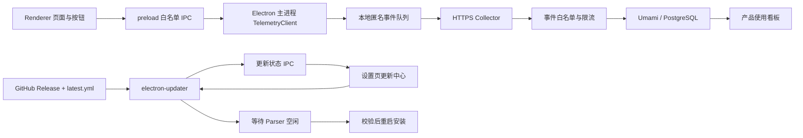
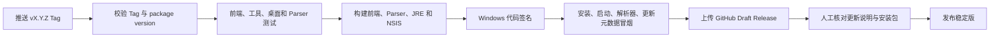

# Dota Lens 匿名使用统计与在线更新 PRD

| 项目 | 内容 |
| --- | --- |
| 文档状态 | 更新功能本地实现中；匿名统计待实施 |
| 创建日期 | 2026-07-27 |
| 最近更新 | 2026-07-27 |
| 当前客户端 | Dota Lens 0.4.5 |
| 建议首发版本 | 0.5.0 建立基础能力，0.5.1 验证首次在线升级 |
| 客户端形态 | Electron Windows x64 桌面应用 |
| 更新载体 | Windows NSIS 安装版；便携版仅提示和下载 |
| 关联文档 | `DESKTOP-FRONTEND-PRD.md`、`DOTA-LENS-0.5.0-PLAYER-REPORT-PRODUCTIZATION-PRD.md` |

## 1. 文档结论

本需求应拆成两条互不依赖的产品链路：

1. **匿名使用统计**：统计页面访问、功能按钮使用、关键流程完成率和失败原因。
2. **在线更新**：检查新版本、展示更新内容、下载、校验并在合适时间安装。

推荐方案如下：

| 能力 | 推荐方案 | 原因 |
| --- | --- | --- |
| 客户端埋点 | Electron 主进程维护匿名标识、事件队列和网络发送 | 不把采集地址和本地文件权限直接暴露给页面；可统一做隐私过滤 |
| 按钮统计 | 所有可操作控件声明稳定的 `action_id`，由统一点击代理上报 | 可以覆盖全部按钮，又不会上传按钮文字或输入内容 |
| 页面统计 | 在现有 `setPage`、`setDetailView` 入口统一记录进入和有效停留 | 不会因为重复渲染把一次访问算成多次 |
| 数据接收 | 自建轻量 HTTPS Collector，严格校验后写入 Umami | 实施轻、已有页面和事件看板，同时保留服务端数据控制权 |
| 数据看板 | Umami 页面排名、事件排名；关键漏斗使用固定查询或独立看板 | 足够回答“哪个页面和功能最常用”，无需先建设重型数据平台 |
| 分享链接统计 | 自有短链接或下载页按 `campaign_id` 聚合后跳转 GitHub Release | 区分抖音、GitHub 和其他入口，又不把来源识别逻辑塞进客户端 |
| 在线更新 | `electron-updater` + GitHub Releases + NSIS | 与当前 electron-builder、公开 GitHub 仓库和 Windows 安装包兼容 |
| 发布流水线 | GitHub Actions 构建、测试、签名、上传安装包和 `latest.yml` | 避免本地人工打包造成版本和更新元数据不一致 |

两条链路必须解耦：

- 用户不同意匿名统计，仍然可以正常使用全部功能和在线更新。
- 统计服务器不可用，不得影响软件启动、解析 Replay 或检查更新。
- GitHub 更新源不可用，不得阻断客户端使用，也不得反复弹窗。

## 2. 当前实现审计

### 2.1 已具备

- Electron `43.x` 桌面主进程。
- electron-builder `26.x`。
- Windows NSIS 安装包构建配置。
- `electron-updater` 已接入主进程，GitHub Releases 已配置为稳定版更新源。
- 已实现检查、可更新、下载中、下载完成、等待 Parser、安装和失败状态。
- 已实现受限 preload IPC，Renderer 不能直接调用更新器或持有发布权限。
- 设置页已有“软件更新”入口、版本信息、更新说明、下载进度和安装操作。
- Replay 解析运行时会阻止重启安装；安装前会停止客户端拥有的 Parser。
- 开发版和便携版不会误调用 NSIS 原地更新。
- NSIS 本地构建已生成安装包、`blockmap`、`latest.yml` 和 `app-update.yml`。
- 公开 GitHub 仓库和 Releases 发布入口。
- `contextIsolation=true`、`nodeIntegration=false`、`sandbox=true`。
- preload 白名单 IPC。
- 设置页、诊断页、任务历史和本地持久化基础。
- 所有核心页面切换已集中经过 `setPage` 和 `setDetailView`。

### 2.2 尚未具备或尚未完成真实验收

| 缺口 | 当前状态 | 影响 |
| --- | --- | --- |
| 匿名统计协议 | 无 | 不知道真实用户最常看哪些页面 |
| 用户知情与退出 | 无 | 不能直接上线行为采集 |
| 稳定事件命名 | 无 | 后续按钮改文案会破坏统计口径 |
| 离线事件队列 | 无 | 网络波动时统计大量丢失 |
| 统计接收服务 | 无 | 客户端没有安全回传目标 |
| 产品数据看板 | 无 | 无法查看页面排行、功能排行和漏斗 |
| 发布工作流 | `.github/workflows` 不存在 | 版本发布仍依赖人工操作 |
| Windows 代码签名 | 尚未形成发布门禁 | 更新包来源和完整性信任不足 |
| 自动检查持久化 | 尚未记录最近检查时间和执行 12 小时节流 | 长时间或频繁启动时检查策略不完整 |
| 便携版下载 | 当前只显示说明，不提供新版便携包下载按钮 | 便携版用户仍需自行前往 Release |
| 更新中的 Parser 处理 | 已阻止强制退出，但尚无“解析完成后提醒”和“取消任务并安装” | 忙碌任务下只能稍后再次操作 |
| 真实跨版本升级 | 尚未执行 `0.5.0 → 0.5.1` | 不能把本地演示和打包成功视为生产闭环 |

当前本地实现已经可以用于审核页面和状态流转，但在完成代码签名、发布流水线及跨版本真升级前，不应宣称在线更新已正式发布。

### 2.3 关键启动限制

当前已经发布的 0.4.5 本身没有更新器，因此无法凭空获得在线更新能力。

必须让现有用户**手动安装一次包含更新器的新版本**。从该版本开始，后续版本才能在应用内完成升级。建议：

- 0.5.0：首次内置在线更新能力，仍由现有用户手动下载安装。
- 0.5.1：作为第一场真实在线升级验收，从 0.5.0 客户端内完成。

## 3. 产品目标与非目标

### 3.1 产品目标

1. 能准确回答最近 7 天和 30 天使用频率最高的页面。
2. 能准确回答每个主要功能按钮的点击次数、使用人数和使用会话数。
3. 能看到“启动软件 → 查询账号 → 打开比赛 → 解析完成 → 查看玩家报告 → 跳转事实”的转化漏斗。
4. 能区分“按钮被点了”和“功能真正成功完成”。
5. 用户可以清楚知道收集了什么，并能随时关闭和删除匿名统计数据。
6. 安装版客户端可以检查更新、查看更新说明、显示下载进度并安全重启安装。
7. 更新安装不得中断正在进行的 Replay 解析。
8. 更新或统计服务失败时，客户端核心功能仍然可用。

### 3.2 非目标

第一版不做：

- 不收集 Dota 2 游戏 ID、SteamID64、比赛 ID、玩家名或英雄选择历史。
- 不上传 Replay、解析 JSON、地图坐标、眼位坐标、聊天内容或本地文件路径。
- 不录屏、不采集鼠标轨迹、不做热力点击图。
- 不采集输入框文字、搜索词、错误堆栈中的本地路径。
- 不建立跨设备用户账号。
- 不做广告画像、用户出售或第三方营销。
- 不做远程功能开关或远程执行代码。
- 不让便携版静默覆盖自身；便携版只提示并下载新文件。

## 4. 产品与隐私原则

### 4.1 明确同意

匿名产品统计属于非核心功能。第一次运行包含统计能力的版本时，显示一次清晰选择：

```text
帮助改进 Dota Lens

允许发送匿名页面访问、功能使用和错误类型，帮助我们判断哪些功能值得优先优化。
不会发送 Dota 2 游戏 ID、比赛 ID、Replay、分析结果或本地路径。

[暂不参与]  [同意匿名统计]
```

要求：

- 两个按钮视觉权重一致。
- 默认不勾选，用户作出选择前不发送、不缓存任何统计事件。
- 选择“暂不参与”不影响任何功能。
- 设置页可随时开启、关闭和删除匿名数据。
- 收集字段或用途发生变化时，必须重新取得同意。

该设计遵循“充分知情、自愿、明确”和“提供便捷撤回方式”的原则。法律细节仍应在正式发布前由实际运营主体复核。

### 4.2 最小化

只收集回答产品问题所必需的数据。客户端不得提供任意属性上报能力；每个事件和属性都必须进入服务端白名单。

### 4.3 功能更新与产品统计分离

- 自动检查更新默认开启，属于软件维护功能。
- 匿名使用统计默认关闭，必须经过用户同意。
- 关闭统计后，更新检查仍然工作。
- 更新请求会直接连接更新提供方，应在隐私说明中单独告知。

### 4.4 开源透明

仓库中公开：

- 完整事件字典。
- 客户端过滤规则。
- 数据保留时间。
- Collector 接口协议。
- 用户关闭和删除数据的方法。

## 5. 总体技术架构



架构边界：

- Renderer 只能提交预定义的事件名和枚举属性。
- 主进程负责同意状态、匿名标识、持久化队列、批量发送和更新器。
- Collector 负责再次过滤，客户端校验不能代替服务端校验。
- 统计服务和更新服务使用不同域名、不同故障处理和不同隐私设置。

## 6. 匿名使用统计需求

### 6.1 匿名身份

用户同意后生成：

| 字段 | 生命周期 | 用途 |
| --- | --- | --- |
| `installation_id` | 本次安装，用户删除后立即更换 | 统计去重后的安装数 |
| `session_id` | 每次启动生成；30 分钟无活动后更换 | 统计会话和漏斗 |
| `event_id` | 每条事件唯一 | 服务端幂等去重 |
| `deletion_token` | 与安装标识同时生成，只保存在本机 | 用户请求删除服务端数据 |

规则：

- 使用随机 UUID，不根据硬件、Windows 用户名、IP 或游戏账号生成。
- 服务端存储加盐哈希后的 `installation_id`。
- 不采集 MAC 地址、设备序列号或硬件指纹。
- 用户关闭统计时立即停止采集并清空未发送队列。
- 用户点击“删除匿名数据”时调用删除接口，成功后删除本地标识；离线时保留一条仅用于完成删除的待办。

### 6.2 会话和页面访问口径

#### 页面进入

在以下统一入口记录，不在各页面渲染函数中零散记录：

- `setPage(page_id)`
- `setDetailView(module_id)`
- 帮助图片查看器、导入对话框、解析确认框等重要模态入口

同一页面重复渲染不增加访问次数。只有页面或模块真的发生切换时记录一次。

#### 有效停留

页面退出、窗口失焦或应用关闭时记录本次有效停留：

- 只累计窗口处于前台且页面可见的时间。
- 单次停留最多计 30 分钟。
- 小于 2 秒的访问标记为 `bounce=true`，但仍保留访问事件。
- 不上报用户拖动时间轴的精确时间点。

#### 页面频率指标

页面排行同时展示：

1. 总访问次数。
2. 独立安装数。
3. 独立会话数。
4. 人均访问次数。
5. 中位有效停留时间。
6. 进入后发生关键操作的比例。

不能只按总点击数判断页面价值，否则频繁来回切换的页面会被高估。

### 6.3 全按钮覆盖策略

不采用自动抓取 DOM 文本的“无差别录制”。所有可操作控件必须显式声明：

```html
<button data-telemetry-action="matches.lookup.submit">读取比赛</button>
```

确实不应统计的控件必须声明：

```html
<button data-telemetry-ignore="sensitive-input">验证</button>
```

实现要求：

- 一个全局事件代理监听 `data-telemetry-action`。
- 只上传固定 `action_id`，不上传按钮文字、输入值或 DOM 内容。
- 动态生成按钮必须通过统一组件函数声明 `action_id`。
- 测试扫描所有静态按钮：必须有 `data-telemetry-action` 或 `data-telemetry-ignore`。
- 动态模板测试检查已登记的 `action_id`。
- 同一个操作同时记录“点击”和“结果”，避免把失败操作当成功能使用。

### 6.4 事件协议

建议协议：

```json
{
  "schema": "dota-lens-telemetry/1.0",
  "installation_id": "<random-installation-uuid>",
  "session_id": "<random-session-uuid>",
  "app_version": "0.5.0",
  "sent_at": "2026-07-27T12:00:00Z",
  "events": [
    {
      "event_id": "<random-event-uuid>",
      "name": "page_view",
      "occurred_at": "2026-07-27T11:59:58Z",
      "sequence": 12,
      "properties": {
        "page_id": "detail",
        "module_id": "player_score",
        "reading_mode": "simple"
      }
    }
  ]
}
```

批量接口：

```text
POST /v1/events/batch
Content-Type: application/json
```

服务端响应：

```json
{
  "accepted": 8,
  "rejected": 0,
  "server_time": "2026-07-27T12:00:01Z"
}
```

### 6.5 全局允许属性

| 属性 | 示例范围 | 说明 |
| --- | --- | --- |
| `app_version` | 语义版本号 | 版本采用率 |
| `parser_version` | 主版本和次版本 | 解析能力分层 |
| `platform` | `windows` | 当前只允许 Windows |
| `arch` | `x64` | 打包架构 |
| `windows_major` | `10`、`11`、`unknown` | 兼容性统计，不传完整构建号 |
| `locale` | `zh-CN`、`other` | 只保留白名单枚举 |
| `reading_mode` | `simple`、`professional` | 阅读模式使用率 |
| `distribution` | `nsis`、`portable`、`development` | 区分更新能力 |

禁止自由文本属性。

### 6.6 第一版事件字典

#### 应用与页面

| 事件 | 触发时机 | 允许属性 |
| --- | --- | --- |
| `app_started` | 主窗口完成加载 | `distribution`、上次是否正常退出 |
| `app_session_ended` | 正常退出或更新前退出 | 会话有效时长分桶 |
| `page_view` | 顶级页面切换 | `page_id`、来源 |
| `detail_module_view` | 单场详情 Tab 切换 | `module_id`、`reading_mode` |
| `page_duration` | 页面离开 | 页面、时长分桶、是否快速离开 |
| `dialog_opened` | 重要对话框打开 | 固定 `dialog_id` |

页面白名单：

```text
help
matches
replays
tasks
settings
detail.development
detail.map
detail.build
detail.vision
detail.combat
detail.player_score
detail.players
```

#### 主要操作

统一使用 `ui_action`，通过固定 `action_id` 区分：

| 操作组 | 首批 `action_id` |
| --- | --- |
| 全局 | `global.help.open`、`global.replay_import.open`、`global.reading_mode.change` |
| 比赛 | `matches.lookup.submit`、`matches.refresh`、`matches.filter.change`、`matches.match.open` |
| Replay | `replays.file.select`、`replays.directory.scan`、`replays.import.start` |
| 解析任务 | `analysis.confirm`、`analysis.reparse`、`analysis.cancel`、`analysis.retry` |
| 单场导航 | `detail.module.open`、`detail.subject.switch`、`detail.back_to_matches` |
| 地图时间轴 | `map.zoom`、`map.layer.toggle`、`timeline.seek`、`timeline.event.open` |
| 玩家报告 | `report.mode.change`、`report.evidence.jump`、`report.dimension.open`、`report.training.open` |
| 战斗 | `combat.fight.select`、`combat.player.drilldown`、`combat.scope.change` |
| 视野 | `vision.ward.select`、`vision.player.filter`、`vision.ward_type.filter` |
| 设置 | `settings.directory.select`、`settings.diagnostics.export`、`settings.telemetry.change` |
| 更新 | `update.check`、`update.download`、`update.install`、`update.later`、`update.skip_version` |

#### 结果事件

| 事件 | 状态 | 不允许上传 |
| --- | --- | --- |
| `match_lookup_result` | 成功、为空、网络失败 | 游戏 ID、比赛列表 |
| `replay_import_result` | 成功、格式错误、读取失败 | 文件名、完整路径、比赛 ID |
| `analysis_job_result` | 完成、失败、取消、超时 | 比赛 ID、原始错误堆栈 |
| `report_open_result` | 完整、部分数据、旧协议、缺失 | 玩家、英雄和比赛 |
| `evidence_jump_result` | 成功、目标缺失、模块缺失 | 精确游戏时间和地图坐标 |
| `update_result` | 无更新、可更新、下载完成、安装失败 | GitHub Token、文件路径 |

失败原因必须映射为固定错误码，例如：

```text
network_unavailable
replay_unavailable
invalid_replay
parser_not_ready
analysis_timeout
report_protocol_old
update_feed_unavailable
update_signature_invalid
```

### 6.7 本地队列

- 文件位置：Electron `userData/telemetry/queue.json`。
- 原子写入，避免断电损坏。
- 每 20 条或每 30 秒批量发送。
- 应用退到后台时不强制等待网络。
- 每批最多 50 条、64 KB。
- 最多保留 1,000 条或 7 天，先删除最旧事件。
- 失败后使用指数退避：1 分钟、5 分钟、30 分钟、2 小时、12 小时。
- HTTP 4xx 视为协议错误并丢弃对应事件；5xx 和网络错误重试。
- 遥测发送绝不阻塞 UI 和 Replay Parser。

### 6.8 外部分享链接统计

应用内统计只能回答“安装后的用户使用了什么”，不能自动知道安装包来自抖音、GitHub、群聊还是其他分享入口。

GitHub Release Asset API 可以提供每个文件的总 `download_count`，但不能按分享渠道拆分，也不能把一次下载可靠关联到某次应用启动。

推荐为不同推广渠道生成固定短链接：

```text
https://go.dotalens.example/r/douyin-release
https://go.dotalens.example/r/github-readme
https://go.dotalens.example/r/community-group
```

短链接服务只允许预先登记的：

```text
source_id
campaign_id
target_version
target_asset
```

访问后跳转到同一个 GitHub Release 或下载页。第一版只保留：

- 按天聚合的有效点击数。
- 来源渠道。
- 活动编号。
- 目标版本和安装包类型。
- 机器人过滤结果。

不保留完整 IP、不写 Cookie、不生成跨站身份，也不把短链接访问与应用内 `installation_id` 关联。

必须明确区分三个数字：

| 指标 | 数据来源 | 能说明什么 |
| --- | --- | --- |
| 分享链接点击数 | 自有短链接服务 | 哪个推广入口带来的访问最多 |
| Release Asset 下载数 | GitHub API | 某个安装包累计被下载多少次 |
| 首次启动数 | 用户同意后的应用统计 | 有多少安装实际打开过客户端 |

第一版不得把三者直接相除后命名为“精确安装转化率”，因为浏览器下载和桌面应用之间没有可靠匿名关联。只能作为趋势对照。

若以后必须按渠道统计实际启动，有三个方案：

1. 首次启动时让用户自愿选择“从哪里知道 Dota Lens”，可信度一般但隐私风险最低。
2. 为每个渠道生成带固定渠道元数据的独立安装包，会增加构建、签名和更新维护成本。
3. 使用下载引导器传递一次性归因令牌，开发和安全成本最高。

推荐第一版只做渠道点击聚合，不做跨浏览器到客户端的用户级归因。

## 7. Collector 与数据看板

### 7.1 推荐落地

第一版采用：

```text
Dota Lens 客户端
→ 自建 HTTPS Collector
→ 服务端白名单、限流、去重和脱敏
→ 自托管 Umami
→ Umami 页面和事件看板
```

不建议客户端直接向 Umami `/api/send`：

- 直接上报难以做 Dota Lens 专用字段白名单。
- 公开客户端无法安全保存服务端密钥。
- 任何嵌入客户端的密钥都可能被提取，不能当作身份认证。
- 直接暴露事件入口更容易被伪造数据污染。

Collector 仍然是公开接口，因此准确性依赖：

- 单 IP 和单安装标识限流。
- 事件名、属性名和属性值白名单。
- 请求体大小限制。
- `event_id` 幂等去重。
- 时间偏差校验。
- 异常流量隔离，不直接进入正式看板。

### 7.2 数据表最小字段

| 字段 | 用途 |
| --- | --- |
| `event_id` | 幂等键 |
| `installation_hash` | 匿名去重 |
| `session_id` | 会话漏斗 |
| `event_name` | 事件类型 |
| `page_id` | 页面排行 |
| `module_id` | 单场模块排行 |
| `action_id` | 按钮排行 |
| `app_version` | 版本采用率 |
| `occurred_at` | 客户端发生时间 |
| `received_at` | 服务端接收时间 |
| `properties` | 经过白名单过滤的少量枚举 |

接入层访问日志不得长期保存完整 IP。确需安全限流时，只保留短期不可逆摘要，并明确保留期限。

### 7.3 数据保留

建议初始口径：

- 原始事件：90 天。
- 日级聚合：12 个月。
- Collector 安全日志：7 天。
- 无效和被拒绝事件：只保留计数，不保留请求原文。
- 用户删除请求：72 小时内清除对应原始事件和匿名标识映射。

### 7.4 必备看板

#### 看板 A：使用总览

- 同意率。
- 日活安装数、周活安装数。
- 每安装平均会话数。
- 会话中位时长。
- 版本分布。
- 安装版和便携版占比。

#### 看板 B：页面使用排行

- 顶级页面访问排行。
- 单场详情模块排行。
- 独立安装数排行。
- 中位停留时间排行。
- 简明与专业模式下的模块差异。

#### 看板 C：按钮和功能排行

- `action_id` 总点击排行。
- 独立安装使用率。
- 每次会话平均使用次数。
- 点击后成功率。
- 高点击、低成功功能。
- 可见但几乎无人使用的功能。

#### 看板 D：核心漏斗

```text
启动应用
→ 查询比赛
→ 打开单场
→ 确认解析
→ 解析成功
→ 打开玩家报告
→ 查看证据
→ 跳转到对应复盘位置
```

每一步显示：

- 总次数。
- 独立安装数。
- 与上一步的转化率。
- 失败码。
- 按版本拆分。

#### 看板 E：更新采用率

- 检查更新成功率。
- 发现新版本人数。
- 下载开始率和完成率。
- “稍后安装”比例。
- 新版本 1、3、7 天采用率。
- 更新失败码和受影响版本。

更新采用率只对同意匿名统计的用户可见，不能拿下载请求日志替代用户授权后的产品统计。

#### 看板 F：分享渠道

- 各 `source_id` 的有效点击数。
- 各活动和版本的点击趋势。
- GitHub Release Asset 总下载数。
- 同期匿名首次启动数。
- 机器人和异常流量比例。

该看板只做聚合趋势，不展示单次访问明细或用户级路径。

## 8. 在线更新产品需求

### 8.1 支持范围

| 分发类型 | 第一版行为 |
| --- | --- |
| NSIS 安装版 | 检查、提示、下载、校验、重启安装 |
| Portable 便携版 | 检查、提示、下载新版本、打开文件位置；不静默替换 |
| 开发环境 | 使用独立测试更新源，不连接正式 Release |

`electron-updater` 官方支持 Windows NSIS，并由 electron-builder 生成 `latest.yml` 等更新元数据。便携包不属于第一版可靠的原地更新目标。

### 8.2 更新入口

设置页新增“隐私与更新”分类，分为两个全宽区段：

#### 匿名使用统计

- 当前状态：已开启 / 已关闭。
- 一句话说明。
- “查看收集内容”。
- 开关。
- “删除我的匿名使用数据”。
- 最近发送状态只显示成功或失败，不显示内部标识。

#### 软件更新

- 当前版本。
- 更新通道：稳定版；Beta 暂不开放。
- 最近检查时间。
- 自动检查更新开关，默认开启。
- “检查更新”按钮。
- 更新状态、版本号、更新说明和下载进度。
- “下载更新”“稍后提醒”“重启安装”。
- 便携版显示“下载新版便携包”。

### 8.3 检查时机

- 应用启动并显示主窗口 15 秒后检查一次。
- 距离上次检查不足 12 小时不重复自动检查。
- 用户手动检查不受 12 小时限制。
- 第一次安装后的前 15 秒不检查，避免与 Parser 启动争用。
- 网络失败后本次会话不再自动重试；用户仍可手动重试。

### 8.4 更新状态机

```text
idle
→ checking
→ not_available
→ available
→ downloading
→ downloaded
→ waiting_for_parser
→ installing

任意网络阶段 → failed_retryable
签名或校验失败 → failed_security
```

显示文案：

| 状态 | 用户文案 |
| --- | --- |
| `checking` | 正在检查新版本 |
| `not_available` | 当前已是最新版 |
| `available` | 新版本可用，查看更新内容 |
| `downloading` | 正在下载，显示百分比和速度 |
| `downloaded` | 下载完成，可重启安装 |
| `waiting_for_parser` | 当前 Replay 正在解析，完成后即可安装 |
| `failed_retryable` | 暂时无法连接更新服务，稍后可重试 |
| `failed_security` | 更新包未通过安全校验，已停止安装 |

### 8.5 Replay Parser 协调

当前桌面端退出时会停止自己启动的 Parser。在线安装必须额外处理：

1. 检查是否存在运行中的解析任务。
2. 若有任务，“重启安装”不可直接执行。
3. 提供“解析完成后提醒安装”和“取消任务并安装”两个明确操作。
4. 取消任务必须确认本地 Replay 缓存和任务历史已经持久化。
5. 调用更新器安装前，主动停止由客户端拥有的 Parser。
6. 刷新遥测队列，但最多等待 500 毫秒，不能因此阻塞安装。
7. 再调用 `quitAndInstall()`。

不能只依赖现有 `before-quit`，更新安装有独立的退出生命周期，需要专门测试。

### 8.6 发布资产

每个稳定版 Release 至少包含：

```text
Dota-Lens-Setup-<version>-x64.exe
Dota-Lens-Setup-<version>-x64.exe.blockmap
latest.yml
SHA256SUMS.txt
更新说明
```

便携版可额外包含：

```text
Dota-Lens-<version>-portable-x64.exe
```

`latest.yml`、安装包和 blockmap 必须来自同一次 CI 构建，禁止人工混用不同版本资产。

### 8.7 GitHub Actions 发布流水线



要求：

- 发布令牌只保存在 GitHub Actions Secrets。
- 客户端连接公开仓库时不内置 GitHub Token。
- 只有 Tag 与 `package.json` 版本完全一致才允许发布。
- 测试失败、签名失败、EXE 冒烟失败或 `latest.yml` 缺失时禁止发布。
- Release 先作为 Draft 上传全部资产，再由人工发布。
- 发布后保留一台上一版本测试机完成真实升级验收。

### 8.8 签名与完整性

生产级一键安装更新的发布门禁：

1. Windows 安装包和主程序使用 Authenticode 代码签名。
2. CI 保存签名证书和密码，仓库不得包含证书。
3. updater 校验更新元数据中的哈希。
4. 签名验证失败或 SHA 校验失败时停止安装并记录固定错误码。
5. 更新说明不得包含可执行 HTML。

在代码签名准备完成前，可以先上线：

- 在线版本检查。
- 更新说明。
- 手动打开 Release 下载页。

不建议在未签名阶段默认自动下载并重启安装。

### 8.9 GitHub 不可用降级

第一版：

- 检查失败只在设置页显示，不使用阻断式弹窗。
- 保留“打开 Releases 页面”。
- 24 小时内不重复提示相同网络错误。
- 客户端核心功能完全离线可用。

第二阶段：

- 增加由开发者控制的通用 HTTPS 更新源。
- 同步 `latest.yml`、安装包和 blockmap 到镜像存储。
- 更新器先访问主更新源，失败后再访问镜像。
- 镜像仍必须通过同一代码签名和哈希校验。

## 9. 客户端模块划分

建议新增：

```text
desktop/
  telemetry-client.cjs
  telemetry-schema.cjs
  updater.cjs
  settings-store.cjs

tests/desktop/
  telemetry-client.test.cjs
  telemetry-privacy.test.cjs
  updater-state.test.cjs
  updater-parser-gate.test.cjs

server/telemetry-collector/
  event-schema
  rate-limit
  storage
  deletion
```

IPC 白名单建议：

```text
dota-lens:telemetry:get-consent
dota-lens:telemetry:set-consent
dota-lens:telemetry:track
dota-lens:telemetry:delete
dota-lens:update:get-state
dota-lens:update:check
dota-lens:update:download
dota-lens:update:install
dota-lens:update:skip
```

Renderer 不得直接持有 Collector 管理密钥、GitHub 发布令牌或更新安装权限。

## 10. 测试方案

### 10.1 遥测测试

1. 未同意时任何操作都不创建标识、不写队列、不发网络。
2. 同意后只允许协议白名单事件。
3. 游戏 ID、SteamID64、比赛 ID、Replay 路径和地图坐标进入属性时被拒绝。
4. 每个静态按钮都有 `action_id` 或明确忽略声明。
5. 页面重复渲染不重复记录 `page_view`。
6. 页面切换正确记录有效停留。
7. 网络离线时事件进入队列，恢复后按顺序发送。
8. 同一 `event_id` 重试不会在服务端重复计数。
9. 关闭统计立即清空队列。
10. 删除请求完成后，旧匿名标识不能再产生事件。
11. Collector 拒绝未知事件、未知属性、超长字符串和超大请求。
12. Collector 日志不包含请求原文、游戏数据或完整 IP。

### 10.2 更新测试

1. 当前版本无更新。
2. 新版本可用但用户选择稍后。
3. 下载进度正确显示。
4. 下载中断后可以恢复或重新下载。
5. 哈希不匹配时禁止安装。
6. 签名无效时禁止安装。
7. Parser 空闲时可以重启安装。
8. Parser 正在解析时不可直接安装。
9. 用户取消任务后，任务历史和 Replay 缓存仍可恢复。
10. GitHub 连接失败时客户端正常进入主页面。
11. 便携版只提示下载，不调用 NSIS 安装流程。
12. 0.5.0 安装版可以真实升级到 0.5.1。
13. 更新后本地设置、分析包、Replay 缓存和任务历史不丢失。
14. 降级版本不会被误识别为更新。

## 11. 验收标准

### 11.1 匿名统计

- 未同意状态下网络抓包为零统计请求。
- 仓库中的事件字典与服务端白名单一致。
- 100% 可点击控件完成“统计或明确忽略”声明。
- 页面访问重复计数测试通过。
- 事件批量发送不增加可感知 UI 延迟。
- 断网 24 小时后恢复，合法队列可继续发送。
- 看板能按 7 天、30 天展示页面排行和按钮排行。
- 漏斗能显示每一步次数、独立安装数、转化率和失败码。
- 任意统计记录中不存在游戏账号、比赛、Replay 和本地路径字段。
- 用户可以关闭统计并完成服务端删除。

### 11.2 在线更新

- CI 能生成安装包、blockmap 和 `latest.yml`。
- 发布资产版本完全一致。
- 0.5.0 到 0.5.1 真实升级成功。
- 正在解析 Replay 时不会被更新器强制退出。
- 安装完成后数据目录和设置保持不变。
- GitHub 或镜像不可用时不阻断软件。
- 安全校验失败时绝不调用安装器。
- 便携版不会误走安装版更新流程。

## 12. 实施阶段

### 阶段 A：协议、隐私与测试基线，P0

目标：先决定收什么、不收什么，再写发送代码。

1. 建立 `dota-lens-telemetry/1.0` 协议。
2. 建立事件和属性白名单。
3. 新增“隐私与更新”设置页面线框和文案。
4. 建立全部按钮的 `action_id` 清单。
5. 增加“未同意绝不采集”的自动测试。
6. 确定隐私说明中的运营主体、联系方式和删除渠道。

交付：协议、隐私文案、事件字典和失败测试。

### 阶段 B：客户端统计与 Collector，P0

1. 实现主进程 TelemetryClient。
2. 实现同意状态、匿名标识、队列和批量发送。
3. 接入页面访问和核心按钮。
4. 部署 Collector。
5. 接入 Umami。
6. 建立页面、按钮和漏斗看板。
7. 完成删除接口。

交付：可以在测试环境看到真实匿名事件。

### 阶段 C：在线版本检查，P0

1. 安装 `electron-updater` 和日志依赖。
2. 配置 GitHub `publish`。
3. 实现 updater 状态机和 IPC。
4. 设置页显示版本、更新说明和检查结果。
5. 未签名阶段只提供手动下载。
6. 增加 GitHub Actions Draft Release 工作流。

交付：客户端可发现新版本，但不冒险静默安装。

### 阶段 D：签名、一键安装与真实升级，P0

1. 接入 Windows 代码签名。
2. 接入下载进度。
3. 实现 Parser 空闲门禁。
4. 实现重启安装。
5. 建立上一版本升级测试机。
6. 使用 0.5.0 → 0.5.1 完成真实升级。

交付：安装版在线更新闭环。

### 阶段 E：数据驱动迭代，P1

1. 增加 7 天和 30 天产品周报。
2. 对低使用率页面进行入口、文案或功能价值复核。
3. 对高点击低成功功能优先修复。
4. 增加版本采用率提醒。
5. 增加更新镜像。
6. 评估 Beta 通道和分批发布。

## 13. 工作量评估

| 工作包 | 预估 |
| --- | --- |
| 协议、隐私文案、事件字典 | 1 至 2 人日 |
| 客户端匿名标识、队列、IPC | 2 至 3 人日 |
| 页面与按钮接入、自动测试 | 2 至 4 人日 |
| Collector、限流、删除接口 | 2 至 4 人日 |
| Umami 部署和看板 | 1 至 2 人日 |
| updater 状态机和更新页面 | 2 至 3 人日 |
| GitHub Actions、签名和发布门禁 | 2 至 4 人日 |
| 真实 EXE 升级、故障与回归 | 2 至 3 人日 |

完整生产闭环约 **14 至 25 人日**。不包含代码签名证书采购、服务器备案或长期运维时间。

若先做最小可验证版本：

- 页面排行。
- 20 个核心按钮。
- 核心漏斗。
- 手动检查版本并打开下载页。

约 **5 至 8 人日**，但仍必须先完成知情同意和数据白名单。

## 14. 风险与应对

| 风险 | 影响 | 应对 |
| --- | --- | --- |
| 用户担心开源软件上传隐私 | 信任下降 | 默认关闭、公开协议、设置可删除、绝不收游戏数据 |
| 客户端事件可被伪造 | 看板污染 | Collector 白名单、限流、去重、异常隔离 |
| 统计太细导致维护困难 | 事件口径混乱 | 稳定 `action_id`，禁止用中文按钮文案作为事件名 |
| 页面重渲染重复计数 | 页面排行失真 | 只在统一导航函数记录 |
| 只统计点击不统计结果 | 高点击被误判为成功 | 操作事件与结果事件成对设计 |
| GitHub 网络波动 | 更新失败 | 非阻断提示、低频重试、后续增加镜像 |
| 更新时终止解析 | Replay 任务中断 | Parser 空闲门禁、取消确认、持久化后安装 |
| 未签名更新包 | Windows 警告和安全风险 | 签名作为自动安装发布门禁 |
| 首个更新版无法自动送达 | 老用户停留旧版 | 明确通知用户手动安装一次 0.5.0 |
| Portable 无法可靠原地更新 | 文件替换失败 | 只下载并提示手动替换 |

## 15. 评审时需要确认

建议默认按以下决策实施：

1. 匿名统计默认关闭，用户明确同意后开启。
2. 不采集任何游戏账号、比赛和 Replay 内容。
3. 使用自建 Collector + Umami。
4. 先覆盖所有页面和 20 个核心按钮，再扩展到全部操作控件。
5. 0.5.0 内置更新器，0.5.1 做第一次真实在线升级。
6. GitHub Releases 作为第一更新源，镜像放到 P1。
7. 未完成 Windows 代码签名前，只做版本检查和手动下载。
8. 安装版支持一键更新，便携版只提示和下载。

正式实施前仍需确定：

- Collector 和 Umami 的部署域名。
- 实际运营主体与隐私联系邮箱。
- 原始事件最终保留期限。
- Windows 代码签名方案。
- 0.5.0 是否继续提供 Portable 包。

## 16. 参考资料

- [electron-builder Auto Update](https://www.electron.build/docs/features/auto-update/)
- [electron-builder Publish](https://www.electron.build/publish/)
- [Electron Code Signing](https://www.electronjs.org/docs/latest/tutorial/code-signing)
- [GitHub Releases](https://docs.github.com/en/repositories/releasing-projects-on-github/managing-releases-in-a-repository)
- [GitHub Release Assets API](https://docs.github.com/en/rest/releases/assets)
- [Umami Sending Stats API](https://docs.umami.is/docs/api/sending-stats)
- [中华人民共和国个人信息保护法](https://www.samr.gov.cn/zw/zfxxgk/fdzdgknr/bgt/art/2023/art_f374e8245320413181742e6d1baf4366.html)
