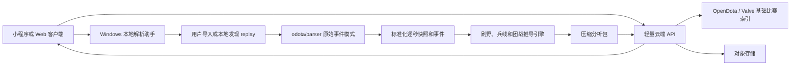

# Dota Lens 产品需求文档（PRD）

| 文档项 | 内容 |
| --- | --- |
| 产品名称 | Dota Lens |
| 文档版本 | v0.1 |
| 文档状态 | 评审稿 |
| 编写日期 | 2026-07-16 |
| 目标版本 | MVP / 第一版可用产品 |
| 产品形态 | 小程序或 Web 消费端 + Windows 本地解析助手 + 轻量云端 API |

## 1. 文档目的

本文档定义 Dota Lens 第一版的产品目标、用户流程、数据口径、功能范围、交互结构、技术边界和验收标准。

第一版不是复刻 OpenDota 的全部功能，而是围绕一个更明确的问题构建：

> 一名玩家打完一场 Dota 2 比赛后，能够选中自己的英雄，按秒回看移动、刷野、补刀、经济、装备、战斗和视野事件，并看懂某段决策带来了什么收益、又放弃了什么机会。

## 2. 背景与问题

### 2.1 当前产品背景

现有原型已经具备以下界面和能力：

- 输入 SteamID64 或 account_id 拉取最近比赛。
- 比赛列表与比赛详情分为两个主视图。
- 单场详情包含总览、英雄分析、玩家、曲线、视野/地图、时间轴、团战/目标等页签。
- 已接入 OpenDota 基础比赛数据与已解析比赛数据。
- 已支持英雄、装备、技能中文名和 Dota 地图底图。

当前核心问题不是页面数量不足，而是数据来源不稳定、数据精度被误解、页面没有清楚说明哪些数据是真实事件、哪些数据只是聚合结果。

### 2.2 OpenDota 数据审计结论

以一组脱敏测试账号在 2026-07-16 的最近 100 场比赛为样本：

| 指标 | 结果 |
| --- | ---: |
| 最近比赛 | 100 场 |
| 已解析 | 5 场 |
| 未解析 | 95 场 |
| 最近 15 场已解析数量 | 0 场 |

已解析样本比赛 `8888582245` 中，玩家对象有 142 个非空字段，但不同字段的时间精度并不相同：

| 数据维度 | 样本数据量 | OpenDota 公共 API 精度 |
| --- | ---: | --- |
| 经济、经验、补刀、反补曲线 | 各 37 点 | 每 60 秒 |
| 出装事件 | 40 条 | 秒级 |
| 英雄击杀 | 11 条 | 秒级 |
| 神符拾取 | 3 条 | 秒级 |
| 假眼放置 | 6 条 | 秒级时间和坐标 |
| 真眼放置 | 10 条 | 秒级时间和坐标 |
| 团战 | 8 场 | 区间及区间内聚合数据 |
| 地图目标 | 28 条 | 秒级 |
| 英雄位置 | 690 个采样 | 仅准备阶段至 10:00，且被压成无时间顺序的热力图 |
| 野怪击杀 | 16 个 | 只有数量和种类，没有击杀时间 |

OpenDota parser 内部每秒生成一次 `interval` 数据，包含英雄坐标、金钱、经验、补刀、反补、状态和装备快照；但公共 API 的聚合过程只保留每分钟曲线，并将前 10 分钟坐标压缩为热力图计数。

### 2.3 用户问题

用户目前无法稳定完成以下任务：

1. 最近比赛大部分没有 OpenDota 深度解析，进入详情后只能看到基础数据。
2. 页面没有明确显示字段覆盖范围，用户无法判断“没发生”还是“没数据”。
3. OpenDota 公共 API 无法回答“第几分钟在哪里刷野”。
4. OpenDota 公共 API 无法精确回答“这段刷野赚了多少钱”。
5. “因为刷野漏了多少兵”不是原始字段，需要基于位置、兵线和击杀事件推导。
6. 当前地图时间滑块容易让用户误以为 `lane_pos` 是全场带时间的轨迹。

## 3. 产品定位

### 3.1 一句话定位

Dota Lens 是一款面向个人玩家的 Dota 2 单场决策复盘工具，重点解释一名英雄在每个时间段做了什么、获得了什么、错过了什么。

### 3.2 核心用户

第一版核心用户为：

- 希望认真复盘自己的普通或天梯玩家。
- 重点关注发育效率、刷钱路线、漏线、死亡和关键装备节奏的核心位玩家。
- 希望分析游走、眼位、团战参与和资源交换的辅助玩家。
- 愿意在 Windows 游戏电脑上运行一个本地解析助手的个人用户。

### 3.3 核心价值

| 用户问题 | 产品回答 |
| --- | --- |
| 我这一分钟在做什么？ | 展示英雄位置轨迹、所在区域、战斗和经济事件。 |
| 这段刷野赚了多少？ | 展示刷野段持续时间、营地、击杀、金钱、经验和移动耗时。 |
| 我刷野时漏了多少线？ | 展示同期兵线机会、实际补刀和估算漏刀，并标记置信度。 |
| 这次死亡为什么亏？ | 展示死亡前后的路线、技能物品使用、经济差和错失资源。 |
| 装备节奏是否合理？ | 展示购买时间、关键组件间隔以及同期经济来源。 |
| 眼位和地图决策是否有效？ | 展示放置位置、存活时间、附近事件和覆盖区域。 |

## 4. 产品目标与非目标

### 4.1 MVP 目标

1. 用户可以用 Steam 数字 ID 查看比赛记录并识别每场数据状态。
2. 用户可以从比赛列表进入独立的单场详情视图，不依赖长页面滚动。
3. 对已取得 replay 的比赛，生成全场逐秒英雄快照和事件时间线。
4. 默认聚焦用户自己的英雄，提供位置、经济、补刀、装备、战斗、视野和发育分析。
5. 自动识别刷野片段，并统计每段的时间、区域、野怪、金钱和经验。
6. 估算刷野期间错过的兵线机会，并明确展示估算依据和置信度。
7. 所有英雄、装备、技能、神符和地图目标均使用中文名称和图标。
8. 不要求个人开发者运行完整 OpenDota 服务，也不要求常驻高内存解析服务器。

### 4.2 非目标

第一版明确不做：

- 比赛进行中的实时分析或作弊式提示。
- 自动代替用户操作 Dota 2 客户端。
- 全量复刻 OpenDota 的英雄统计、排行榜、职业比赛和公开数据探索功能。
- 基于主观判断生成“唯一正确打法”。
- 将估算的漏刀、路线价值包装为确定事实。
- 社区、好友、战队、评论和内容发布功能。
- 对所有历史比赛进行无限制批量 replay 下载与解析。
- 第一版直接部署完整 PostgreSQL、Redis、Cassandra、MinIO 和 OpenDota Core 全家桶。

## 5. 成功指标

### 5.1 数据指标

| 指标 | MVP 目标 |
| --- | ---: |
| 本地 replay 导入成功率 | ≥ 95% |
| 支持当前版本正常 replay 的解析成功率 | ≥ 90% |
| 逐秒快照完整率 | ≥ 98% |
| 关键事件带时间戳比例 | ≥ 98% |
| 数据来源标识覆盖率 | 100% |
| 估算指标带置信度比例 | 100% |

### 5.2 性能指标

| 指标 | MVP 目标 |
| --- | ---: |
| 40 分钟 replay 本地解析 P50 | ≤ 60 秒 |
| 40 分钟 replay 本地解析 P95 | ≤ 180 秒 |
| 已生成报告首屏加载 P95 | ≤ 2 秒 |
| 时间滑块更新延迟 | ≤ 100 毫秒 |
| 地图拖动和图表交互帧率 | 目标 60 FPS，最低不低于 30 FPS |

### 5.3 产品指标

| 指标 | MVP 目标 |
| --- | ---: |
| 成功进入至少一个完整复盘的用户比例 | ≥ 70% |
| 单场复盘查看模块数中位数 | ≥ 3 个 |
| 解析失败后能理解原因的用户比例 | 定性测试 ≥ 80% |

## 6. 产品原则

1. **数据真实优先**：缺失时明确显示缺失，不生成伪造曲线或随机示例。
2. **事实与推导分离**：原始事件、聚合统计、模型估算使用不同标签。
3. **个人英雄优先**：详情默认聚焦本人英雄，不用大量总览指标淹没核心分析。
4. **时间同步优先**：地图、曲线、事件、装备和刷野片段围绕同一个时间游标联动。
5. **按需解析优先**：个人电脑或临时任务完成重计算，云端只承担轻量查询和存储。
6. **中文可读优先**：内部键值可以保留英文，用户界面必须显示中文名称。
7. **可解释优先**：所有结论都能追溯到对应时间、位置和事件。

## 7. 产品形态与用户流程

### 7.1 产品组成

| 组成 | 职责 |
| --- | --- |
| 小程序或 Web 客户端 | 查比赛、查看解析状态、浏览单场复盘。 |
| Windows 本地助手 | 导入或监控 replay、执行 parser、生成分析包、上传结果。 |
| 轻量云端 API | 账号与比赛索引、解析任务状态、报告元数据、鉴权。 |
| 对象存储 | 保存压缩后的逐秒数据和事件分析包。 |
| OpenDota | 提供可用的比赛列表、基础数据和已解析数据兜底。 |
| Valve WebAPI | 在配置 API Key 后提供官方基础比赛信息。 |

### 7.2 首次使用流程

1. 用户输入 `account_id` 或 SteamID64。
2. 系统换算并校验账号 ID。
3. 拉取最近比赛列表。
4. 每场比赛显示数据状态：完整、OpenDota 深度、仅基础、等待 replay、解析中、失败。
5. 用户选择一场比赛进入详情。
6. 若已有完整分析包，直接打开复盘。
7. 若只有基础数据，页面引导用户在电脑端打开本地助手并导入 replay。
8. 本地助手解析完成后，客户端自动刷新状态并打开完整复盘。

### 7.3 单场复盘流程

1. 进入比赛详情后默认选中本人英雄。
2. 默认进入“发育复盘”，显示前 15 分钟的路线、补刀和资源段。
3. 用户拖动统一时间轴，地图、经济、装备、事件和提示同步变化。
4. 用户可以点击一个刷野片段，查看进入营地、击杀、收益、离开和同期兵线机会。
5. 用户可以切换战斗、出装、视野和完整时间轴。
6. 用户点击任意结论，可展开“依据”查看原始事件。

### 7.4 数据处理流程



## 8. 版本范围

### 8.1 P0：MVP 必须完成

- Steam 数字 ID 绑定和最近比赛列表。
- 比赛解析状态与数据覆盖说明。
- 已解析比赛与未解析比赛筛选。
- 独立比赛详情视图。
- 本地助手手动导入 `.dem` 和 `.dem.bz2`。
- 单任务 replay 解析队列。
- 1 秒英雄快照：时间、坐标、金钱、经验、补刀、反补、等级、生命状态、装备。
- 帧级或事件级战斗日志保留。
- 秒级出装、击杀、死亡、神符、眼位和目标物时间线。
- 真实 Dota 地图上的英雄轨迹、营地、眼位和事件。
- 刷野片段识别与收益统计。
- 刷野期间漏线机会估算与置信度。
- 全局时间游标联动。
- 中文英雄、装备、技能和事件名称。
- 原始事实、聚合结果、估算结论三类标签。
- 解析失败原因和重试入口。

### 8.2 P1：MVP 后增强

- 自动监控用户配置的 Dota replay 目录。
- Steam GC 自动获取 replay 地址与下载。
- 多比赛后台队列。
- 死亡损失分析和死亡前 30 秒回放。
- 拉野、屯野、控符、控盾和眼位价值分析。
- 同英雄同分段基准对比。
- 关键装备时间与历史个人均值对比。
- 报告分享链接和静态图片导出。
- 小程序消息通知“比赛分析完成”。

### 8.3 P2：长期方向

- 阵容与分路识别模型。
- 团战站位和技能衔接分析。
- 路线推荐与替代决策模拟。
- 多场趋势分析。
- 教练批注和训练目标。
- 队伍级视野和资源分配分析。

## 9. 功能需求

### 9.1 账号与比赛列表

| 编号 | 需求 | 验收标准 |
| --- | --- | --- |
| FR-001 | 支持输入 account_id 和 SteamID64。 | 两种格式均能转换为正确的 32 位账号 ID。 |
| FR-002 | 拉取最近比赛。 | 默认显示 20 场，可继续加载至 100 场。 |
| FR-003 | 显示比赛基本信息。 | 每场包含英雄、结果、时长、开始时间、模式和比赛 ID。 |
| FR-004 | 显示数据状态。 | 状态至少包含完整、OpenDota 深度、基础、待导入、解析中、失败。 |
| FR-005 | 支持按状态筛选。 | 用户可只看“可完整复盘”或“等待解析”的比赛。 |
| FR-006 | 点击比赛进入独立详情。 | 详情不附加在长列表底部，返回后保留列表位置。 |
| FR-007 | 显示数据来源。 | 明确标识 Valve、OpenDota、本地 replay 或推导结果。 |

### 9.2 Replay 获取与解析

| 编号 | 需求 | 验收标准 |
| --- | --- | --- |
| FR-101 | 本地助手支持手动导入 replay。 | 支持 `.dem` 与 `.dem.bz2`，并校验文件格式。 |
| FR-102 | 自动识别 match_id。 | 解析后 match_id 与目标比赛一致，否则阻止上传。 |
| FR-103 | 单任务解析队列。 | 同一时间只运行一个 parser，避免内存叠加。 |
| FR-104 | 展示解析进度。 | 至少包含读取、解析、标准化、推导、上传五个阶段。 |
| FR-105 | 保留原始逐秒 interval。 | 不走丢弃秒级数据的聚合 `/blob` 结果作为唯一数据源。 |
| FR-106 | 支持取消和重试。 | 用户可以取消未完成任务并对可恢复错误重试。 |
| FR-107 | 解析器版本可追踪。 | 每个分析包记录 parser、Dota patch、规则和算法版本。 |
| FR-108 | 不上传 Steam 密码。 | MVP 不向云端收集 Steam 用户名、密码或 Steam Guard 信息。 |
| FR-109 | 提供 Replay schema 探针。 | 每个受支持 patch 至少验证英雄、单位、技能、物品、视野和操作字段是否实际出现在 Replay send table 中。 |

### 9.3 单英雄逐秒复盘

| 编号 | 需求 | 验收标准 |
| --- | --- | --- |
| FR-201 | 默认选中本人英雄。 | account_id 匹配成功时自动定位本人玩家。 |
| FR-202 | 提供统一时间游标。 | 地图、曲线、装备、状态和事件使用同一秒数。 |
| FR-203 | 展示逐秒轨迹。 | 地图可查看全场轨迹，并按时间裁剪已走路径。 |
| FR-204 | 展示逐秒状态。 | 当前时间点显示位置、区域、金钱、经验、补刀、等级和装备。 |
| FR-205 | 支持时间缩放。 | 支持全场、10 分钟、5 分钟和 1 分钟窗口。 |
| FR-206 | 支持事件跳转。 | 点击死亡、购买、眼位、团战等事件后游标跳转到对应时间。 |
| FR-207 | 数据缺口可见。 | 缺失区间显示断线或“无快照”，不得插值为真实数据。 |
| FR-208 | 保留高精度事件时钟。 | 每条原始事件至少保存 `demo_tick`、`game_time_ms` 和单调递增的 `event_seq`，不得只保留四舍五入后的秒数。 |

### 9.4 刷野分析

| 编号 | 需求 | 验收标准 |
| --- | --- | --- |
| FR-301 | 识别进入和离开野区。 | 根据地图区域与英雄坐标生成区域状态。 |
| FR-302 | 识别营地访问。 | 英雄进入营地多边形并发生中立单位事件时生成访问记录。 |
| FR-303 | 生成刷野片段。 | 片段包含开始、结束、持续时间、营地、路线和移动耗时。 |
| FR-304 | 统计野怪。 | 显示击杀的中立单位名称、数量和时间。 |
| FR-305 | 统计收益。 | 显示可归因金钱、经验、补刀增量和净值变化。 |
| FR-306 | 区分收益口径。 | “事件金钱”和“净值变化”必须分开显示。 |
| FR-307 | 显示刷野效率。 | 显示每分钟金钱、每分钟经验和移动时间占比。 |
| FR-308 | 支持片段证据展开。 | 用户可查看组成该片段的原始快照和事件。 |

### 9.5 兵线与漏刀分析

| 编号 | 需求 | 验收标准 |
| --- | --- | --- |
| FR-401 | 识别主要分路。 | 根据开局位置、队友位置和兵线活动给出上/中/下路及置信度。 |
| FR-402 | 识别兵线窗口。 | 按波次生成到线和死亡时间窗口。 |
| FR-403 | 记录实际补刀。 | 使用补刀增量和单位死亡事件记录实际获得。 |
| FR-404 | 估算可争取补刀。 | 排除死亡、回城、团战和不可达区间后计算机会数。 |
| FR-405 | 估算刷野导致的漏刀。 | 仅在英雄处于刷野片段且同期存在所属兵线机会时归因。 |
| FR-406 | 显示置信度。 | 每个漏线结论显示高、中、低置信度和依据。 |
| FR-407 | 禁止过度因果。 | 无法确定时使用“同期错过”而不是“刷野导致”。 |

### 9.6 战斗、出装与视野

| 编号 | 需求 | 验收标准 |
| --- | --- | --- |
| FR-501 | 秒级出装时间线。 | 显示购买、获得、出售或丢失事件及中文图标。 |
| FR-502 | 技能与物品使用。 | 按时间展示技能、物品、目标和次数。 |
| FR-503 | 伤害拆解。 | 支持按技能、目标英雄和团战片段查看伤害。 |
| FR-504 | 团战片段。 | 展示起止、参战者、死亡、买活、伤害、治疗、经济和经验变化。 |
| FR-505 | 眼位时间线。 | 展示放置、消失时间、类型、玩家、坐标和存活时长。 |
| FR-506 | 地图图层控制。 | 位置、路线、野区、眼位、击杀、死亡和目标物可独立开关。 |
| FR-507 | 目标物事件。 | 展示塔、兵营、肉山、盾、信使和第一滴血。 |
| FR-508 | 保存队伍可见性变化。 | 对英雄和重要单位记录天辉/夜魇可见状态变化与最后可见位置。 |
| FR-509 | 保存完整英雄决策状态。 | 逐秒保存血量、蓝量、移动速度、关键状态、库存、充能和技能/物品冷却。 |
| FR-510 | 保存完整单位命令。 | 操作事件包含命令类型、执行单位、目标实体、目标坐标、技能或物品、排队状态和序列号。 |

### 9.7 数据说明与调试能力

| 编号 | 需求 | 验收标准 |
| --- | --- | --- |
| FR-601 | 提供数据覆盖面板。 | 显示每个维度是否存在、数量、精度和来源。 |
| FR-602 | 区分零与缺失。 | `0` 显示为零，`null` 或不存在显示为缺失。 |
| FR-603 | 提供原始字段查看。 | 开发模式可查看标准化前后的 JSON 片段。 |
| FR-604 | 展示算法版本。 | 推导卡片可查看规则版本和计算说明。 |
| FR-605 | 允许报告问题。 | 可复制 match_id、parser 版本和错误码。 |

## 10. 数据维度与精度

### 10.1 原始事实层

| 维度 | 核心字段 | 目标精度 | MVP 是否保留 |
| --- | --- | --- | --- |
| 英雄位置 | `time, slot, x, y` | 每秒 | 是 |
| 经济状态 | `gold, networth` | 每秒 | 是 |
| 经验状态 | `xp, level` | 每秒 | 是 |
| 补刀状态 | `last_hits, denies` | 每秒 | 是 |
| 生存状态 | `life_state` | 每秒 | 是 |
| 装备状态 | `inventory, charges, slot` | 每秒快照 + 事件 | 是 |
| 金钱事件 | `time, player, reason, value` | 每次事件 | 是 |
| 经验事件 | `time, player, reason, value` | 每次事件 | 是 |
| 单位死亡 | `time, killer, victim, position` | 每次事件 | 是 |
| 英雄伤害 | `time, source, target, inflictor, value` | 每次伤害 | 是 |
| 技能使用 | `time, source, ability, target` | 每次事件 | 是 |
| 物品使用 | `time, source, item, target` | 每次事件 | 是 |
| 购买事件 | `time, player, item, charges` | 每次事件 | 是 |
| 眼位事件 | `time, player, type, x, y, enter/leave` | 每次事件 | 是 |
| 神符事件 | `time, player, rune_type` | 每次事件 | 是 |
| 建筑与肉山 | `time, type, team, player` | 每次事件 | 是 |
| 玩家操作 | `time, order_type` | 每次事件或聚合 | 视 parser 稳定性保留 |

### 10.2 聚合结果层

聚合结果必须可由原始事实重新计算：

- 每 10 秒、30 秒和 60 秒经济曲线。
- 每分钟补刀、反补、经验和净值增量。
- 技能和物品总使用次数。
- 按技能、目标和时间段的伤害总量。
- 野怪、线上小兵、英雄、建筑和信使击杀数量。
- 眼位数量、存活时长和地图分布。
- 团战区间内伤害、治疗、死亡、买活和经济变化。

### 10.3 推导分析层

推导结果不属于 Valve 或 replay 的直接字段，必须展示“推导”标签：

- 所在区域：线上、己方野区、敌方野区、河道、基地、肉山区。
- 营地访问与刷野片段。
- 刷野移动成本。
- 刷野段事件收益与净值变化。
- 所属兵线和兵线窗口。
- 可争取补刀、同期错过补刀和刷野相关漏刀。
- 死亡损失、回城损失和团战资源交换。
- 装备节奏快慢。
- 决策建议和替代路线。

### 10.4 Replay 扩展字段获取方案

当前 OpenDota `Parse` 只序列化 Clarity 暴露字段的一部分。Dota Lens 在固定上游
commit 的基础上维护轻量 parser 分支，不修改原始 Replay，不依赖 OpenDota
`/blob` 聚合结果。扩展字段按“Replay 事实、静态版本数据、推导结果”三层存储。

#### 10.4.1 高精度事件时钟

Clarity `Context` 提供 demo tick 和每 tick 毫秒数，战斗日志还提供原始浮点时间。
每条事件统一增加：

| 字段 | 来源 | 用途 |
| --- | --- | --- |
| `demo_tick` | `Context.getTick()` | Replay 原始顺序和逐帧定位。 |
| `game_time_ms` | game rules 时间或 combat log raw timestamp | 扣除暂停后的比赛时间。 |
| `event_seq` | parser 单调计数器 | 保证同 tick 内事件顺序稳定。 |
| `game_time_s` | `floor(game_time_ms / 1000)` | 与逐秒快照和前端时间轴联动。 |

不得再用 `Math.round(timestamp)` 作为唯一时间。暂停、赛前阶段和比赛正式开始时间
分别保存，标准化器负责转换为统一比赛时间。

#### 10.4.2 单位实体与生命周期

通过 Clarity 的 `OnEntityEntered`、`OnEntityUpdated`、
`OnEntityPropertyChanged` 和 `OnEntityLeft` 建立以 `ehandle` 为主键的单位注册表。
重点跟踪英雄、线上小兵、中立生物、召唤物、幻象、建筑、信使、眼位和肉山。

单位事实至少包含：

```json
{
  "ehandle": 18437,
  "unit": "npc_dota_creep_goodguys_melee",
  "unit_kind": "lane_creep",
  "team": 2,
  "owner_slot": null,
  "x": 118.42,
  "y": 96.18,
  "hp": 0,
  "life_state": 1
}
```

- `wave_id` 和 `lane_id` 由出生时间、队伍、出生坐标和线路多边形推导。
- `camp_id` 由中立单位出生点和版本对应的营地多边形推导。
- 召唤物、幻象和支配单位通过 owner handle 递归映射到玩家；映射不唯一时降低置信度。
- 单位死亡以实体生命状态变化为主证据，与同 tick 战斗死亡、金钱和经验事件关联。

#### 10.4.3 队伍可见性与眼位贡献

第一层直接保存 combat log 的 `visible_radiant`、`visible_dire` 和事件位置。第二层
由 schema 探针验证实体属性 `m_iTaggedAsVisibleByTeam` 及日夜视野范围是否在当前
Replay patch 中实际传输；存在时只记录可见状态变化，而不是每 tick 重复写入。
若英雄实体没有分队可见位，则保存所有视野源的队伍、坐标、日夜范围、揭示范围和
生命周期，交给版本化视野模拟器推导，不得把 `m_bSelectionRingVisible` 误当队伍视野。

```json
{
  "demo_tick": 25410,
  "viewer_team": 2,
  "target_ehandle": 18437,
  "visible": true,
  "x": 143.2,
  "y": 108.7
}
```

“敌人是否可见”属于事实。“由哪一个眼发现”属于推导：只有当敌人从不可见变为
可见、位于该眼覆盖区域，且没有英雄、小兵、建筑、扫描或其它眼位同时提供视野时，
才记为该眼的直接贡献；多来源重叠时分摊贡献并降低置信度。若 Replay 未传输稳定
的队伍可见标记，MVP 不宣称真实发现次数，后续再评估地形、树木和高低坡视野模拟器。

#### 10.4.4 英雄决策状态

每秒保存英雄血量、蓝量、移动速度、生存状态、关键 modifier、库存、物品充能、
技能和物品冷却。库存复用现有 `getHeroInventory()`，不再将 `hero_inventory`
标为 transient；为控制体积，完整状态按秒保存，tick 内只保存变化事件。

技能和物品实体通过 handle 与英雄关联。字段名可能随 Dota patch 改变，parser 使用
`Entity.hasProperty()` 和版本化字段别名表读取，并把缺失字段写入 coverage，而不是
用零值代替。

#### 10.4.5 完整玩家操作

`CDOTAUserMsg_SpectatorPlayerUnitOrders` 已包含 `order_type`、`units`、
`target_index`、`ability_id`、`position`、`queue`、`sequence_number`、`flags`、
`last_order_latency` 和 `ping`。parser 必须完整序列化，并通过单位注册表把
`target_index` 和执行单位转换为稳定实体引用。

该数据可用于命令 APM、有效 APM、重复折返、排队操作和操作到结果的延迟；Replay
不包含完整鼠标轨迹和镜头移动，因此产品不得将命令 APM 标成鼠标 APM。

### 10.5 Parser 实施阶段与验收

| 阶段 | 实施内容 | 验收标准 |
| --- | --- | --- |
| P0 Schema Probe | 输出相关 DTClass 的候选属性存在性、样例值和非空率。 | 两份黄金 Replay 均生成报告；字段缺失不会导致解析失败。 |
| P1 Clock + Combat | 增加 tick、毫秒、顺序和 Clarity 已提供但上游丢弃的战斗字段。 | 同 tick 顺序稳定；暂停前后时间连续；原秒级数据仍兼容。 |
| P2 Orders + Hero State | 保存完整单位命令、血蓝、库存、充能和冷却。 | 十名英雄正式比赛阶段每秒覆盖；命令目标可解析率可见。 |
| P3 Unit Registry | 保存重要单位出生、状态变化、死亡和 owner 映射。 | 可定位真实小兵和野怪死亡坐标；歧义关联带置信度。 |
| P4 Visibility | 保存队伍可见变化并实现眼位贡献归因。 | 随机抽取至少 20 个时间点与 Replay 队伍视角人工核对。 |
| P5 Normalization | 生成版本化、分片、gzip 分析包和 coverage。 | 前端只读取标准化 schema；原始事件可追溯。 |

性能策略：英雄按秒快照，战斗和操作保留原生事件精度，普通单位采用生命周期和变化
事件，视野只保存状态切换。禁止把所有单位按 30 tick 全量复制，避免单场数据膨胀。

### 10.6 真实 Replay 验证基线

2026-07-17 使用一场脱敏真实比赛验证。该比赛原先在 OpenDota
显示 `version=null`；提交公开解析任务 `417808480` 后取得 Valve Replay。测试输入为
`58,162,918` 字节 `.dem.bz2`，CRC 解压后 `.dem` 为 `92,372,833` 字节。

本地 Java 21 parser 冷缓存约 51 秒、热缓存约 12 秒，最终输出 `204,687,224`
字节 JSONL，共 `229,000` 条事件，`invalid_lines=0`，且仅有一个 `epilogue`。
十名玩家共有 `26,250` 条区间快照，正式比赛 `0-2389` 秒没有断档。

| 字段组 | 实测结果 | 当前结论 |
| --- | --- | --- |
| 高精度时钟 | `demo_tick/raw_game_time_ms/game_time_ms/event_seq` 229,000 条全覆盖；序号无重复、回退和跳号。 | P1 可用。 |
| 完整战斗日志 | raw JSONL 不再沿用上游 `ordinal <= 19` 过滤；本场新增保留 63 条暴击和 2,727 条 modifier 叠层事件。解析器也保留 `REVEALED_INVISIBLE`，但本场实测为 0 条。 | P1 可用；事件类型缺席必须显示 0，不得解释为字段缺失或伪造样本。 |
| 单位生命周期 | 3,544 enter、3,096 left、34,161 state；覆盖兵线小兵、中立、英雄、眼、召唤物、建筑和信使。 | P3 事实层可用，wave/camp/owner 仍需标准化。 |
| 英雄决策状态 | 正式比赛血蓝、坐标、移速、库存和技能状态全覆盖；212,683 个物品状态和 387,965 个技能状态均有冷却。 | P2 可用；modifier 快照待补。 |
| 完整玩家操作 | 85,859 条命令完整保存 issuer、units、target、ability、queue、sequence、flags、latency、ping；67,184 条带坐标。 | P2 可用；无鼠标轨迹和镜头。 |
| 眼位生命周期 | 35 个假眼、67 个真眼全部有玩家、队伍、坐标和范围；结束的 34/60 个眼全部有毫秒寿命、原因和置信度。 | 眼位事实层可用；真眼反隐半径走版本化规则。 |
| 队伍可见性 | 英雄 `m_iTaggedAsVisibleByTeam` 覆盖为 0；战斗日志只提供事件瞬间可见位。DT schema 有视野范围，部分非英雄有 `m_nFoWTeam`。 | P4 不可宣称直接真值，必须模拟并人工核对。 |

当前 Protobuf 中没有通用的“目标实体对某队可见”消息。P4 实施顺序为：保存视野源
事实；接入版本化 GridNav、树木、高低坡和日夜规则；用 combat log 可见位作事件锚点；
最后随机抽取至少 20 个时间点与 Replay 队伍视角核对。通过前，眼位“发现次数”和
“安全兵线”必须显示为估算值及置信度。

## 11. 核心推导口径

### 11.1 地图区域识别

系统维护与 Dota patch 对应的地图数据：

- 地图边界与坐标转换。
- 三条兵线多边形。
- 天辉和夜魇野区多边形。
- 每个中立营地的中心、边界、等级和阵营侧。
- 河道、肉山区、基地和高地区域。

每秒根据英雄坐标计算 `zone_id`。英雄位于多个区域边界时，优先级为营地、兵线、河道、野区、基地、其他。

### 11.2 刷野片段识别

候选刷野片段满足以下条件：

1. 英雄进入一个中立营地或野区区域。
2. 期间发生由该英雄或其可归属单位造成的中立单位死亡。
3. 相邻中立击杀间隔不超过配置阈值，MVP 默认 20 秒。
4. 相邻营地之间的移动可以合并为一段连续路线，默认最大间隔 35 秒。
5. 死亡、长时间回城或进入明确团战后结束片段。

每个片段输出：

| 字段 | 含义 |
| --- | --- |
| `start_time / end_time` | 片段起止时间。 |
| `camp_ids` | 访问营地顺序。 |
| `path` | 逐秒位置轨迹。 |
| `neutral_kills` | 野怪种类、数量和时间。 |
| `event_gold` | 可由金钱事件直接归因的收益。 |
| `event_xp` | 可由经验事件直接归因的收益。 |
| `networth_delta` | 起止净值变化。 |
| `movement_seconds` | 未发生中立战斗的移动时间。 |
| `efficiency` | 每分钟事件金钱与经验。 |
| `confidence` | 片段识别置信度。 |

### 11.3 收益口径

页面必须并列展示两类收益：

- **事件收益**：该时间段内能够按原因明确归类为中立单位、相关技能或共享奖励的金钱和经验事件。
- **状态变化**：片段结束值减开始值，可能包含被动金钱、击杀助攻、消耗品购买、死亡损失等其他因素。

两者不得混成一个“刷野赚了多少钱”。优先使用事件收益，状态变化用于交叉校验。

### 11.4 兵线机会口径

MVP 将兵线机会分为三层：

1. **事实层**：兵线单位死亡、击杀者、时间、位置和玩家补刀增量。
2. **机会层**：玩家处于所属兵线可达范围，或在合理时间内能够到达该波兵线。
3. **归因层**：玩家同时处于刷野片段，且没有死亡、团战、回城等更强解释。

漏刀结果分为：

- `实际补刀`：玩家确定击杀的线上单位。
- `同期错过`：所属兵线窗口内未获得的补刀机会。
- `刷野相关漏刀`：同期错过且与刷野时间重叠。
- `不可归因`：缺少足够位置或单位死亡数据。

### 11.5 置信度

| 级别 | 条件 | UI 表达 |
| --- | --- | --- |
| 高 | 时间、位置、单位死亡、击杀者和所属兵线完整。 | “高置信度：刷野期间同期错过 3 个兵。” |
| 中 | 缺少部分单位事件，但位置、补刀增量和波次一致。 | “估算同期错过约 2～4 个兵。” |
| 低 | 主要依赖波次模型或存在团战、换线等干扰。 | “可能错过兵线，暂不计入确定损失。” |

## 12. 信息架构与页面要求

### 12.1 主导航

第一版保留两个一级视图：

1. **比赛列表**：负责选择比赛和查看数据状态。
2. **比赛详情**：负责单场复盘，打开后不再显示长比赛列表。

### 12.2 比赛列表

每条比赛使用固定高度行或紧凑比赛卡，包含：

- 英雄头像和中文名。
- 胜负、KDA、时长和比赛时间。
- 比赛 ID。
- 数据状态标签。
- “查看基础数据”“打开完整复盘”或“等待 replay”主操作。

列表顶部提供状态筛选：全部、可完整复盘、OpenDota 深度、仅基础、解析中、失败。

### 12.3 比赛详情

详情页顶部固定展示：

- 返回比赛列表。
- 比赛 ID、胜负、时长和解析来源。
- 当前英雄选择器。
- 统一时间游标和播放控制。
- 数据覆盖入口。

二级页签调整为：

| 页签 | 主要内容 |
| --- | --- |
| 发育复盘 | 默认页；刷野片段、兵线、补刀、经济、经验和路线。 |
| 地图轨迹 | 全场轨迹、营地、眼位、击杀、死亡和目标物。 |
| 出装技能 | 秒级购买、装备快照、技能升级和使用。 |
| 战斗团战 | 击杀、死亡、伤害、技能物品、团战和目标。 |
| 完整时间轴 | 所有事件筛选、搜索和跳转。 |
| 玩家对比 | 双方玩家基础和聚合数据。 |
| 数据覆盖 | 字段、数量、精度、来源和缺失原因。 |

### 12.4 发育复盘默认布局

- 左侧或主区域：真实 Dota 地图和英雄轨迹。
- 右侧：按时间排序的刷野、兵线、回城、死亡和团战片段。
- 下方：经济、经验、补刀和净值曲线。
- 点击片段后，地图和曲线缩放到该片段。
- 同一片段内并列显示“获得”和“错过”。

### 12.5 统一时间交互

- 时间滑块支持拖动、点击和键盘微调。
- 支持暂停、播放、上一事件、下一事件。
- 播放速度支持 0.5x、1x、2x、4x。
- 拖动时地图和数值立即更新，复杂列表可在松手后更新。
- 所有模块使用同一 `current_time`，不得各自维护互相冲突的时间状态。

## 13. 状态与异常设计

| 状态 | 用户文案 | 可执行操作 |
| --- | --- | --- |
| 基础数据可用 | “这场目前只有赛后基础数据。” | 查看基础、导入 replay。 |
| OpenDota 深度可用 | “有聚合深度数据，但不包含全场逐秒轨迹。” | 查看聚合报告、导入 replay 升级。 |
| 等待 replay | “需要在电脑端下载或导入本场 replay。” | 打开助手说明。 |
| 解析中 | “正在解析：标准化事件 62%。” | 查看进度、取消。 |
| 完整数据可用 | “逐秒 replay 分析完成。” | 打开完整复盘。 |
| replay 过期 | “Valve 已无法提供本场 replay。” | 查看已有基础或 OpenDota 数据。 |
| parser 不兼容 | “当前 Dota 版本暂未适配。” | 保留文件、等待更新、重试。 |
| 数据部分缺失 | “位置完整，战斗日志部分缺失。” | 查看覆盖面板。 |
| 解析失败 | 显示可读原因与错误码。 | 重试、重新导入、复制诊断信息。 |

## 14. 技术架构约束

### 14.1 总体策略

- 不部署完整 OpenDota Core。
- MVP 只复用 `odota/parser` 或 Clarity 解析能力。
- parser 在用户 Windows 电脑上按需运行，默认并发为 1。
- 云端不保存 Steam 密码，不负责常驻 GC 登录。
- 云端数据库只保存账号、比赛、任务、报告元数据和索引。
- 大型逐秒数组和事件包保存为压缩对象，不拆成数万行数据库记录。
- 原始 replay 默认保留在用户本地，可由用户配置自动清理。

### 14.2 本地助手模块

| 模块 | 职责 |
| --- | --- |
| Replay Importer | 文件选择、解压、格式和 match_id 校验。 |
| Parser Runner | 启动 Java parser、限制内存、捕获日志和退出码。 |
| Normalizer | 将 OpenDota 原始事件转换为稳定内部 schema。 |
| Derivation Engine | 区域、刷野、兵线、团战和置信度计算。 |
| Package Builder | 生成 manifest、summary、snapshots、events 和 derived 数据。 |
| Sync Client | 使用用户令牌上传压缩包和任务状态。 |
| Diagnostics | 导出不含账号密码的诊断信息。 |

### 14.3 资源限制

- parser 单任务内存上限目标为 2～4 GB，具体以实测调整。
- 单任务 CPU 默认最多使用 2～4 核。
- 本地助手空闲时内存目标小于 150 MB。
- 不允许默认并行解析多场 replay。
- replay 和中间文件写入临时目录，成功或取消后按策略清理。

## 15. 数据模型

### 15.1 分析包结构

```text
match-{match_id}/
  manifest.json
  summary.json
  players.json
  snapshots.json.gz
  events.json.gz
  teamfights.json.gz
  derived.json.gz
```

### 15.2 Manifest

```json
{
  "schema_version": "1.0.0",
  "match_id": 8888582245,
  "account_id": 123456789,
  "dota_patch": "unknown",
  "parser": {
    "name": "odota-parser",
    "version": "commit-sha"
  },
  "derivation_version": "0.1.0",
  "precision": {
    "snapshot_seconds": 1,
    "combat": "event",
    "position": "second"
  },
  "coverage": {
    "position": 1.0,
    "gold_events": 1.0,
    "combat_events": 0.98
  }
}
```

### 15.3 PlayerSnapshot

```json
{
  "t": 742,
  "slot": 8,
  "player_slot": 131,
  "x": 149.7,
  "y": 117.1,
  "zone_id": "dire_jungle_camp_04",
  "gold": 5320,
  "networth": 6180,
  "xp": 6012,
  "level": 11,
  "last_hits": 56,
  "denies": 3,
  "life_state": 0,
  "inventory": [
    { "item": "blink", "slot": 0, "charges": 0 }
  ]
}
```

### 15.4 CombatEvent

```json
{
  "id": "evt-000123",
  "t": 842,
  "tick": 25410,
  "type": "hero_kill",
  "source_slot": 8,
  "target_slot": 6,
  "source_unit": "npc_dota_hero_lion",
  "target_unit": "npc_dota_hero_disruptor",
  "inflictor": "lion_finger_of_death",
  "value": 780,
  "x": 151.2,
  "y": 118.0
}
```

### 15.5 FarmSegment

```json
{
  "id": "farm-018",
  "player_slot": 131,
  "start_time": 720,
  "end_time": 763,
  "camp_ids": ["dire_jungle_camp_04", "dire_jungle_camp_05"],
  "neutral_kills": 7,
  "event_gold": 284,
  "event_xp": 391,
  "networth_delta": 236,
  "movement_seconds": 14,
  "lane_opportunities": 4,
  "missed_lane_creeps_estimate": 3,
  "confidence": "medium",
  "evidence_event_ids": ["evt-000120", "evt-000121"]
}
```

## 16. API 草案

| 方法 | 路径 | 用途 |
| --- | --- | --- |
| `GET` | `/accounts/{account_id}/matches` | 获取比赛列表与状态。 |
| `GET` | `/matches/{match_id}` | 获取比赛基础信息。 |
| `GET` | `/matches/{match_id}/coverage` | 获取字段覆盖与来源。 |
| `POST` | `/parse-jobs` | 创建本地解析任务记录。 |
| `PATCH` | `/parse-jobs/{job_id}` | 更新阶段、进度和错误。 |
| `POST` | `/matches/{match_id}/analysis-package` | 获取上传凭证。 |
| `POST` | `/matches/{match_id}/analysis-package/complete` | 提交校验值并标记完成。 |
| `GET` | `/matches/{match_id}/analysis/summary` | 获取详情首屏摘要。 |
| `GET` | `/matches/{match_id}/analysis/player/{slot}` | 获取指定英雄完整分析。 |
| `GET` | `/matches/{match_id}/analysis/timeline` | 按区间和事件类型获取时间线。 |

### 16.1 本地桌面 API（已实施）

本地服务只监听 `127.0.0.1:5600`，前端不直接下载 Replay，也不加载完整 raw JSONL。

| 方法 | 路径 | 用途 |
| --- | --- | --- |
| `GET` | `/api/status` | 获取本地 parser 版本和任务状态。 |
| `GET` | `/api/players/{account_id}/matches` | 代理最近比赛，并合并本地缓存与任务状态。 |
| `POST` | `/api/matches/{match_id}/parse` | 创建或复用单场自动解析任务；支持 `force` 重算。 |
| `GET` | `/api/jobs/{job_id}` | 查询下载、解压、解析、摘要、完成或失败状态。 |
| `GET` | `/api/matches/{match_id}/analysis` | 读取轻量真实分析摘要、玩家和覆盖数据。 |

自动解析顺序为：读取 OpenDota 比赛详情；解析或请求 `replay_url`；从 Valve 流式下载
`.dem.bz2`；优先用本机 Python 原生 bzip2 解压并缓存 `.dem`，失败时回退 Java；解析为
raw JSONL；校验唯一 `epilogue`、无效行和事件序号；最后生成小型 `summary.json`。

## 17. 非功能需求

### 17.1 兼容性

- 客户端支持主流桌面和移动浏览器。
- 小程序端不得一次加载完整未压缩事件文件。
- Windows 本地助手优先支持 Windows 10 和 Windows 11 x64。
- parser 与 Dota patch 的兼容关系必须可配置。

### 17.2 可用性

- 比赛列表基础查询不依赖本地助手在线。
- 已生成报告在本地助手离线后仍可查看。
- OpenDota 或 Valve API 临时失败时优先展示缓存并注明更新时间。
- 分析包上传使用校验和，支持断点或失败重试。

### 17.3 可观测性

每个解析任务至少记录：

- job_id、match_id、parser 版本和 patch。
- replay 文件大小和校验值。
- 各阶段耗时和峰值内存。
- 快照数、事件数、覆盖率和丢弃数。
- 错误类型、退出码和可重试标记。

### 17.4 数据体积

- `summary.json` 目标小于 500 KB。
- 单场压缩分析包目标小于 20 MB，超过时分片。
- 首屏接口不返回全场逐秒数组。
- 地图轨迹按需加载，可按玩家和时间区间切片。

## 18. 安全与隐私

1. MVP 不收集 Steam 密码、Steam Guard 验证码或本地登录会话。
2. 本地助手只读取用户选择或配置的 replay 目录。
3. 上传前显示 match_id、数据类型和文件大小。
4. 分析包使用用户级访问控制，默认不公开。
5. 分享功能上线前必须支持撤销链接和过期时间。
6. 日志不得包含认证令牌、本地完整路径或 Steam 敏感凭据。
7. replay 和分析包支持用户主动删除。

## 19. 数据质量与测试

### 19.1 测试样本

至少维护以下 replay 样本：

- 正常 30～40 分钟比赛。
- 超过 60 分钟的长比赛。
- 有暂停、掉线、买活和多次肉山的比赛。
- 有幻象、召唤物和支配单位的比赛。
- 核心位大量刷野的比赛。
- 辅助位大量插眼和游走的比赛。
- parser 不支持的新 patch replay。
- 损坏或未完整下载的 replay。

### 19.2 固定对照样本验收

将比赛 `8888582245` 作为 OpenDota 聚合数据对照样本，至少验证：

- 玩家 account_id 使用脱敏测试值 `123456789`。
- 英雄 ID 为 `26`。
- OpenDota 分钟曲线有 37 个点。
- 出装日志有 40 条。
- 英雄击杀日志有 11 条。
- 假眼日志有 6 条，真眼日志有 10 条。
- 团战有 8 场，目标事件有 28 条。
- 中立单位击杀聚合值为 16。
- 公共 `lane_pos` 只能作为前 10 分钟热力图，不作为全场轨迹测试依据。

本地 raw replay 测试应进一步验证逐秒快照和逐事件数据，不以 OpenDota 公共 API 的聚合精度作为上限。

## 20. MVP 验收标准

MVP 完成需同时满足：

1. 用户可通过 account_id 查询比赛并明确区分完整、聚合和基础数据。
2. 用户选择比赛后进入独立详情页，返回列表时保持上下文。
3. 用户可在 Windows 助手中导入一场 replay 并完成解析。
4. 完整报告至少包含本人英雄全场逐秒位置、经济、经验、补刀和装备状态。
5. 地图、曲线和事件时间线可使用同一游标联动。
6. 至少识别一个真实刷野片段，并能展开其野怪和收益证据。
7. 至少展示一次兵线机会分析，并带置信度和计算说明。
8. 所有缺失维度在覆盖面板中可见，不出现虚构数据。
9. 英雄、装备和技能在用户界面中显示中文名和图标。
10. 本地助手单任务运行，不依赖完整 OpenDota Core 服务。

## 21. 里程碑建议

| 阶段 | 目标 | 主要交付物 |
| --- | --- | --- |
| M0：数据基线 | 让现有页面先正确说明数据。 | 解析状态筛选、覆盖面板、真实精度标识、已解析样本。 |
| M1：本地原始解析 | 跑通一场 replay 到原始 JSON。 | Windows CLI、parser 封装、逐秒 interval、事件标准化。 |
| M2：完整单场复盘 | 用原始数据驱动现有详情页。 | 全场轨迹、同步时间轴、出装、战斗、眼位、团战。 |
| M3：发育分析 | 形成产品差异化。 | 营地区域、刷野片段、收益、兵线机会和置信度。 |
| M4：轻量同步 | 在小程序或 Web 随时查看。 | 分析包、上传、对象存储、报告 API、鉴权。 |
| M5：体验完善 | 达到可持续个人使用。 | 自动监控目录、通知、缓存、诊断和版本更新。 |

## 22. 风险与应对

| 风险 | 影响 | 应对 |
| --- | --- | --- |
| Dota patch 改变 replay 字段 | parser 失败或字段缺失 | 记录 patch 和 parser 版本，维护黄金 replay 与兼容矩阵。 |
| replay 已过期 | 无法获得逐秒数据 | 尽早下载、本地监控、保留 OpenDota 和基础数据兜底。 |
| 召唤物或幻象归属错误 | 刷野收益统计偏差 | 维护 owner 映射，低置信度时不做确定归因。 |
| 换线与游走导致兵线归属错误 | 漏刀估算误导 | 分时间段识别分路，并展示置信度。 |
| 金钱事件重复计算 | 刷野收益虚高 | 使用事件 ID 去重，事件收益与净值变化交叉校验。 |
| 小程序一次加载数据过大 | 页面卡顿 | 摘要首屏、按玩家和时间区间分片、压缩传输。 |
| 本地助手安装门槛 | 用户无法完成解析 | 提供免安装包、自动检测依赖和清晰阶段状态。 |
| 用户误把估算当事实 | 产品信任下降 | 事实、聚合、推导三类视觉标签和证据展开。 |

## 23. 已确认决策

1. 第一版不部署完整 OpenDota Core。
2. OpenDota 用于比赛索引、基础数据和已解析数据兜底，不作为逐秒数据的最终来源。
3. 深度数据来自 raw replay 解析，并保留逐秒 interval 与原始事件。
4. 重计算优先在用户 Windows 电脑本地按需执行。
5. 单场详情默认聚焦本人英雄和发育复盘。
6. 比赛列表与详情是独立视图。
7. 地图必须使用真实 Dota 地图底图。
8. 任何漏刀、刷野价值和决策评价必须标记为推导结果。

## 24. 待评审问题

1. MVP 是先交付 Web/PWA，还是直接开发微信小程序壳？
2. 本地助手第一版采用命令行、托盘应用还是简洁桌面窗口？
3. replay 第一版只做手动导入，还是同时做目录监控？
4. 分析包默认只保存本地，还是自动同步到私有云端？
5. 云端报告默认保留多长时间？
6. 第一版是否只深度分析账号本人英雄，还是允许切换十名英雄？
7. 漏刀模型第一版是否限定前 20 分钟，以降低换线和复杂团战带来的误差？

## 25. 参考资料

- OpenDota parser：https://github.com/odota/parser
- OpenDota parser 原始 interval：https://github.com/odota/parser/blob/master/src/main/java/opendota/Parse.java
- OpenDota 聚合逻辑：https://github.com/odota/parser/blob/master/src/main/java/opendota/CreateParsedDataBlob.java
- OpenDota Core：https://github.com/odota/core
- 已解析样本：https://api.opendota.com/api/matches/8888582245

## 26. M1 POC 验证状态

2026-07-16 已用两份真实 replay 验证普通解析入口：

- 两场均成功返回原始逐行 JSON，无无效行。
- 十名玩家正式比赛阶段均为连续 1 秒 interval，总缺秒为 0。
- 正式比赛阶段位置、金钱、净值、经验和补刀字段覆盖率为 100%。
- 95 MB replay 的本机热 JVM 解析耗时为 2.65 秒，原始 31.89 MiB JSONL 经
  gzip 后为 1.32 MiB。
- 技术路线通过；生产化仍需完成流式输出、严格错误处理、库存变化、任务队列
  和 replay 获取链路。

详细证据、限制和复现方式见 `POC-REPLAY-PARSER.md` 与 `tools/replay-poc/`。

2026-07-17 已开始按 10.4 的方案实施固定版本 parser 分支：

- 普通 POST 入口已改为边解析边输出 JSONL；`epilogue`、无效行、事件序号和逐秒断档
  由 POC 分析器严格校验，失败时返回非零退出码。
- P0-P3 的事实采集已落地：DT schema 探针、毫秒时钟、完整战斗日志、完整玩家命令、
  英雄库存与技能状态、重要单位注册表，以及真假眼生命周期与结束原因。
- 一场脱敏真实比赛已通过构建、单元测试和端到端解析，详细覆盖率以 10.6 为准。
- P5 产品标准化层已落地 `dota-lens/0.4`：逐秒快照、发育片段、出装技能、打钱、眼位、
  战斗、地图目标、语义时间轴和玩家指标由一次 JSONL 流式扫描生成。连续队伍视野在
  人工核对通过前仍标记为推导数据。

同日已完成账号到产品的首条真实链路。脱敏测试账号返回 20 场最近比赛；对应 Replay
在关闭 schema 探针的产品模式下生成 228,662 条事件、26,250 条 interval、
85,859 条命令、74,385 条战斗事件、40,801 条单位生命周期事件、102 个眼位和 66,629
个事件级视野锚点，`invalid_lines=0`。已下载压缩包首次解压并解析约 18 秒，DEM 缓存
重解析约 10.8 秒。当前前端已开放发育、打钱、地图、视野、出装技能、战斗团战、
完整时间轴、玩家对比和数据覆盖九个真实数据模块。样本分析包包含 23,900 个逐秒快照、
410 个分钟发育片段、102 个眼位、32 个战斗片段、31 个目标事件和 6,561 条语义事件。
区域归类、发育类型、低收益窗口、眼位用途、几何发现和评分标记为推导；没有兵线单位
轨迹时不计算精确漏刀。
